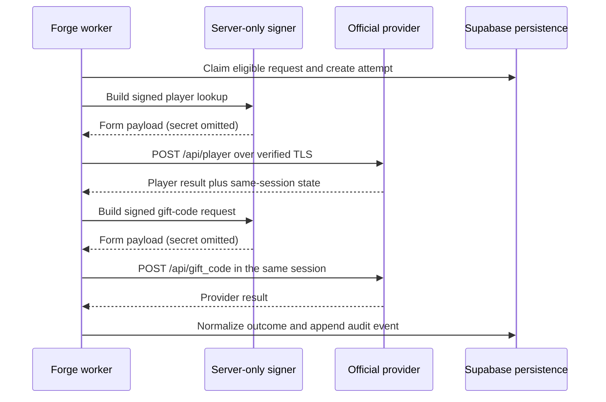
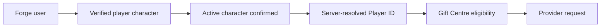
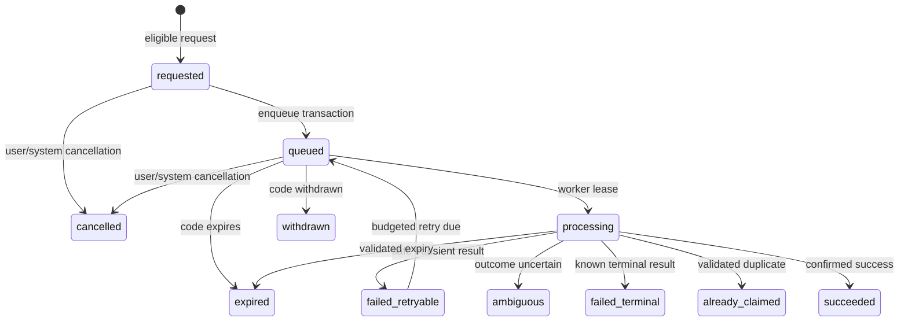

# Gift Centre Official Provider Integration Design

**Status:** proposed architecture; ready for Clark and Aegis review

**Workstream:** `feature/giftcode-auto-redeem`

**Design date:** 17 July 2026

**Runtime state:** no live provider, route, job, persistence, migration, credential,
or external mutation request exists on this branch

## 1. Purpose and authority

This document defines the implementation contract for a future Forge
server-side integration with the official Kingshot gift-code redemption flow.
It covers boundaries, identity and consent gates, persistence, execution,
provider normalization, operations, security, privacy, validation, recovery,
and rollout. A future implementation must conform to this design or record an
approved replacement decision before it can enable live redemption.

This design builds on:

- [AEGIS](./AEGIS.md), the Forge product and engineering constitution;
- the [Forge blueprint](./FORGE_BLUEPRINT.md); and
- the [Gift-code auto-redemption audit](./audits/GIFTCODE_AUTO_REDEEM_M1.md).

Clark has confirmed that the supplied auto-redemption script is working,
official, and the authoritative technical reference for the provider flow.
The provider mapping in this document therefore treats that script as the
source of truth. The separate KvK planner implementation is corroborating
material only. No source code from either external project is copied here.

The official status of the script does not itself approve a Forge production
deployment. Forge still requires controlled product, Player-domain, database,
security, privacy, operational, non-production validation, and release
approval. This milestone deliberately defers executable provider code,
credentials, routes, jobs, persistence, migrations, and live tests.

### Normative language

`MUST`, `MUST NOT`, `SHOULD`, and `MAY` are requirements for the later
implementation. A hard blocker prevents provider implementation or execution.
An approval gate permits design and local simulation work but prevents the
affected rollout stage.

## 2. Current foundation

The branch already provides a safe, non-live foundation:

| Capability | Current state |
| --- | --- |
| Manual journey | The Gift Centre identifies the linked Governor, copies a code, and opens the verified official Century Games redemption destination. Forge states that it has not redeemed the code. |
| Provider boundary | `server/giftcodes/provider.ts` defines a server-local, provider-neutral request/result contract. No API route imports it. |
| Simulation | `mockProvider.ts` is simulation-only, sends no request, and cannot return success. |
| Feature flag | `GIFTCODE_REDEMPTION_ENABLED` is enabled only by the exact string `true`; missing or malformed values are disabled. |
| Eligibility | Pure domain policy checks authentication, a player account, an approved verification status, current consent, and code availability. |
| Consent | `giftcode-redemption-v1` is required by the current foundation. There is no durable consent record yet. |
| Identity | Only `community_verified` and `officially_verified` currently satisfy the foundation policy. Player linking alone does not. |
| Idempotency | Deterministic v1 material uses player-account ID, gift-code ID, and version. It is not yet hashed, persisted, or complete enough for live use. |
| Retry | The current policy permits at most three total attempts, with two bounded delays. Permanent and invalid-request failures never retry. |
| Live execution | No live adapter, external mutation request, signing implementation, credential, provider route, or provider cookie handling exists. |
| Durability | No redemption table, consent table, queue, background job, audit stream, or checked-in migration exists. |

The design below preserves every current safety property and expands the v1
policy where durable implementation needs additional context.

## 3. Official script flow map

### 3.1 Classification key

| Mark | Meaning |
| --- | --- |
| Confirmed | Directly present in the supplied working official script. |
| Inferred | A Forge interpretation supported by the flow but not an explicit provider contract. |
| Unknown | Not established by the supplied material. |
| Validate | Must be tested only in an approved provider-safe environment. |

### 3.2 End-to-end sequence



The diagram is architectural. This branch contains no implementation of either
POST.

### 3.3 Confirmed behavior

| Area | Official flow |
| --- | --- |
| Provider | HTTPS origin `https://kingshot-giftcode.centurygame.com`; player lookup path `/api/player`; redemption path `/api/gift_code`. |
| Inputs | A Player ID and gift code. Neither a game password nor CAPTCHA is required by the supplied implementation. |
| Player lookup payload | Form-encoded fields `fid`, `time`, and `sign`. The Player ID populates `fid`. |
| Redemption payload | Form-encoded fields `fid`, `cdk`, `time`, and `sign`. The code populates `cdk`. |
| Signing shape | Sort request fields by key, join their `key=value` forms, append static signing material, and calculate a hexadecimal MD5 digest. The signing value is intentionally omitted. |
| Request order | Player lookup occurs first. Redemption occurs only after a successful lookup. |
| Session | Both requests use the same HTTP session. Provider-set cookie/session state may therefore be required by the redemption request. |
| Transport | TLS verification remains enabled for the redemption sequence. Forge must preserve it. |
| Response | JSON includes provider message/error information and can include `msg`, `err_code`, `code`, or `data`, depending on the step/outcome. |
| Known messages | The script handles `SUCCESS`, `RECEIVED`, `SAME TYPE EXCHANGE`, `TIME ERROR`, `CDK NOT FOUND`, `USED`, `TIMEOUT RETRY`, `NOT LOGIN`, signing errors, `STOVE_LV ERROR`, `RECHARGE_MONEY ERROR`, and `RECHARGE_MONEY_VIP ERROR`. |
| Known numeric codes | The script associates several messages with codes including 40004, 40005, 40006, 40007, 40008, 40011, 40014, 40017, and 40018. Forge will classify the message/code pair, not either value alone. |
| Timeouts | The source configures bounded connect/read timeouts. |
| Retries | Its HTTP layer retries selected server errors, including POSTs. Forge must not copy transport-level POST retries because an uncertain response can follow a successful mutation. |
| Headers | The surrounding helper supplies browser-like headers. Forge will use only a provider-approved minimal, fixed header set and will not import randomization or evasion behavior. |

### 3.4 Inferences and unknowns

| Topic | Classification | Design treatment |
| --- | --- | --- |
| Static signing value is a public protocol constant or a secret credential | Unknown; hard blocker | Treat as a secret until its owner, classification, permitted storage, rotation, and environment scope are approved. Never reproduce it in docs or code review output. |
| Timestamp unit | Validate | The authoritative script uses different units across the two steps; corroborating material differs. Capture exact accepted unit, skew, reuse, and expiry in a provider-safe test. |
| Cookie necessity and attributes | Inferred/validate | Use an isolated in-memory cookie jar for one attempt. Confirm whether the cookie is mandatory, its TTL, and whether other response state is required. |
| Minimum headers | Unknown/validate | Derive an allowlisted fixed set. If browser impersonation, header randomization, or automation is required, stop implementation for security review. |
| Player response success predicate | Validate | Confirm the supported combination of `msg`, `code`, and `data`; reject malformed or contradictory responses. |
| `RECEIVED` versus `SAME TYPE EXCHANGE` | Inferred | Map to `already_claimed` only after validation establishes that neither means newly redeemed. |
| `USED`/40005 | Unknown | It may mean player duplicate, globally exhausted code, or another terminal state. Map to `unknown_provider_response` until validated. |
| Expiry/withdrawal | Partly confirmed | Known time/code errors exist, but Forge's editorial expiry/withdrawal check remains authoritative before dispatch. Validate provider distinctions. |
| Provider rate limit | Unknown | No approved quotas or service-level contract are recorded. Treat HTTP 429, `Retry-After`, and `TIMEOUT RETRY` conservatively; start with very low Forge limits. |
| Provider-side idempotency | Unknown | Assume none. Forge's durable uniqueness, single-wire-call attempt, and ambiguous-outcome hold are mandatory. |
| Response stability/change policy | Unknown | Strict parser with explicit unknown handling, contract fixtures, health monitoring, and kill switch. |
| Sandbox/test tenant | Unknown; hard rollout blocker | No environment is approved today. Live testing must not proceed with real player accounts. |

### 3.5 External dependencies

The future flow depends on provider DNS/TLS, the provider's player and
redemption services, server secret storage, Forge Supabase persistence, Forge
Auth, the Player Domain, the Editorial gift-code projection, and a Vercel
worker invocation mechanism. The browser depends on none of the provider
transport or signing components.

## 4. Provider adapter design

### 4.1 Boundaries

```text
shared/domains/giftcodes/       provider-neutral policy and results
server/giftcodes/application/   orchestration, eligibility, idempotency
server/giftcodes/providers/     provider interface and implementations
server/giftcodes/providers/official/  transport, signer, cookie jar, parser
server/giftcodes/persistence/   repositories and transactional commands
server/giftcodes/observability/ redaction, metrics, trace helpers
api/giftcodes/                  thin authenticated HTTP adapters
```

The exact folders may follow repo evolution, but imports must point inward:
React and `src/` cannot import `server/giftcodes`; shared domain code cannot
import a provider transport; API routes call application services rather than
the transport directly.

### 4.2 Domain boundary

The existing `GiftCodeRedemptionProvider` remains provider-neutral. Before live
implementation its request should replace raw browser-controllable values with
a server-created command:

```ts
type ProviderRedemptionCommand = {
  attemptId: string
  characterInternalId: string
  providerPlayerId: string
  publishedCodeId: string
  publicationVersion: string
  normalizedCode: string
  idempotencyKey: string
  consentVersion: string
  correlationId: string
  deadline: string
}
```

This is illustrative, not added code. The application service constructs the
command after resolving all identities. The adapter returns normalized data,
never a raw response:

```ts
type ProviderRedemptionResult = {
  outcome: ProviderOutcome
  requestDisposition: 'not_sent' | 'sent' | 'unknown'
  providerReference: string | null
  retryAfterSeconds: number | null
  safeDiagnosticCode: string
}
```

`ProviderOutcome` must include `succeeded`, `already_claimed`,
`invalid_code`, `expired_code`, `invalid_player`, `unauthorized`,
`signature_failure`, `rate_limited`, `temporary_failure`, `ambiguous`, and
`unknown_response`. The domain maps these into lifecycle states.

### 4.3 Execution contract

- The adapter is server-only, framework-independent, replaceable, and injected
  into the application service.
- Unit tests inject a fake transport, clock, signer, and cookie jar. No unit
  test needs a browser, database, provider, or network.
- A live adapter exists only when all three exact-match server gates are true:
  the product feature, official provider, and approved environment. Missing or
  malformed values are false. A durable provider kill switch is checked too.
- `simulation` and `official` are distinct provider registrations. Simulation
  cannot claim production readiness or return success.
- One adapter invocation makes at most one player lookup and one redemption
  wire call. The HTTP client performs zero automatic mutation retries.
- The orchestration layer exclusively owns retry decisions and budgets.
- An `AbortSignal` and absolute deadline are mandatory. The recommended first
  limits are a 45-second total provider deadline and a 90-second worker lease,
  subject to non-production latency evidence and the configured Vercel maximum.
- Aborting before the redemption call is `not_sent`. Aborting during or after
  the call is `unknown` and produces `ambiguous`, never automatic retry.
- TLS certificate and hostname validation are mandatory and cannot be disabled
  by configuration.

### 4.4 Logging and redaction

Allowed log fields are correlation ID, request/attempt opaque IDs, provider ID,
environment, phase, normalized result code, duration bucket, retry count, and
redacted error class. Never log the raw Player ID, code, payload, response body,
signature, signing material, cookie, bearer token, Supabase key, or request
headers. A one-way stable privacy-safe diagnostic token may be used for
cross-event correlation only if Security approves its key and retention.

## 5. Credential and signing boundary

| Material | Static/dynamic | Owner/source | Permitted location and lifetime | Rotation/expiry | Redaction, audit, and access | Compromise response |
| --- | --- | --- | --- | --- | --- | --- |
| Signing material appended before MD5 | Static in supplied script; classification unknown | **Hard blocker:** Clark/Century Games and Security must name the owner and permitted Forge use | Vercel server secret manager only if classified secret; injected only into the official adapter process; never database, source, browser, `VITE_*`, localStorage, client cookie, test fixture, or support UI | Rotation mechanism and overlap window require approval; environment-scoped versions | Never log value, derived preimage, or signature; audit only secret version/fingerprint and access/deploy actor | Disable provider, revoke/rotate, invalidate deployments, inspect access/audit logs, hold queued jobs, incident review before re-enable |
| Request signature | Dynamic per payload/time | Server signer derives it | Memory for one request only; never persisted or returned | Expires with timestamp/provider policy | Log only `signature_created` with version, not value | Treat exposure as signing-material incident; disable provider and rotate if needed |
| Request timestamp | Dynamic | Trusted server clock | Request payload and safe attempt metadata; no client authority | Provider skew window, unit, and reuse require validation | Timestamp may be audited; clock drift alerted | Halt calls on clock anomaly; resync and validate before resume |
| Provider session cookie/state | Dynamic provider response | Official provider | Private in-memory cookie jar scoped to one attempt and origin; discard immediately after sequence | Provider-defined short life; never refresh beyond attempt | Never log, persist, trace, or expose; audit only `session_established: true` | Abort attempt, purge process state, disable provider if systemic leakage, rotate upstream material as directed |
| Forge bearer token | Dynamic user session | Supabase Auth | Existing HTTPS request and server auth verifier only; never passed to provider | Supabase policy | Existing auth redaction; no gift-code audit copy | Revoke session/account security process |
| Supabase server key | Static deployment secret | Forge/Supabase | Existing server secret boundary only; not provider code or browser | Forge rotation policy | Existing secret controls; service activity audited | Rotate, inspect writes, revoke deployments |
| Player ID | Stable sensitive identifier, not a credential | Player Domain | Server-resolved provider request; owner-safe UI may show masked or explicitly approved full value | Changes with ownership/link state | Redact logs; bind to internal character snapshot and consent | Security hold, revoke character eligibility, investigate affected attempts |
| Gift code | Published product data, not a credential | Editorial Platform | Canonical published projection and provider request | Expires/withdrawn by Editorial | Do not include in general logs; safe user display is allowed | Withdraw code and cancel unsent jobs |

MD5 is accepted only as a compatibility step required by the official protocol;
Forge must not treat it as a modern integrity control. HTTPS, secret isolation,
server authorization, durable replay protection, and audit provide Forge's
security boundary.

Forge explicitly prohibits user-supplied game passwords, client-side provider
secrets, localStorage secrets, provider cookies in browsers, public environment
variables, exposed service keys, and secrets in logs/errors. If the static
signing requirement cannot be safely isolated and approved, implementation
stops. If future flow changes require a game password, disabled TLS, browser
automation, or client-held secrets, implementation stops.

## 6. Player Identity dependency

The authoritative relationship is:



Linking is not ownership verification. Live auto-redemption requires a
currently verified character unless Clark, Aegis, Security, and Player-domain
owners explicitly approve a different risk model. The server validates the
requested opaque character reference against the authenticated user; it never
trusts a client Player ID or a client claim that a character is active.

One redemption request binds immutably to one verified-character snapshot.
Revoked, disputed, transferred, or former ownership makes new calls
ineligible. A queued request is rechecked immediately before provider activity.
If ownership changes after a call was sent, Forge records the actual safe
outcome and places the history under support/privacy policy; it does not erase
or rewrite it.

### Expected Player Domain interface

Codex C's available Player Domain draft is read-only input and is not modified
or linked from this branch. Gift Centre expects a server-side interface shaped
conceptually as follows:

| Field/capability | Requirement |
| --- | --- |
| `characterRef` | Opaque client-safe reference accepted by Gift APIs. |
| Internal character/link IDs | Returned only to server services and stable enough for FK/idempotency use. |
| Actor authorization | Confirms the authenticated user currently owns/controls the character. |
| Verification | Effective state, method/tier if relevant, verified revision, and `verifiedAt`; only approved effective states qualify. |
| Ownership state | Current, former/transferred, revoked, disputed, or other explicit state. |
| Active selection | Server-resolved active character; primary/default is a convenience, not authority. |
| Provider identity projection | Exact Player ID only after authorization, purpose check, and current verification. |
| Revision/event | Monotonic revision or event version so Gift Centre can detect stale queued snapshots and react to revocation/dispute. |
| Privacy projection | Safe display name/avatar/kingdom plus private provider ID boundary. |

Gift Centre owns redemption safety and provider behavior. Player owns identity,
ownership, verification, active selection, and provider identity projection.
Gift Centre must not add a duplicate player-account model or write Player
verification state.

## 7. Consent model

Redemption consent is explicit, purpose-specific, versioned, revocable, and
character-scoped. General site terms, linking, verification, past manual use,
or an alliance administrator's preference is not consent.

| Attribute | Rule |
| --- | --- |
| Purpose | `official_gift_code_redemption`; distinguish one-off redemption from future automatic selection if both modes exist. |
| User and character | Bind authenticated user ID, internal character ID/link revision, and provider ID snapshot hash. Consent does not transfer to another character or owner. |
| Version | Store immutable consent document ID/version and a content digest. Material changes to provider, data sent, selection rules, retention, or risk require a new version and re-consent. |
| Scope | Store mode, provider, environment class, code-selection scope, and any bounded batch preference. No blanket proxy/alliance consent. |
| Evidence | Granted/revoked timestamps, actor, request/correlation ID, UI surface version, locale, and policy digest. IP/user-agent evidence is optional, minimized, and retention-approved. |
| Expiry | Product/Privacy approve a duration. Until then, consent has no production-valid lifetime. A verification/ownership revision change invalidates it regardless of calendar expiry. |
| Revocation | Immediate server-side timestamp. It blocks enqueue and is rechecked before every provider call. Unsent queued jobs are cancelled. |
| Support | Support sees state, scope, version, and timestamps, not secret/provider session material. Support cannot grant consent for a user. |
| Deletion/retention | Preference state may be removed after approved retention; proof of past calls is retained/pseudonymized under the approved audit schedule. Revocation history is append-only. |

Consent is checked twice: transactionally while accepting a request and again
after worker claim immediately before any external activity. A consent record
cannot be edited in place; grant and revoke create new current-state and audit
versions.

## 8. Eligibility model

Eligibility is a pure, server-testable policy over authoritative snapshots. The
application service gathers data; the domain function returns stable codes and
does not access React, the browser, Supabase, or the provider.

All checks must pass:

1. `authenticated_user_required`
2. `character_required`
3. `character_authorization_required`
4. `character_verification_required`
5. `active_character_mismatch`
6. `character_ownership_not_current`
7. `character_revoked`
8. `character_disputed`
9. `consent_required`
10. `consent_version_mismatch`
11. `consent_expired`
12. `code_not_published`
13. `code_not_active`
14. `code_expired`
15. `code_withdrawn`
16. `provider_disabled`
17. `live_integration_disabled`
18. `environment_not_approved`
19. `duplicate_success`
20. `conflicting_attempt_active`
21. `rate_limit_exceeded`
22. `retry_budget_exhausted`
23. `provider_unavailable`
24. `security_hold_active`
25. `user_suspended`

Codes are stable API/domain identifiers; UI wording is separate and localizable.
The request-time evaluation returns every safe actionable failure. The
pre-provider evaluation fails closed on the first operational block after
writing a redacted audit event. Security-sensitive reasons may be coarsened to
`not_eligible` for the client while retaining the exact server code.

Feature enablement is conjunctive:

```text
existing product flag
AND official-provider flag
AND approved-environment flag/allowlist
AND durable provider kill switch = enabled
```

Every environment value uses exact-match parsing and defaults to false.

## 9. Idempotency and duplicate protection

### 9.1 Durable key

The v2 canonical material is length-prefixed or canonical-JSON encoded and
contains:

```text
giftcode-redemption:v2
environment
providerId
operationType
verifiedCharacterInternalId
giftCodePublicationId
publicationVersion
```

The server hashes the canonical bytes with SHA-256 and stores only the version
and hash. Internal IDs make the material non-guessable in normal use; Security
may require HMAC-SHA-256 if the identifiers or hash could cross trust
boundaries. The database has a unique constraint on `(idempotency_version,
idempotency_hash)`. A client `Idempotency-Key` protects HTTP command replay but
does not replace the business key and is scoped to actor + route + normalized
body digest.

### 9.2 Behavior

| Situation | Required behavior |
| --- | --- |
| First request | Insert request, initial audit event, and queue-ready state atomically; return `202` with the safe request projection. |
| Same business key in flight | Return `200` with the existing request and `duplicate_in_flight`; create no job/attempt. |
| Completed success | Return existing `succeeded`; never call provider again. |
| Provider already claimed | Persist terminal `already_claimed`; later duplicates return it without a call. |
| Known terminal failure | Return existing failure for the same immutable publication version. A materially corrected/re-published code has a new version and key. |
| Retryable failure | Reuse the same request/key; create a new immutable attempt only through the bounded scheduler. |
| Ambiguous result | Hold the key in terminal-review state. No automatic or user retry can create another call until a provider-safe reconciliation or approved support decision. |
| Concurrent insert | Unique-constraint loser reads and returns the winning row. |
| Worker replay/duplicate claim | Lease/version check plus idempotency state prevents a second call; attempts have a unique request + ordinal. |
| Provider duplicate response | Normalize to `already_claimed` only for validated message/code pairs; preserve evidence that Forge cannot prove whether this or a prior actor caused redemption. |
| Retention | Business idempotency records outlive the maximum code validity and approved redemption/audit dispute window. Never delete a success key while the same publication can be retried. |

No in-memory map, process singleton, cookie, or provider response alone is an
idempotency control.

## 10. Redemption lifecycle

### 10.1 States

`eligible` is a transient decision, not stored status. The durable request
states are:

- `requested`: transaction accepted and immutable identity/code snapshots made;
- `queued`: due for worker claim;
- `processing`: leased to one worker;
- `succeeded`: validated provider response confirms this redemption;
- `already_claimed`: validated response says the character already has it;
- `failed_retryable`: classified transient failure with budget remaining;
- `failed_terminal`: known non-success with no retry;
- `ambiguous`: a call may have succeeded but Forge cannot confirm;
- `cancelled`: cancelled before any redemption wire call;
- `expired`: editorial/provider expiry prevented the call or was confirmed;
- `withdrawn`: editorial withdrawal prevented the call.

`provider_accepted` is deliberately not a current state: the official flow has
no separately validated asynchronous acceptance stage. It may be added only if
provider-safe validation proves such a state. HTTP 2xx or `request_sent` never
means success.



### 10.2 Transition contract

| Transition | Actor and prerequisites | Transaction and audit | Retry/UI/support | Reversibility and notification |
| --- | --- | --- | --- | --- |
| eligible -> requested | Authenticated user; all eligibility checks pass; exact character/code confirmed | Atomic idempotency insert, consent/identity/publication snapshot, `redemption_requested` | No attempt consumed; UI `Requested`; support read-only | Request can cancel before send; immediate in-app acknowledgement |
| requested -> queued | System in same acceptance transaction | Set `queued`, due time, version; `redemption_queued` | No attempt consumed; UI `Queued`; support may cancel/hold | Can cancel before send; optional queued notification |
| requested/queued -> cancelled | Owner, security system, or authorized support; no redemption call started | Compare-and-set status; `redemption_cancelled` with actor/reason | No retry; UI `Cancelled`; support cannot undo | Terminal for this request; new request only if still eligible and policy permits; notify owner |
| queued -> processing | Worker owns unexpired lease; mutable eligibility rechecked | Short claim transaction increments lease/version and creates attempt ordinal; `processing_started` | Attempt starts only when wire activity is about to begin; UI `Processing` | Lease can recover before send; no routine notification |
| processing -> succeeded | Strictly validated success message/code and response shape | Short final transaction inserts redacted attempt result and `success_confirmed`; releases lease | No retry; UI `Redeemed`; support cannot change result | Immutable terminal; notify owner once |
| processing -> already_claimed | Validated duplicate pair | Persist terminal result and `already_claimed_confirmed` | No retry; UI `Already redeemed`; support can explain evidence | Immutable terminal; notify owner once |
| processing -> failed_retryable | Classified transient/rate result, `requestDisposition=not_sent` or validated safe-to-retry, budget remains | Persist attempt; set due time and `failed_retryable`; `retry_scheduled` | Consumes attempt; UI `Retry scheduled`; support may cancel, not extend budget | System may move to queued; notify only after material delay/exhaustion |
| failed_retryable -> queued | Scheduler; due, still eligible, budget remains | Compare-and-set status/version; `redemption_requeued` | No additional attempt until claim | Reversible only by cancellation/hold; no duplicate notification |
| processing -> failed_terminal | Validated permanent result or exhausted budget | Persist attempt and exact safe code; `terminal_failure` | No retry unless a later approved policy creates a new publication/request; UI safe reason | Immutable result; notify owner |
| processing -> ambiguous | Timeout/abort/connection loss after send, malformed contradictory response after send, or crash with sent marker | Persist ambiguity and `ambiguous_outcome`; security/support hold | Automatic and user retry prohibited; UI `Outcome needs review`; support follows reconciliation runbook | Never rewrite to success without approved evidence; notify owner and on-call |
| queued -> expired | Worker/editorial event; current time past canonical expiry | Compare-and-set; `redemption_expired_before_send` | No attempt/retry; UI `Expired`; support read-only | Terminal for publication; notify only if user requested it |
| queued -> withdrawn | Editorial withdrawal event or worker recheck | Compare-and-set; `redemption_withdrawn_before_send` | No attempt/retry; UI `Withdrawn`; support read-only | Terminal for publication; notify affected queued users safely |

Every state mutation uses optimistic `version` comparison, writes an append-only
audit event in the same transaction, and never performs network I/O while a
database lock is held.

## 11. Response and error mapping

Request creation normally returns `202`; status/history reads return `200`.
The following HTTP values describe synchronous eligibility/API errors or the
safe projection returned by status APIs. Expected provider outcomes are stored
and returned as domain data, not thrown as generic `500` errors.

| Provider/API situation | Forge result | Client HTTP / wording | Retry | Log/audit/support |
| --- | --- | --- | --- | --- |
| Strict confirmed success | `succeeded` | `200`: “Code redeemed for the confirmed Governor.” | Never | Info; `success_confirmed`; no operator action |
| Validated `RECEIVED`/equivalent | `already_claimed` | `200`: “This Governor already received this code.” | Never | Info; terminal event; support can view mapping version |
| Invalid code | `failed_terminal:invalid_code` | `200` status result; new invalid request may be `422`: “This code is not valid.” | Never | Warn only on spikes; audit terminal; Editorial review if unexpected |
| Expired code | `expired` | `200` result or `422` preflight: “This code has expired.” | Never | Info/metric; audit; verify canonical expiry drift |
| Withdrawn canonical code | `withdrawn` | `409`: “This code is no longer available.” | Never | Info; audit Editorial version; no call |
| Invalid player | `failed_terminal:invalid_player` | `200` safe result: “The provider could not validate this Governor.” | Never automatically | Warn; audit redacted; Player/support review |
| Provider unauthorized / not logged in | `failed_terminal:provider_unauthorized` and provider circuit open | `503`: “Automatic redemption is temporarily unavailable.” | No request retry until operator recovery | Error/alert; audit; disable provider and inspect credential/session |
| Signature failure | `failed_terminal:signature_failure` and circuit open | `503`, same safe wording | Never retry unchanged request | Critical; audit version only; disable provider; Security/provider review |
| Provider HTTP 429 or validated limit message | `failed_retryable:rate_limited` | `200` status with safe `retryAt`; synchronous admission limit is `429` | Only within budget and provider delay | Warn/metric; audit; lower concurrency/open circuit if global |
| Temporary provider 5xx/validated transient before known mutation | `failed_retryable:provider_unavailable` | `200` status or pre-enqueue `503` | Bounded with jitter only when safe | Warn; audit retry schedule; on-call if threshold |
| Timeout before redemption bytes sent | `failed_retryable:timeout_not_sent` | `200`: “A retry is scheduled.” | Bounded | Warn; audit disposition; inspect latency |
| Timeout/connection failure after send | `ambiguous` | `200`: “Forge could not confirm the outcome. Do not retry yet.” | Prohibited | Error/alert; ambiguity event; reconciliation/support |
| Malformed response before send (lookup) | `failed_retryable:malformed_lookup` | `200` safe temporary wording | Bounded if no mutation sent | Error; schema fingerprint only; provider review |
| Malformed/contradictory redemption response | `ambiguous` | `200` unconfirmed wording | Prohibited | Error/alert; redacted fixture fingerprint; mapping review |
| Unknown provider message/code | `ambiguous` if sent, otherwise `failed_terminal:unknown_response` | `200` safe unavailable/unconfirmed wording | Prohibited until mapping approved | Error; audit safe code/hash; provider/support review |
| Invalid Forge request | `invalid_request` | `400` malformed/unknown fields or `422` domain validation | Never | Debug/metric; audit only abuse/significant failures |
| Unauthenticated/unauthorized Forge actor | `authentication_required`/`forbidden` | `401`/`403`; no provider detail | Never | Security metric; minimized audit |
| Duplicate in flight/completed | Existing request result | `200` existing safe projection | No new call | Info/metric `duplicate_prevented`; append request-observed event only if useful |

The parser uses exact validated message/code pairs. HTTP status alone is never
success. Raw bodies are held only long enough to parse in memory and are not
logged or persisted.

## 12. Retry and rate-limit policy

### 12.1 Attempts

- Maximum three total provider attempts: initial plus at most two retries.
- Recommended base delays remain 30 and 120 seconds, with deterministic
  bounded jitter of up to 20%; `Retry-After` or a validated provider delay is a
  minimum, not a way to exceed the attempt cap.
- The worker transport performs no automatic POST retry.
- Permanent, invalid, expired, withdrawn, already-claimed, unauthorized,
  signature, and ambiguous results are terminal.
- A connection/timeout is retryable only when the adapter can prove the
  redemption request was not sent. Otherwise it is ambiguous.
- Manual retry uses the same budget and eligibility checks. It cannot retry an
  ambiguity, reset attempts, or create a second business key.

### 12.2 Layered limits

Initial production values require provider evidence and approval. Until then,
the default limit is zero because the provider is disabled. The implementation
must support:

| Layer | Key and behavior |
| --- | --- |
| Admission IP | Hashed/truncated source context, short window, abuse defense; never the sole identity limit. |
| User | Auth user + rolling window; covers all characters. |
| Character | Internal verified-character ID + window; prevents account switching bypass. |
| Code/version | Publication ID/version + window; detects bad mass publication and provider rejection. |
| Provider/global | Token bucket and maximum concurrent calls; configured below any approved upstream quota. |
| Batch | Explicit reviewed code list with a fixed product-approved maximum; each code is an independent request/key. |

Rate buckets are updated atomically at admission and dispatch. A rejected
request does not consume a provider attempt. Security limits may be opaque to
the client. `Retry-After` is bounded by code expiry and consent validity.

### 12.3 Circuit breaker and backpressure

The provider circuit opens on any signature/authentication failure, unknown
response surge, TLS failure, or an approved rolling threshold of 5xx/timeout/
rate-limit outcomes. `open` prevents new provider calls and leaves eligible
requests queued or fails them safely according to expected recovery time.
`half_open` permits one canary only in an approved environment; production
canaries require operational approval. Queue admission pauses when oldest-job
age, dead-letter count, or provider-open duration crosses threshold. Exact
thresholds are rollout decisions backed by non-production evidence.

## 13. Durable queue and execution model

### 13.1 Options

| Option | Assessment |
| --- | --- |
| Synchronous Vercel request | Reject for live use: client timeouts and process termination make outcome handling fragile. |
| In-memory/background promise | Reject: Vercel instances can scale to zero or terminate, and process memory is not durable. |
| Business request table as Postgres queue + scheduled worker | **Recommended first architecture:** request state is already required, creation is transactional, and no new queue dependency/extension is needed. |
| Supabase Queues (`pgmq`) | Viable later; durable with visibility semantics, but adds extension/version/configuration decisions and duplicate state beside the business request. Verify installed version and delay/visibility behavior first. |
| External queue/Vercel Queues | Defer until throughput or latency justifies another managed dependency and failure boundary. |

[Vercel Functions](https://vercel.com/docs/functions) are elastic and may reuse
or terminate instances, so durability lives in Postgres. [Supabase Queues](https://supabase.com/docs/guides/queues)
remains a supported future dispatcher option, not the first dependency.

### 13.2 Recommended execution

1. The request API calls one private transactional database command. It locks
   or validates the idempotency key, inserts the request and audit event, sets
   `status=queued`, and commits. No network call occurs.
2. A protected Vercel scheduled worker selects a small due batch ordered by
   `next_attempt_at, id` using `FOR UPDATE SKIP LOCKED`, gives each row a
   90-second lease, increments `version`, and creates the immutable attempt in
   a short transaction.
3. The worker releases all locks, rechecks consent/identity/code/provider
   health, then performs at most one official flow with a 45-second deadline.
4. A short compare-and-set transaction records the normalized result, attempt,
   next due time or terminal state, and audit event.
5. The function stops claiming before its remaining execution budget could
   violate a lease. It may process one job at first; bounded concurrency is an
   approved tuning decision.

`lease_owner`, `lease_expires_at`, and optimistic `version` prevent duplicate
claims. A heartbeat is unnecessary while one call's hard deadline is safely
below its lease; if future work exceeds that invariant, add a compare-and-set
heartbeat without holding locks. A crashed lease is recoverable only after
examining the attempt's send disposition: no sent marker can requeue; a sent
or indeterminate marker becomes `ambiguous`, not retry.

Dead letters are terminal requests whose retry budget is exhausted or whose
internal processing repeatedly fails before a provider call. They remain in
the business table with an append-only event and alert; they are not copied to
an unaudited side queue. Owner cancellation is allowed only for `requested`,
`queued`, or safely `failed_retryable` requests. A worker never holds a
database transaction across HTTP.

## 14. Database design

This is a logical proposal only. No migration is created or applied. Final FKs
must wait for reconciliation of the checked-in and deployed Player/editorial
schemas.

### 14.1 Entities

| Entity | Purpose and keys | Constraints/state/concurrency | Sensitive/server/public behavior | Retention and audit |
| --- | --- | --- | --- | --- |
| `gift_code_redemption_consents` | Purpose-specific Gift Centre consent. Opaque UUID PK; FK to auth user and Player-owned internal character/link identity plus policy version. | Append-only grant/revoke rows or immutable versions; one partial unique current grant per user + character + purpose; `granted_at`, `revoked_at`, `expires_at`, `version`. | Evidence, identity revisions, actor, digest server-only. Owner-safe projection exposes scope/version/times. No raw IP by default. | Approved consent/audit period; revocation never overwrites grant evidence; linked audit events. |
| `gift_code_redemption_requests` | Business aggregate and durable queue. UUID PK; FKs to user, character/link, consent version, canonical gift-code publication/version. | Unique `(idempotency_version,idempotency_hash)`; checked lifecycle; attempt count 0..3; optimistic `version`; queue due/lease fields; immutable identity/code/provider/environment snapshots; timestamps. | Player ID snapshot encrypted or held through a restricted Player reference where feasible; idempotency, lease, security hold, internal result server-only. Owner-safe status view only. | Outlive code validity and dispute window; completed history immutable/pseudonymizable; every mutation has same-transaction audit. |
| `gift_code_redemption_attempts` | Immutable record for each wire opportunity. UUID PK; FK request; unique `(request_id, ordinal)`. | Ordinal 1..3; phase/disposition/outcome; started/completed/deadline times; no updates except a tightly controlled finalize-once transition guarded by version. | Safe provider code, timing, transport class, redacted response fingerprint server-only; no raw payload/body/signature/cookie. | Shorter diagnostic retention than request/audit; preserve minimal outcome evidence after diagnostic purge. |
| `gift_code_redemption_audit_events` | Append-only security/business history. UUID PK; request FK nullable for provider-wide events; consent/attempt references as applicable. | Event type, occurred time, actor type/ID, correlation, sequence; no UPDATE/DELETE application grants; uniqueness prevents duplicate event writes. | Redacted JSON metadata; owner projection is a curated subset; support/admin permissioned. | Long approved audit/dispute period; tamper monitoring and export. |
| `gift_code_provider_health` | Durable provider kill switch/circuit snapshot per provider + environment. Composite or UUID PK with unique provider/environment. | Mode `disabled/closed/open/half_open`; optimistic version; reason, changed actor/time, cooldown; no credentials. | Server/admin only; client gets coarse availability. | Current row plus audit events; operational history in metrics/audit. |
| `gift_code_provider_rate_limits` | Durable token/window counters where database enforcement is needed. Composite scoped hashed key + bucket time PK. | Atomic counts/tokens, expiry, checked non-negative values; no raw IP. | Worker/application only; no public projection. | Short TTL aligned to window plus abuse-review need; aggregate metrics retained separately. |

Canonical gift codes remain Editorial-owned. The design uses a stable published
record/version FK or immutable snapshot interface rather than a duplicate Gift
Centre content table. Player IDs and verification remain Player-owned. Gift
Centre may retain the minimum immutable identity snapshot needed to prove which
authorized character a provider request targeted.

### 14.2 Indexes and integrity

- Index every FK used for deletion/authorization joins.
- Partial due-work index on `(next_attempt_at, id)` where status is `queued` or
  safely retryable and no active lease exists.
- Partial lease index on `lease_expires_at` for `processing` rows.
- Owner history cursor index `(user_id, created_at desc, id desc)`.
- Character/code history indexes for authorized support queries.
- Provider health unique index `(provider_id, environment)`.
- Check constraints for lifecycle, attempt bounds, timestamps, send
  disposition, and terminal fields. Cross-row rules live in a private,
  transactionally tested command.
- Use UTC `timestamptz`; opaque UUIDs follow repo convention. Never use a raw
  Player ID, gift code, or email as a primary/idempotency key.

### 14.3 Migration and rollback sequence

1. Approve and land the Player identity/verification schema and canonical
   Editorial gift-code publication projection; reconcile schema drift.
2. Add enum/check domains, private tables, FKs, constraints, indexes, explicit
   grants, and RLS disabled from public use until policies are in place.
3. Add RLS policies and security-invoker safe views; test as anon,
   authenticated owner/non-owner, support, admin, and worker.
4. Add private transactional commands with fixed `search_path`, explicit input
   validation, revoked public execution, and service/worker-only grants.
5. Seed no consent, success, queue, or provider-enabled rows. Provider health
   defaults disabled.
6. Deploy read-only code first, then simulation writes behind disabled flags,
   then controlled integration stages.

Rollback disables all provider gates and worker schedules first. Schema changes
are additive during rollout; rollback code can ignore new tables. Never drop
request/audit tables or constraints as an emergency rollback. Destructive
cleanup requires a later approved retention migration with export/backup and
verification.

## 15. RLS and permission design

[Supabase RLS guidance](https://supabase.com/docs/guides/database/postgres/row-level-security)
requires RLS on exposed tables, but grants remain a separate control. The
implementation must enable RLS, explicitly revoke broad privileges, use
`(select auth.uid())` in owner policies, index policy columns, and use
`security_invoker` views where supported. Authorization must never rely on
user-editable metadata.

| Principal | Allowed | Prohibited |
| --- | --- | --- |
| Public/`anon` | No redemption, consent, attempt, health, rate, or audit access. | All reads/writes and provider execution. |
| Authenticated owner | Read only their safe consent/request/history projections. Request/cancel through authenticated server APIs, not base-table writes. | Other users' history; base inserts/updates; Player ID binding changes; outcome/audit/rate/lease fields. |
| Authenticated non-owner | Nothing for another user's rows. | All cross-owner reads/writes. |
| Support | Read redacted request/attempt/audit views for an assigned case with recorded reason; invoke allowed server support commands. | Secrets/raw bodies; forging success; ownership/consent/verification bypass; retry-budget extension. |
| Admin/owner role | Provider disable/hold and approved operational commands via services; redacted exports. | Direct result rewriting, secret display, silent audit edits, consent on behalf of user. |
| Worker | Least-privilege private commands for claim/finalize/rate/health, and server-side Player/Editorial reads. | Browser access, unrelated tables, arbitrary SQL, public invocation. |
| Supabase service role | Existing server credential may call private commands initially; every service method still authenticates/authorizes its actor. A narrower database role is preferred when deployment support permits. | Client bundle/use, provider secret access beyond adapter, bypass as application policy. |

Provider execution is service-side only. Users cannot self-verify, supply or
alter authoritative Player IDs, change consent history, mutate provider
outcomes, mark success, extend attempts, clear ambiguity, change health state,
or read other users' history. Audit application grants are insert-only through
private commands; corrective events append rather than update.

## 16. API design

All routes are proposed, not implemented. They follow the Forge pattern of a
thin Vercel handler, bearer authentication through `requireForgeActor`, strict
method/body/query validation, an application service, and a stable envelope:

```json
{
  "status": "success",
  "data": {},
  "meta": { "requestId": "opaque", "revision": 1 }
}
```

```json
{
  "status": "error",
  "error": {
    "code": "stable_code",
    "message": "Safe user-facing message.",
    "requestId": "opaque",
    "retryable": false
  }
}
```

Unknown fields are rejected. Timestamps are UTC ISO 8601. Owner history uses an
opaque cursor, not offset pagination. No response contains provider endpoints,
raw Player bindings, credentials, signatures, cookies, raw payloads, or raw
responses.

### 16.1 Owner APIs

| Method/path | Auth and authorization | Request and response | Errors, idempotency, limits | Transaction and audit |
| --- | --- | --- | --- | --- |
| `GET /api/giftcodes/redemption-context?characterRef=&codeRef=` | Forge bearer; server authorizes character and reads published code | Returns safe character confirmation, consent state, provider coarse availability, eligibility codes, and revision | `400` bad refs, `401`, `403`, `404`; owner read limit; no secrets | Read-only consistent snapshot; optionally audit suspicious repeated failures, not normal reads |
| `PUT /api/giftcodes/redemption-consent` | Forge bearer; currently verified/authorized character | Exact body `{characterRef,purpose,mode,consentVersion,policyDigest,confirmed:true}`; returns safe consent projection | `409` stale character/policy revision, `422` ineligible; HTTP Idempotency-Key accepted; strict low write limit | Atomic append grant/current-state update + `consent_granted` audit |
| `DELETE /api/giftcodes/redemption-consent?characterRef=&purpose=` | Forge bearer; owner authorization | Returns revoked consent and count of unsent requests cancelled | Idempotent delete semantics; `409` only for active call that cannot cancel | Atomic revoke + cancel eligible unsent requests + consent/cancellation events |
| `POST /api/giftcodes/redemptions` | Forge bearer; verified active character, valid consent, all eligibility gates | Exact body `{characterRef,codePublicationRef,expectedPublicationVersion,confirmationRevision}`; returns existing or new safe request | `400/401/403/409/422/429/503`; required HTTP Idempotency-Key; business idempotency always enforced | One acceptance transaction inserts/returns request, queues, consumes admission bucket, and audits; no provider call |
| `GET /api/giftcodes/redemptions?characterRef=&cursor=&limit=` | Forge bearer; owner only | Redacted cursor-paginated history; max approved page size | `400/401/403`; read limit; no internal diagnostics | Read-only security-invoker view or server projection |
| `GET /api/giftcodes/redemptions/{requestId}` | Forge bearer; request owner | Safe status, timestamps, code display metadata, confirmed character snapshot, retry time, safe result | `401/403/404`; polling rate with backoff/ETag or revision | Read-only; no routine audit |
| `DELETE /api/giftcodes/redemptions/{requestId}` | Forge bearer; owner; cancellable state only | Safe cancelled/current projection | Idempotent; `409` once provider send may have begun; low write rate | Compare-and-set cancellation + audit |
| `POST /api/giftcodes/redemptions/{requestId}/retry` | Forge bearer; owner; only `failed_retryable`, remaining budget, current eligibility | No body beyond expected revision; returns requeued/current request | `409` ambiguity/terminal/stale, `422` ineligible, `429`; HTTP key; same business key | Compare-and-set requeue; never resets budget; `manual_retry_requested` audit |

Consent routes may ultimately be owned by a shared Consent/Player API. Gift
Centre still defines and verifies the purpose/version. The route ownership is
an integration decision; duplicate consent stores are prohibited.

### 16.2 Internal support and provider APIs

| Method/path | Auth and authorization | Contract | Safety and audit |
| --- | --- | --- | --- |
| `GET /api/admin/giftcodes/redemptions` | Forge bearer plus explicit support/admin permission and case reason | Redacted filtered cursor history; no raw provider material | Every access is audited; least-privilege fields and export limits |
| `POST /api/admin/giftcodes/redemptions/{id}/cancel` | Support/admin permission; unsent state | Expected revision + reason | Same cancellation guard as owner; `support_intervention` event |
| `POST /api/admin/giftcodes/redemptions/{id}/retry` | Narrow admin permission; safe retryable state and existing budget only | Expected revision + reason | Cannot retry ambiguity or extend budget; dual approval may be required in production |
| `POST /api/admin/giftcodes/redemptions/{id}/security-hold` | Security/admin permission | Hold mode/reason/case | Prevents dispatch; append-only event; owner gets safe availability wording |
| `GET /api/admin/giftcodes/provider-health` | Support read or admin manage permission | Redacted circuit, latency/error aggregates, queue age | No credential/version secret; access audit |
| `POST /api/admin/giftcodes/provider-health/{providerId}` | Owner/admin or incident commander permission | Exact expected version and transition `disable/open/close`; reason | Defaults fail closed; every transition audited; enable requires stronger approval than disable |
| `POST /api/internal/giftcodes/worker` | Vercel scheduler/internal secret or platform-authenticated invocation; never user bearer | No user-supplied job IDs by default; claims bounded due work | Scheduler credential isolated; fixed concurrency/deadline; no response diagnostics; worker invocation metric/audit |

Support APIs return expected domain conflicts as `409/422`, not generic `500`.
Unexpected internal faults use a request ID and safe `500`; their logs remain
redacted.

## 17. Audit model

Audit events are append-only and written in the same transaction as each
durable state change. Provider transport logs are not the audit record.

### 17.1 Event taxonomy

- `consent_granted`, `consent_revoked`, `consent_expired`
- `redemption_requested`, `eligibility_failed`, `redemption_queued`
- `processing_started`, `provider_session_established`
- `provider_request_sent`, `provider_response_received`
- `success_confirmed`, `already_claimed_confirmed`
- `retry_scheduled`, `manual_retry_requested`, `retry_exhausted`
- `terminal_failure`, `ambiguous_outcome`, `redemption_cancelled`
- `redemption_expired_before_send`, `redemption_withdrawn_before_send`
- `support_intervention`, `security_hold_placed`, `security_hold_released`
- `provider_disabled`, `provider_enabled`, `provider_circuit_opened`
- `feature_configuration_observed` when a deployment/config fingerprint changes

`provider_request_sent` means the adapter crossed its send boundary; it is not
success. `provider_response_received` stores only normalized classifications
and a safe schema/fingerprint, not the body.

### 17.2 Required event envelope

| Field | Rule |
| --- | --- |
| `event_id`, `event_type`, `occurred_at`, `sequence` | Server generated; UTC; stable event type; monotonic request sequence where applicable. |
| `actor_type`, `actor_id` | `user`, `support`, `admin`, `worker`, `system`, or `deployment`; ID omitted/pseudonymized only under approved policy. |
| `user_id`, `character_internal_id` | Private authorization/audit fields; nullable for provider-wide events. Never raw public projection. |
| `code_publication_id`, `publication_version` | Immutable Editorial identity; code text normally omitted. |
| `request_id`, `attempt_id`, `consent_id` | Opaque correlations where applicable. |
| `correlation_id`, `http_request_id`, `trace_id` | Non-secret operational correlation; not a bearer token. |
| `provider_id`, `environment` | Stable non-secret identifiers. |
| `metadata` | Schema-versioned allowlist of normalized reason, prior/next state, attempt ordinal, config/secret version label, and support case/reason. |
| `privacy_classification` | `operational`, `player_sensitive`, `consent_evidence`, or `security_audit`; drives view and retention. |

Never log/audit raw secrets, signing inputs or signatures, cookies, bearer
tokens, Supabase keys, full Player/provider payloads, full upstream responses,
or arbitrary exception objects. Database privileges disallow application
UPDATE/DELETE. Corrections append an event referencing the prior event.

## 18. Observability

Operational telemetry and user-facing status are separate. A user never sees a
provider endpoint, signature error detail, circuit threshold, raw latency, or
other users' aggregates.

### 18.1 Structured signals

| Signal | Dimensions (bounded) | Alert direction |
| --- | --- | --- |
| Requests accepted/rejected | environment, provider, safe eligibility code, mode | Unexpected rejection/volume spike |
| Provider outcome count/rate | normalized result family, attempt ordinal | Success drop; unknown/signature/auth/ambiguity rise |
| Provider latency | phase and outcome family, histogram | p95/p99 above validated deadline budget |
| Rate-limit events | layer and provider; never user/Player ID | Sustained provider/global or abuse spike |
| Retries/exhaustion | reason, ordinal | Retry exhaustion above approved threshold |
| Duplicate prevention | in-flight/success/terminal/business-vs-HTTP | Sudden spike may indicate replay/UI fault |
| Queue depth/oldest age | state/environment | Age beyond SLO; due jobs not draining |
| Lease recovery/dead letters | recovery classification | Any ambiguous crash recovery; count above zero |
| Consent/verification failures | safe reason | Sudden drift after Player/consent deployment |
| Circuit/provider health | state transition/reason | Any signature/auth/TLS open is page-worthy |
| Redaction violations | scanner/assertion source | Any occurrence is a security incident |

Trace spans cover API eligibility, database acceptance, worker claim,
pre-dispatch recheck, player lookup, redemption request, normalization, and
finalization. Span attributes use opaque IDs and safe result codes only. Health
checks validate configuration presence/classification labels, database access,
queue age, clock drift, and circuit state without calling the provider.

Initial alert thresholds are deliberately unselected until controlled test
baselines exist. Regardless of baseline, any detected secret/cookie/signature
in telemetry, TLS validation failure, signature/authentication failure, or
ambiguous-result burst opens the circuit and pages Security/on-call.

## 19. Security review

| Threat | Prevention | Detection | Response | Recovery |
| --- | --- | --- | --- | --- |
| Account takeover | Supabase Auth, existing session validation, high-risk confirmation, rate limits | Auth anomalies, character/consent change signals | Suspend actor, security hold requests | Restore account, re-verify character, require new consent |
| Character hijacking | Player-owned verification; linking alone rejected; active character confirmed | Ownership/revocation/dispute events; wrong-character reports | Cancel unsent work; hold character | Re-establish ownership and re-consent; preserve history |
| Player ID tampering | API accepts opaque `characterRef`; server resolves Player ID | Request schema rejection and binding mismatch audit | Block request, rate-limit abuse | Correct Player record only through Player Domain |
| Replay attacks | HTTP and business idempotency, timestamp window, unique constraints | Duplicate-prevented metric, timestamp skew | Return existing result; block abusive actor | Rotate keys if signing replay exposure; retain success key |
| Duplicate redemption | Durable unique key, lease/version, one wire call per attempt | Unique conflicts, duplicate claims/provider duplicate | Stop duplicate worker/circuit if systemic | Reconcile without claiming false success; incident review |
| Signature theft | Server secret manager, memory-only derivation, no logs/client | Secret scan, access/deploy audit, redaction alerts | Disable provider and rotate/revoke | Rebuild clean deployment; controlled validation |
| Credential leakage | Least privilege, no public env, no raw errors | Bundle/source/log scanners, secret manager audit | Incident response, revoke credentials | Validate scope of exposure and safely re-enable |
| SSRF | Hard-coded provider origin/path allowlist; no client URL/redirect following; DNS/IP policy | Destination/redirect violation telemetry | Abort and open circuit | Review provider endpoint/DNS change before allowlist update |
| Request forgery | Bearer auth, CSRF-safe bearer API, strict content type/origin as defense-in-depth, confirmation revision | Invalid origin/body/idempotency patterns | Reject/rate-limit/hold | Session reset and user re-confirmation |
| Malicious code input | Server loads canonical published code; strict length/charset normalization; form encoding | Validation failures and Editorial anomaly metrics | Reject/withdraw code | Publish corrected version through Editorial |
| Rate-limit abuse | Layered limits, bounded batch, global semaphore/circuit | Limit counters, queue/429 spike | Throttle, open circuit, suspend abuse | Gradual restart below approved quota |
| Worker duplication | `SKIP LOCKED`, leases, version CAS, attempt uniqueness | Lease conflict and duplicate-claim metrics | Stop extra scheduler/deployment; ambiguity hold if sent | Expire safe leases; reconcile attempts before retry |
| Stale consent | Version/digest/expiry and pre-send recheck | Consent revision mismatch | Cancel unsent request | New explicit consent only |
| Revoked identity | Player event/revision and pre-send check | Revocation/dispute listener/recheck metric | Cancel/hold unsent work | Reverification and new consent; never transfer old consent |
| Audit tampering | Append-only commands, restricted grants, RLS, backups/exports | Sequence gaps, database audit, hash/export checks | Disable mutating service and investigate | Restore evidence from trusted backup; append correction |
| Log leakage | Allowlisted structured logger, no bodies/headers, automated scans | CI/runtime DLP/redaction assertions | Quarantine logs, rotate affected material, incident | Purge per platform policy and validate clean telemetry |
| Provider impersonation | HTTPS hostname validation, fixed origin, no redirects, DNS/TLS monitoring | Certificate/DNS errors and response-schema anomaly | Abort/open circuit | Provider-confirmed endpoint/certificate review before resume |
| DNS/TLS compromise | Platform resolver/TLS, certificate validation, optional egress controls | TLS failures, destination monitoring | Stop all calls and engage provider/Security | Resume only after trusted resolution and controlled validation |
| Support abuse | Narrow permission, case reason, read redaction, no result override, dual control for risky actions | Support access/action audit and anomaly review | Revoke role, hold provider/affected requests | Independent evidence review and access recertification |

Security non-negotiables are verified TLS, fixed provider allowlisting, no
redirect to an unapproved host, no browser automation/evasion, no client secret,
no user game password, and no automatic retry of an ambiguous mutation.

## 20. Privacy and retention

### 20.1 Data classes

| Class | Examples | Purpose and visibility |
| --- | --- | --- |
| Gift-code record data | Published code ID/version, display code, expiry/withdrawal | Editorial/product data; public safe projection where published. |
| Player identity data | User-character binding, Player ID, ownership/verification revision, safe name/avatar | Sensitive identity; Player-owned; minimum server projection to Gift Centre and confirmed owner UI. |
| Provider operational data | Request/attempt IDs, phase, normalized result, latency, rate/circuit/lease state | Server/support operations; no public or raw response projection. |
| Consent/audit data | Purpose/version/digest, grant/revoke, actor, immutable events | Restricted proof and security history; curated owner export. |

Purpose limitation permits Player ID use only to perform the explicitly
consented official redemption and support/security investigation. The provider
receives only fields required by its flow. Forge does not retain cookies,
signatures, signing preimages, raw payloads, or raw bodies. Provider response
retention is normalized fields plus an optional non-reversible schema
fingerprint; raw responses are discarded after parsing.

### 20.2 Lifecycle

- Revoking consent stops future calls and cancels unsent work; it does not
  falsify or delete historical provider actions.
- Unlinking/account deletion removes preferences and direct owner access, then
  deletes or pseudonymizes identity links according to approved legal/security
  retention while preserving minimum dispute/audit integrity.
- Privacy export contains consent history, safe request outcomes, character
  snapshots, and human-readable audit entries; it omits secrets, internal abuse
  controls, other users, and provider raw data.
- Support access is case-bound, redacted, time-limited where possible, and
  audited.
- An incident follows Forge privacy/security response: contain, assess affected
  data and provider impact, notify owners/regulators/provider where required,
  rotate material, and retain protected investigation evidence.

Recommended approval starting points are 24 months for request/consent/audit
evidence after terminal activity, 30 days for detailed attempt diagnostics, 90
days for provider health aggregates, and window + 7 days for rate buckets.
These are proposals, not active policy. Privacy, Security, Legal, and Clark must
approve exact periods and deletion/pseudonymization semantics before migration.

## 21. Non-production validation plan

No provider test is executed by this milestone. No provider-safe environment,
synthetic identity set, or test-code set is currently approved; that is a hard
rollout blocker. If the only available validation would affect real player
accounts, testing stops and is reported rather than performed.

### 21.1 Entry controls

Before the first network call, record an approved test charter naming the exact
provider origin/environment, provider owner approval, synthetic/test Player
IDs, test gift codes and expected outcomes, signing secret version and storage,
egress source, time window, rate ceiling, cleanup owner, incident contact, and
evidence location. Confirm the provider supports the intended non-production
effects. Use no real user's identifier, cookie, token, or code entitlement.

### 21.2 Test matrix

| Test | Method and expected evidence |
| --- | --- |
| Offline contract | Fixture tests for canonical form encoding, sorted fields, signing input redaction, time source, strict parser, and every result pair; fixtures contain no live secret. |
| Signing validation | Approved test identity/code succeeds only with correct signer; evidence contains version label and normalized result, not signature/preimage. |
| Invalid signature | Isolated approved call receives expected auth/sign failure, opens test circuit, produces no secret logs, and never retries. |
| Session/cookie | Verify same-session requirement, cookie origin scoping and memory disposal; assert persistence/log/browser absence. |
| Header minimum | Remove nonessential headers to derive fixed approved set. Stop if randomized browser impersonation is required. |
| Timestamp/skew | Validate seconds/milliseconds, reuse across steps, accepted clock skew, and expiry without exposing signing material. |
| Timeout/connection | Fault-injected transport proves `not_sent` retry versus after-send ambiguity and AbortSignal deadlines. |
| Rate limit | Provider-approved low ceiling or local fault fixture validates 429/message/`Retry-After`, counters, circuit, and no loop. Never provoke an unapproved real limit. |
| Duplicate | Concurrent local requests produce one business row/call; controlled provider duplicate response maps only after expected semantics are confirmed. |
| Already redeemed | Dedicated test identity/code pair with approved prior state returns validated `already_claimed`, not new success. |
| Invalid player | Synthetic invalid ID yields terminal safe result without leaking the ID. |
| Invalid/expired code | Dedicated provider test values map separately and do not retry. |
| Revoked consent | Revoke after enqueue/before claim and after claim/before send; both prevent calls and append events. |
| Revoked/disputed character | Player fixture revision changes before send; job cancels/holds with no call. |
| Retry | Fault fixture permits only attempt ordinals 1..3 with 30/120-second policy plus bounded jitter; terminal and ambiguity never retry. |
| Ambiguous response | Drop response after a simulated send; state is `ambiguous`, key remains locked, user/support cannot retry. |
| Queue recovery | Terminate worker before send and after sent marker; first safely requeues, second becomes ambiguous; duplicate worker cannot send twice. |
| Database atomicity | Inject failures at acceptance/finalization boundaries; state and audit commit together or neither does. |
| Log redaction | Scanner and assertions cover source, build, structured logs, traces, audit metadata, errors, and support export. |
| Browser boundary | Production bundle contains no provider endpoint/path, signer, cookie field, signing/secret names/values, server module, or mutation transport. |
| Cleanup | Revoke test consent/credentials, disable test provider, archive approved evidence, remove transient test data under policy, and confirm no real account changed. |

Evidence includes test charter/approval, exact commit/deployment/config
fingerprints, synthetic identifiers by opaque test reference, timestamps,
normalized results, queue/audit IDs, screenshots of safe UI if applicable,
scanner reports, metrics, and cleanup sign-off. It excludes secrets and raw
provider bodies.

## 22. Rollout plan

| Stage | Entry and exit criteria | Rollback trigger/action | Monitoring and readiness approvals |
| --- | --- | --- | --- |
| 1. Architecture approval | Clark/Aegis review this design and decisions; exit when owners accept boundaries/blockers | Design rejection: revise docs only | Product, Security, Privacy, Player, Editorial, DB, Ops named |
| 2. Disabled implementation | Approved signer classification and schemas; land server adapter/persistence with every live flag false; exit on offline tests/scans | Any boundary/secret defect: revert code, flags remain false | CI safety tests, source/bundle scans, threat review |
| 3. Local simulation | Fake transport/database fixtures only; exit on lifecycle/idempotency/crash coverage | Any false-success/duplicate path: stop and fix | Test metrics, audit fixtures, support runbooks drafted |
| 4. Isolated integration | Exact approved provider-safe environment and synthetic data; exit on complete matrix/evidence | Any real-account effect, TLS/header workaround, unknown success, leak, duplicate, or ambiguity retry: disable and incident review | Provider contact, Security/Privacy approval, redaction and queue dashboards |
| 5. Internal admin-only | Production-like environment, named internal test characters with explicit consent and approved impact; exit on stable SLO/runbooks | Signature/auth/TLS/unknown/ambiguity or threshold breach: kill switch | On-call/support staffed; per-attempt review; Legal/Product release approval |
| 6. Limited beta | Opt-in cohort, single-code mode, very low quotas, no bulk automation unless separately approved | Error/rate/queue/privacy/user-harm threshold: disable provider and cancel unsent | Cohort consent/support comms, daily security/ops review |
| 7. Monitored rollout | Expand cohort only after beta exit report; exit on sustained approved SLO | Automated circuit or manual authority rolls back to manual journey | Dashboards/alerts, capacity and incident exercise, privacy review |
| 8. General availability | All gates closed, provider operational contract understood, support/incident owners on rotation | Kill switch, flag disable, deployment rollback; never delete history | Continuous audit/access review, provider change monitoring, periodic consent review |

Each stage starts disabled in every unapproved environment. Rollback always
preserves manual official redemption, request/audit evidence, and ambiguity
holds. Enabling requires explicit multi-owner approval; disabling is available
to the incident authority immediately.

## 23. Failure and recovery design

| Failure | Safe handling | Recovery without false success |
| --- | --- | --- |
| Provider outage | Circuit open; stop claims/calls; retain or safely fail queued jobs based on expiry | Provider confirmation + health window + approved canary; recheck all mutable eligibility |
| Credential rotation | Hold queue, deploy new secret version, never overlap unknown versions silently | Offline signature fixtures then approved provider-safe test; audit version transition |
| Signing mismatch | Critical circuit open on first validated failure; no retry | Confirm time/unit/secret/config with provider; rotate if exposure suspected; controlled validation |
| Partial acceptance DB failure | Single transaction returns error or committed request; client replay reads unique key | Repair transaction/code; never enqueue outside committed request |
| Finalization DB failure | Attempt send disposition remains durable before/around call; retry final write, not provider call | If sent and outcome cannot be durably proven, mark/reconcile ambiguous |
| Queue/scheduler failure | Durable due rows remain; queue-age alert | Restore scheduler, claim expired safe leases, recheck eligibility |
| Ambiguous provider result | Terminal hold, user warned not to retry, provider-safe reconciliation only | Append evidence-based resolution; never infer success from send/HTTP alone |
| Timeout after provider success | Classified ambiguous unless strict response was durably received | Provider-supported status/reconciliation or validated duplicate probe only if explicitly safe and approved |
| Duplicate worker | Lease/CAS prevents second claim; sent-marker conflict opens hold | Stop duplicate deployment, inspect attempts, reconcile uncertain request |
| Vercel process termination | Lease expires; disposition determines safe requeue vs ambiguity | New worker recovers under version guard; never rely on process memory |
| Stale feature flag | Durable kill switch checked at claim and pre-send; configuration fingerprint alert | Correct deployment env, prove all four gates, controlled re-enable |
| Bad deployment | Disable provider/worker first, roll back app artifact | Preserve additive schema/history; validate known-good version before enable |
| Mass rate limiting | Global circuit/backpressure, no retry storm | Wait provider delay, lower concurrency/rate, revalidate expiry/consent before gradual drain |
| Incorrect publication | Editorial withdraw event cancels unsent jobs; already-sent results remain historical | Publish corrected version, new idempotency key; notify affected users without rewriting history |
| Security incident | Kill switch, queue hold, credential/session containment, scoped investigation | Rotate/revoke, assess privacy/provider impact, clean deployment, approval and controlled validation |

Recovery commands require expected revisions, authorized actor/reason, and audit
events. Direct database edits, success overrides, budget resets, or deletion of
evidence are not recovery mechanisms.

## 24. Admin and support model

Future tooling may let authorized roles:

- view owner-safe status and redacted attempt history;
- search by opaque request/case reference and permitted character/code scope;
- cancel queued/clearly unsent requests;
- request a retry only when policy says safe and budget remains;
- place a user, character, code, provider, or environment security hold;
- disable the provider or a canonical code;
- view coarse provider health, queue age, circuit state, and alerts; and
- export a redacted, integrity-preserving audit evidence package.

Support cannot modify normalized provider results, forge/declare success,
change character ownership or verification, grant/bypass consent, reveal a
Player ID beyond approved case need, reveal any credential/signature/cookie,
retry ambiguity, extend budgets, enable an unapproved provider/environment, or
delete audit history. Admin abilities are split: Editorial disables/withdraws
codes, Player owners correct identity, Security/incident authority can disable
the provider/hold work, and only the approved release authority enables it.

Every support read/action requires Forge role permission, case/reason capture,
redacted output, and audit. High-risk re-enable or exceptional resolution
should require two-person approval. Support playbooks must explicitly preserve
`ambiguous` wording and avoid telling a player that Forge redeemed a code
without a confirmed result.

## 25. UI implications

This milestone does not redesign the current Gift Codes page. A later UI uses
safe server projections and retains the official manual route whenever live
automation is disabled.

| State | Future UI behavior |
| --- | --- |
| Eligible | Show exact Governor snapshot, code/version, consent scope, and explicit confirmation before request. |
| Consent required | Explain purpose/data/action and offer versioned consent; no redemption action until granted. |
| Unverified character | Explain linking is insufficient and route to Player verification; no live action. |
| No active character | Require an explicit Player-domain selection and confirmation. |
| Queued | “Queued for redemption”; allow cancellation while safe; do not say sent/redeemed. |
| Processing | “Redemption in progress”; disable duplicate action and show no provider internals. |
| Success confirmed | “Code redeemed for [Governor]” only after validated persisted success. |
| Already redeemed | “This Governor already received this code”; do not imply Forge just succeeded. |
| Failed retryable | Safe reason and retry time; clarify automatic retry count; allow cancellation. |
| Failed terminal | Safe actionable reason, manual official option where appropriate, no false completion wording. |
| Ambiguous | “Forge could not confirm the outcome. Do not retry yet”; support route and no retry button. |
| Provider unavailable | Manual official redemption remains available; clarify Forge has not sent/redeemed. |
| Rate limited | Safe wait time; no repeated action; internal quotas hidden. |
| Feature disabled | Existing manual journey and linked Governor confirmation only. |

Semantic buttons/links, keyboard operation, visible focus, live-region status
announcements without noisy polling, avatar fallback, and responsive layouts
remain required. No UI or bundle receives provider transport details, signing
fields, cookies, secrets, raw errors, or support-only diagnostics.

## 26. Integration with Editorial Platform

Editorial owns canonical gift-code content and publication lifecycle. Gift
Centre consumes an immutable server projection with publication ID/version,
normalized code, `published/active/expired/withdrawn` state, availability
times, and safe display metadata.

- Only published, active, unexpired, non-withdrawn versions are eligible.
- Expiry is checked on request and immediately before send using server time.
- Withdrawal immediately blocks new requests and cancels queued/unsent work.
- Publication ID and version participate in idempotency. A correction creates a
  new immutable version rather than reopening the old key.
- Editorial changes never rewrite completed request/attempt/audit history; the
  request keeps its publication snapshot.
- Provider results do not mutate canonical gift-code content. Failure spikes
  may raise an Editorial review signal, but withdrawal/publication remains an
  authorized Editorial action.
- Gift Centre does not write through Editorial repositories or add fields to
  Codex A's active files in this milestone.

The later implementation must integrate through an approved published
projection/service, not the current unvalidated browser feed. An Editorial
outbox/event for withdrawal is useful for prompt cancellation, but the worker
still rechecks the canonical state so event delivery is not the only defense.

## 27. Integration with Player Domain

Player owns verified-character lookup, active selection, ownership state,
revocation/dispute, actor-character authorization, and the private/public
identity boundary. Gift Centre calls a server interface and stores only its
approved immutable request snapshot.

The contract must answer in one consistent revision:

```text
resolveGiftRedemptionCharacter(actorUserId, characterRef)
=> authorized internal character/link identity
 + current ownership and effective verification
 + active-character match
 + provider Player ID projection for this purpose
 + safe display snapshot
 + revision / verifiedAt / revokedAt / disputedAt
```

Errors are stable (`not_found`, `not_authorized`, `not_verified`, `revoked`,
`disputed`, `former_owner`, `active_mismatch`) and expose no other user's
identity. Gift Centre subscribes to or periodically observes revocation,
dispute, transfer, and active-character changes, then still rechecks at send.
Switching character requires a new request and character-scoped consent; the
old consent never transfers.

Codex C's architecture was consumed as read-only input and may evolve. This
design therefore fixes the required semantics, not its filenames or schema. No
Codex C file, table, context, or implementation is changed here.

## 28. Implementation roadmap

| Milestone | Objective and dependencies | Files/modules and schema impact | Security gates and validation | Exit, rollback, overlap risk |
| --- | --- | --- | --- | --- |
| 1. Official flow specification and secure boundary | Approve this exact flow, signing classification, session/header/time behavior; depends on Clark/provider/Security | Docs plus optional non-executable provider fixtures/types; no schema | Secret classification, fixed TLS/origin, offline signing/parser fixtures | Approved decision log; docs revert only; low Gift-only risk |
| 2. Database and RLS proposal | Reconcile deployed Player schema and Editorial projection; approve entities/retention | New reviewed Supabase migration(s), private commands, safe views in a later branch | RLS/grant matrix tests, FK/index review, rollback dry run; no apply without approval | Migration approved but unapplied until release; disable/revert additive code; coordinate Player/Editorial schema owners |
| 3. Server provider adapter behind disabled flag | Independently implement signer/session/transport/parser with injected fakes | `server/giftcodes/providers/official/*`, config and unit fixtures; no route | Secret manager plan, no auto POST retry, TLS/SSRF/redaction tests, all flags false | Offline suite/bundle scan passes; revert adapter; no React overlap |
| 4. Durable queue, idempotency, and audit | Implement request repository, worker lease, lifecycle, attempts/events | Server application/persistence, internal worker route/schedule; apply approved schema only in controlled env | Crash/duplicate/atomicity/ambiguity tests; worker auth; circuit disabled | Simulation jobs recover safely; disable schedule/provider; coordinate Vercel config and DB only |
| 5. Player Identity integration | Consume landed verified-character server contract | Gift adapter to Player service, no duplicate Player schema | Ownership/revocation/dispute/stale-revision tests and Player owner approval | Wrong/stale character cannot enqueue/send; feature remains disabled; highest Codex C coordination risk |
| 6. Consent and eligibility APIs | Durable versioned consent and owner APIs | Gift API/application/domain/UI wiring; consent table/views | Strict auth/body/idempotency/rate tests, privacy copy/digest approval | Simulation-only end-to-end passes; disable APIs/flags; coordinate shared consent decision |
| 7. Admin/support controls | Safe status, holds, disable, bounded retry/cancel, evidence export | Admin Gift feature and permission policy additions; audit only | Role/case/redaction/dual-control tests and support runbooks | No role can forge success/bypass gates; remove UI while kill switch remains |
| 8. Controlled non-production validation | Execute approved matrix only with provider-safe synthetic data | Environment config/evidence; no new product scope | Exact charter, Security/Privacy/provider approvals, live redaction monitoring | All outcomes mapped and clean; disable/revoke/cleanup on any stop condition |
| 9. Limited beta | Opt-in verified users, single-code, low rates | Feature rollout config and safe user UI; no schema redesign | Beta consent/support/on-call, threshold/circuit exercise, audit review | Stable approved beta report; instant provider disable/manual fallback |
| 10. Production rollout | Monitored expansion then GA | Configuration/operations only unless an approved correction | Final Aegis/Product/Security/Privacy/DB/Ops/Player/Editorial release approvals | SLO and incident readiness met; kill switch/deployment rollback; broad cross-team release coordination |

Milestones may split into smaller commits, but gates cannot be reordered around
identity, consent, durability, or controlled validation. No milestone enables a
provider merely because code exists.

## 29. Architecture decisions requiring approval

| Decision | Options | Recommendation | Benefits | Risks | Consequence of deferral |
| --- | --- | --- | --- | --- | --- |
| Credential ownership/classification | Public protocol value; Forge secret; provider-issued secret | Treat supplied signing material as provider/Forge secret until Clark, provider owner, and Security classify it | Safest isolation and response | Rotation may be unavailable/operationally difficult | **Hard implementation blocker** |
| Signing approach | Copy source; independent protocol signer; provider SDK | Independent tiny server-only signer with fixture compatibility and secret injection | Auditable/testable, no external runtime import | Legacy MD5 protocol needs exact encoding/time validation | Blocks adapter implementation |
| Provider session | Stateless calls; per-attempt cookie jar; persistent pool | Fresh origin-scoped in-memory jar per attempt, destroyed afterward | Minimum leakage/cross-user risk | Extra lookup/latency; exact cookie requirement unknown | Blocks integration test/live call |
| Queue technology | Synchronous; Postgres request-table leases; Supabase Queues; external queue | Request table + `SKIP LOCKED` scheduled Vercel worker first | Smallest durable architecture, atomic business state, no dependency | Poll latency and custom lease code | Implementation could proceed only synchronously, which is rejected |
| Retention | Short/minimal; proposed 24m/30d/90d; longer compliance | Start with proposal, subject to Privacy/Security/Legal | Balances support evidence and minimization | Jurisdiction/product needs unknown | Blocks final schema/production, not offline code |
| Consent versioning | Global terms; mutable boolean; purpose/version/digest | Purpose-, character-, provider-, mode-scoped immutable versions | Strong evidence and safe re-consent | More UX/data complexity | Blocks live eligibility |
| Verified character | Link sufficient; community/official verification; official only | Require currently effective Player-approved verification states; initially current `community_verified` or `officially_verified` only if Player owner confirms | Prevents wrong-account mutation | Reduces eligible cohort; verification quality differs | Blocks live request acceptance |
| Active character | Client Player ID; primary default; explicit server-validated selection | Opaque client ref plus server authorization and active confirmation on request/send | Safe multi-character behavior | Depends on Player Domain landing | Blocks live request acceptance |
| Retry policy | None; current 3 attempts; larger provider-derived | Preserve maximum 3 with 30/120 base + bounded jitter, only proven-safe retry | Known bounded posture | Provider rate delay may exceed code lifetime | Without approval, default no retry |
| Ambiguous result | Retry; mark failed; mark success; hold/reconcile | Terminal `ambiguous`, no automatic/user retry, provider-safe reconciliation only | Avoids duplicate/false success | May require manual support and leave uncertainty | Can implement hold; blocks live rollout without runbook |
| Support permissions | Broad admin; read-only; narrow commands | Redacted read plus cancel/hold/disable and policy-safe retry; no overrides | Operable without breaking evidence | Permission/case tooling effort | Blocks beta/support readiness |
| Beta scope | All users; alliance/batch; opt-in single-code cohort | Small named opt-in cohort, single-code first, very low quotas | Limits harm and observes exact flow | Slower learning/rollout | Production remains disabled |
| Provider-disable authority | Deployment only; admin only; incident roles | Durable kill switch for Security/incident owner plus deployment flags; enable is stricter than disable | Fast containment and fail-closed config | State/config coordination | Blocks operational approval |
| Incident ownership | Gift team; platform on-call; joint RACI | Named Gift incident lead with Security, Player, Editorial, Privacy, provider contact, and platform on-call RACI | Clear containment/recovery | Coordination overhead | Blocks beta/live operations |
| Exact provider environment/test data | Real production accounts; provider sandbox; approved synthetic production tenant | Provider-safe sandbox/test tenant; otherwise no live validation | No unintended player effects | May not exist today | **Hard rollout blocker** |
| Minimum headers/time semantics | Copy randomized headers/source timing; fixed validated contract | Fixed allowlist and exact validated timestamp/session contract | Maintainable, no evasion behavior | Provider may enforce undocumented behavior | Blocks provider-safe validation/live use |

Clark and Aegis should record accept/reject/owner/date for each decision. Security
must co-approve credential, signing, session, ambiguity, provider-disable, and
incident decisions; Privacy owns retention/consent; Player owns verification/
active-character semantics; Operations owns queue/rate/circuit readiness.

## 30. Optional code changes and implementation boundary

This milestone needs only this document. No type refinement or test change is
required because the existing safety tests already enforce the disabled flag,
simulation-only provider, no external request, no success, eligibility,
idempotency material, and bounded retry foundation.

Permitted later in this architecture milestone only if review reveals a gap:
non-executable interfaces, safety-contract tests, documentation references, and
diagrams. Prohibited here are live provider code, network calls, credentials,
API routes, jobs, migrations, persistence, dependencies, canonical data
changes, Player implementation, Supabase writes, and deployment.

### Design completion checklist

- The supplied script is treated as working, official, and authoritative.
- The exact two-step flow, signer/session boundary, response taxonomy, and
  validation unknowns are mapped without exposing signing material.
- The future browser/server, Player/Gift, Editorial/Gift, and provider/domain
  boundaries are explicit.
- Consent, eligibility, durable idempotency, lifecycle, retry, queue, schema,
  RLS, APIs, audit, observability, security, privacy, validation, rollout,
  recovery, support, UI, roadmap, and approvals are implementation-ready.
- Live behavior remains disabled; no request, secret, schema, route, job,
  dependency, migration, or deployment is introduced.

Until every hard blocker and rollout gate is approved, Forge supports only the
existing manual journey to the official Century Games redemption destination.
