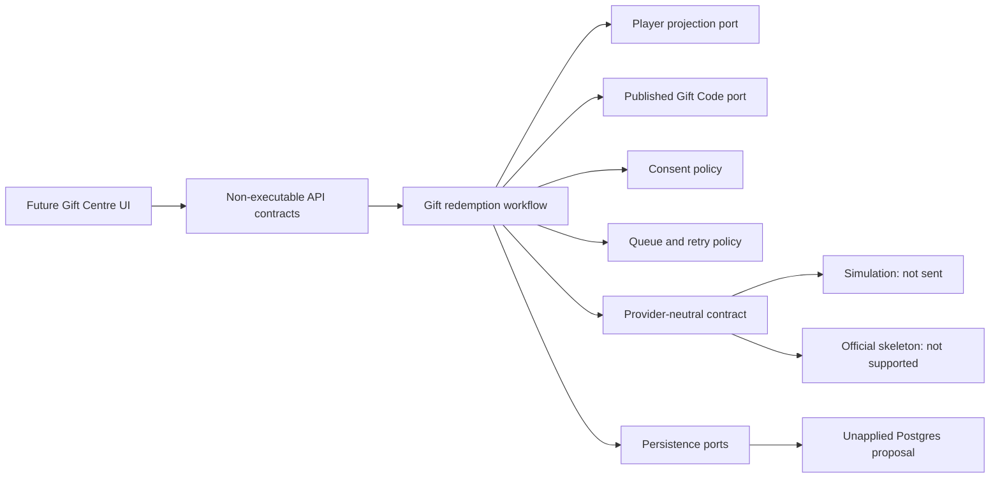
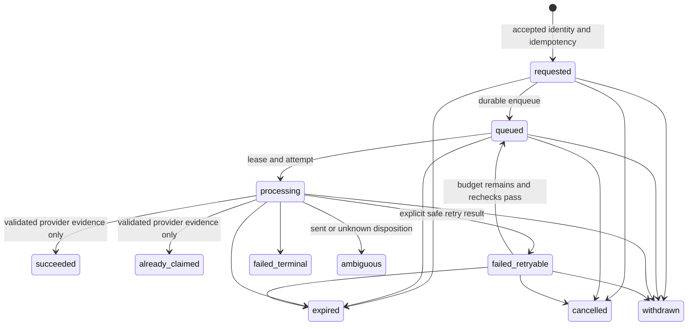
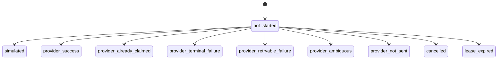
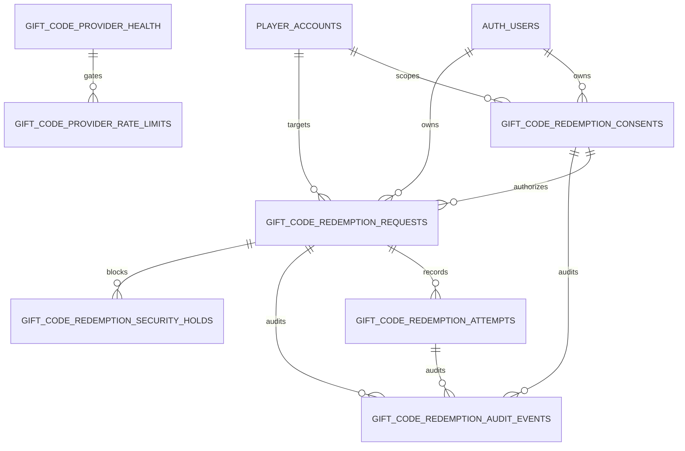

# Gift Redemption Workflow and Persistence Foundation

**Release:** 0.7.1

**Sprint:** 9.4

**Status:** implemented locally; architectural review required; migration
unapplied; provider and queue disabled

## 1. Boundary

Sprint 9.4 implements the local contracts needed to accept, classify, persist,
queue, inspect, and safely stop a future Gift Code redemption. It does not add
an executable API route, worker schedule, provider endpoint, provider transport,
signer, credential, cookie, production policy, or user interface.

The Sprint 9.3 provider registry, factory, Simulation Provider, and Official
Provider skeleton are preserved. The workflow sees providers only through
stable provider-neutral capabilities and normalized outcomes.

Dependency direction remains inward. Player and Editorial own their data and
logic. Gift Centre consumes purpose-limited projections and does not duplicate
either domain.

## 2. Workflow model

Request creation requires an authenticated actor, an authorized verified and
active character, current consent, a current published Gift Code version,
enabled feature/environment/provider policy, provider availability and health,
rate allowance, and no security hold.

The workflow returns stable result codes for expected decisions. Generic
exceptions are not used for business flow. Invalid or stale transitions return
`request_conflict`, `stale_version`, or the specific blocking code.

### Request lifecycle

Terminal states cannot transition. `ambiguous` is a preserved review state and
never becomes queued through an automatic, user, or support retry.

### Attempt lifecycle

An attempt has one finalize transition. Success and already-claimed require a
validated provider classification, not an HTTP status or evidence that bytes
were sent. Simulation requires `not_sent` and `simulation_only`.

## 3. Stable result codes and UI wording

`shared/domains/giftcodes/resultCodes.ts` is the stable domain taxonomy.
`GIFT_CODE_UI_SAFE_MESSAGES` is the separate UI-safe wording layer. Domain
codes may be persisted, audited, returned by APIs, and localized without
changing workflow decisions.

| Domain code | Safe wording intent |
| --- | --- |
| `authentication_required` | Sign in before continuing. |
| `character_not_verified` | Verify the selected Governor. |
| `consent_policy_mismatch` | Renew consent for the current policy. |
| `code_withdrawn` | The Gift Code is no longer available. |
| `provider_not_sent` | No redemption request was sent. |
| `provider_ambiguous` | Forge could not confirm the outcome; do not retry. |
| `simulation_only` | No redemption request was sent. |

Raw provider diagnostics never become UI wording.

## 4. Consent model

Consent is immutable except for one irreversible revocation transition. It is
bound to purpose `official_gift_code_redemption`, the authenticated Forge user,
verified internal character and Player revision, provider, environment, mode,
policy version/digest, timestamps, and allowlisted scalar evidence metadata.

Consent validity is deterministic. Revocation, expiry, user/character/provider/
mode/environment mismatch, policy mismatch, and digest mismatch all fail
closed with stable codes. Revocation blocks unsent work at queue selection and
again during the future pre-provider recheck.

No provider identity, credential, signature, cookie, payload, bearer value, or
raw Gift Code is consent evidence.

## 5. Eligibility model

`GiftCodeEligibilityService` composes injected ports. The client command may
contain only an opaque `characterRef` and publication reference. It cannot
contain or override a provider Player ID.

| Port | Authority |
| --- | --- |
| Actor | Existing Forge authentication |
| Player | Ownership, verification, active selection, internal identity revision, purpose-limited provider identity availability |
| Publication | Canonical publication identity/version and active/expired/withdrawn state |
| Consent | Current purpose-scoped grant |
| Feature policy | Product, environment, provider, and queue gates |
| Provider availability | Durable kill switch, capability, health, circuit |
| Rate limit | Admission and provider allowance |
| Security hold | User, character, request, publication, provider scope |

The service returns all safe actionable failures. It contains no React,
browser, Supabase client, Player implementation, Editorial implementation, or
provider transport dependency.

## 6. Idempotency design

Business identity version `giftcode-redemption:v2` contains, in fixed order:
environment, provider ID, operation `redeem`, verified internal character
identity, canonical Gift Code publication identity, and publication version.

Each field is UTF-8 byte-length-prefixed before joining. The server hashes the
canonical material with SHA-256. Persistence stores only the version and
64-character lowercase hash and protects the pair with a unique constraint.

The repository contract is insert-or-return-existing. A concurrent unique
constraint loser returns the winning request. Existing succeeded,
already-claimed, in-flight, terminal, and ambiguous identities do not create a
replacement request or attempt. HTTP idempotency remains a separate future
route-level replay control.

Neither raw Player IDs nor Gift Code text participates in logs or audit
metadata.

## 7. Queue claim model

The business request table is the durable queue. The pure claim contract uses
`queued` and safely `failed_retryable` states, ordering by `next_attempt_at`
then request ID, maximum batch size 10, 90-second default/120-second maximum
leases, optimistic versions, explicit worker identity, mutable rechecks,
provider health/circuit checks, backpressure, and a queue flag that defaults
off.

The unapplied schema includes the partial due-work index required by a future
short `FOR UPDATE SKIP LOCKED` transaction. It does not implement or execute a
claim function. A future worker must commit the claim before provider activity
and must never hold a database transaction during provider communication.

Expired leases recover only when the last disposition is `not_sent`. A `sent`
or `unknown` disposition becomes `ambiguous` and cannot retry.

## 8. Retry and ambiguity policies

Retry policy is deterministic and injected with a clock and jitter source:
three total attempts; 30/120-second base delays; plus or minus 20% bounded
jitter; provider delay as a minimum; and transport-level retry always false.
Only explicit retryable, `not_sent` results can retry.

Success, already claimed, terminal failure, invalid player/code, expired,
withdrawn, signing failure, authorisation failure, ambiguity, security hold,
cancelled request, and exhausted budget cannot automatically retry.

Ambiguity preserves request and attempt history, locks the business identity,
requires future reconciliation, allows only authorized redacted review, and
uses explicit unconfirmed wording. Support cannot reset it.

## 9. Database proposal

Migration:
`supabase/migrations/20260717133243_gift_code_redemption_workflow_foundation.sql`

The migration was created with Supabase CLI 2.109.1 and remains unapplied.

Entities are the requested consent, request-as-queue, attempt, audit, provider
health, provider rate-limit, and security-hold tables.

The deployed project has `player_accounts`, so Player references can be real
foreign keys without changing Player tables. The deployed project has no
canonical published Gift Code relation. Publication ID/version therefore
remain required immutable contract fields until Editorial lands the approved
projection; the migration deliberately creates no duplicate canonical content
table.

## 10. RLS and permissions

Every proposed table enables and forces RLS. All public, anonymous, and
authenticated table privileges are revoked before minimum column-level read
grants are restored for authenticated owners. No browser role receives insert,
update, delete, worker, provider-health mutation, rate-limit mutation, hold
mutation, or audit mutation privileges.

Owner policies use `(select auth.uid())` and indexed `user_id` columns. Service
role access is explicit but future services must still authenticate and check
actor/capability intent before a command. Support access must pass existing
Forge bearer authentication and server capabilities; RLS is defense in depth.

The database guards one-way consent revocation, request transitions and
optimistic versions, finalize-once attempts, append-only audit, attempt/lease/
retry/result/cancellation/expiry/withdrawal invariants, safe metadata, and
unique durable idempotency.

## 11. Safe projections

Security-invoker views expose only owner-safe consent status, request history,
request detail, attempt summary, current request status, and eligibility
context. TypeScript projection factories mirror those shapes.

They exclude provider identity values, Gift Code text, signing fields, cookies,
payloads, request headers, lease ownership, retry internals, rate-limit keys,
support notes, actor identities, and service metadata.

## 12. Server API contract

The route registry describes future context, eligibility, consent, request,
support, provider-health, kill-switch, redacted-inspection, and worker routes,
but sets `executable: false` for every contract. No file under `api/` imports or
activates it.

User and support routes require bearer authentication. Worker invocation uses a
separate internal boundary. Mutation contracts require idempotency, history
uses cursor pagination, and request bodies reject unknown and missing fields.
Safe response envelopes never contain provider endpoints or raw provider data.

## 13. Capability matrix

| Capability | Permitted | Never permitted |
| --- | --- | --- |
| Redemption access | Read owner-safe state; cancel unsent request | Change ownership, consent, result, or attempt |
| Provider operations | Read coarse health; invoke protected future worker | Bypass gates or call from browser |
| Security hold management | Place/release an audited hold | Rewrite request or audit history |
| Kill-switch management | Disable; approved role may later enable | Enable unapproved provider/environment |
| Redacted audit access | Read case-bound safe fields | Reveal provider identity, credentials, payloads, actor metadata |
| Bounded retry approval | Requeue `failed_retryable` within existing budget | Retry ambiguity, reset budget, forge success |

No capability exists to declare success, change Player ownership, bypass
consent/eligibility, alter immutable attempts, edit audit history, expose
credentials, or replace an ambiguous request.

## 14. Audit model

Sprint 9.3 events now include eligibility evaluation, request acceptance,
duplicate prevention, claim, provider-call planning/prevention, simulation,
classification, success, and ambiguity detection. Audit events require a
positive sequence and privacy classification.

Metadata remains sorted, scalar, immutable, and sensitive-key filtered.
Durable audit records contain opaque IDs and normalized codes only. Corrections
append; updates and deletes are blocked by the migration proposal. Events are
internal contracts only and are not externally published.

## 15. Retention, rollback, and sequencing

Starting points remain subject to Clark, Aegis, Privacy, Security, and Legal:
24 months for request/consent/audit evidence, 30 days for detailed attempt
diagnostics, 90 days for provider-health aggregates, and rate-window expiry plus
7 days for counters.

Rows include retention-ready timestamps, but the migration creates no deletion
job. Rollback disables product/provider/environment/queue gates and any future
schedule first. Additive tables and history remain. Destructive rollback is
prohibited without approved export, backup, retention, and verification.

Migration sequence is architecture review; Player/Editorial contract approval;
local SQL/RLS/grant review; Clark/Aegis approval to apply in isolation; schema
apply while all gates remain off; read-only projection verification;
simulation-only persistence; then separate worker/provider approval.

## 16. Remaining blockers

- No canonical published Gift Code database projection exists.
- Player ownership/revocation/active-character server contract is not yet
  landed for this workflow.
- Retention and consent-policy content are not approved.
- No provider-safe environment or synthetic provider identity/code set exists.
- Provider authorization, signing classification, credential ownership,
  session behavior, response mapping, and quotas remain unapproved.
- No migration apply, worker activation, executable API, provider transport,
  or UI implementation is approved by this sprint.

Clark and Aegis approval is required before applying the migration. Security,
Privacy, Player, Editorial, database, and operations owners remain approval
gates for their boundaries.
