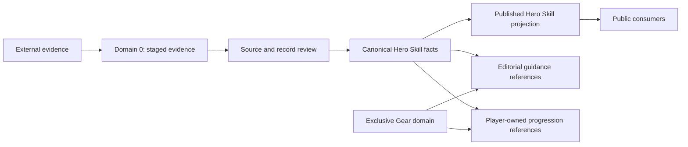
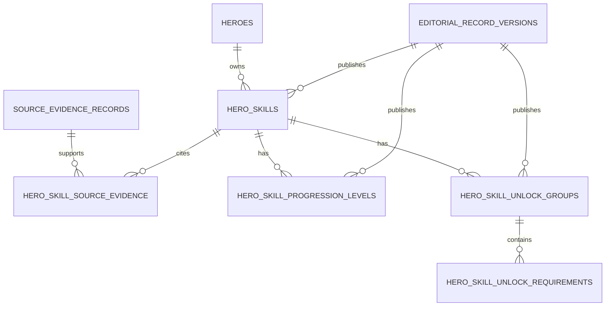

# Hero Skills Canonical Dataset Foundation

## Status and authority

Sprint 9.3 defines the governed target contract for Hero Skills. It is a local design and validation foundation, not a live dataset declaration. No source is approved, no staged fact is canonical, and the schema proposal is unapplied.

The TypeScript authority is `shared/domains/heroes/heroSkills.ts`. Source-evidence rules are shared through `shared/platform/source-evidence.ts`. Source acceptance is governed by `docs/governance/hero-skills-source-governance.md`.

## Domain boundaries



- Hero Skills own identity, Hero binding, canonical names, category, slot, description, structured progression, typed unlocks, source provenance, verification and withdrawal.
- Editorial owns subjective priority, upgrade order, best-use guidance, strengths, weaknesses, synergies and formations.
- Exclusive Gear owns Gear identity, progression and effects. A typed Hero Skill unlock may reference an Exclusive Gear identity without owning that fact.
- Player-owned progression references canonical identities and remains separate from canonical facts.

## Canonical Hero Skill contract

| Field | Requirement | Validation |
|---|---|---|
| `id` | Required | Deterministic UUID-v5 matching the immutable identity seed |
| `identitySeed` / `identityVersion` | Required | Version 1 seed; immutable after minting |
| `heroId` | Required | Canonical Hero UUID; immutable after minting |
| `variantKind` / `variantIndex` | Required | `base` or `awakening`; positive index |
| `name` | Required | Non-empty, at most 120 characters; never generated from a slot |
| `category` | Required | `conquest`, `expedition` or `talent`; never `exclusive_gear` |
| `slot` / `displayOrder` | Required | Positive integers; active Hero/category/slot/variant tuple is unique |
| `description` | Optional for draft, required for publication | Text or null; no generated description |
| `maxLevel` | Optional | Positive integer or null; does not create level rows |
| `progressionAvailability` | Required | `complete`, `partial`, `unavailable` or `unknown` |
| `progression` | Required | Array; complete means every level 1 through `maxLevel` is present |
| `unlockAvailability` | Required | `complete`, `partial`, `unavailable` or `unknown` |
| `unlocks` | Conditional | Required structured condition set when verified unlocks exist; otherwise null |
| `verificationState` | Required | `unreviewed`, `reviewed`, `verified`, `rejected` or `withdrawn` |
| `publicationEligibility` | Required, server calculated | `blocked`, `eligible` or `withdrawn`; cannot be eligible with blockers |
| `source` | Required | Stable source identity/version, digest, primary evidence ID and evidence IDs |
| `reviewedBy` / `reviewedAt` | Conditional | Required when verified; private operational metadata |
| `revision` | Required | Positive integer for optimistic concurrency |
| `publishedVersionId` / `publishedAt` | Conditional | Both present or both absent; immutable publication reference |
| `createdAt` / `updatedAt` | Required | Valid timestamps |
| `withdrawnAt` / `withdrawalReason` | Conditional | Reason required when withdrawn |

Canonical validation rejects editorial-only fields, missing names, invalid source digests, invalid categories, duplicate identities and unsafe publication eligibility.

## Stable identity

ADR-0003 proposes deterministic UUID-v5 identities minted only after identity and source approval. Names, translations, descriptions, current category and current slot can be corrected without changing the stored ID. Hero-binding mistakes require withdrawal and replacement. Staging UUIDs and database sequences are never canonical identity.

## Structured progression contract

Every source-backed level is a first-class child record:

| Field | Rule |
|---|---|
| `id` / `identitySeed` | Deterministic from canonical skill ID and level |
| `skillId` | Required canonical Hero Skill UUID |
| `level` | Positive and unique per active skill |
| `canonicalText` | Required trustworthy level text |
| `effects` | Zero or more structured effects; numeric extraction is optional |
| `effects[].semanticType` | Required when an effect is structured |
| `effects[].numericValue` | Finite numeric value |
| `effects[].unit` / `label` | Optional text |
| `sourceEvidenceId` | Required approved evidence reference before publication |
| `verificationState` | Must be verified for public projection |
| `displayOrder` | Positive, unique and ascending |
| withdrawal/revision/timestamps | Required lifecycle fields |

`maxLevel` is metadata, not a progression generator. `unknown` and `unavailable` progression contain no rows. `complete` progression contains every evidenced level from 1 through `maxLevel`; `partial` preserves known rows and leaves gaps absent.

## Typed unlock contract

Unlock requirements use `type`, `operator`, typed `value`, optional `relatedDomainId`, optional `displayFallback`, approved source evidence, verification state, ordering and withdrawal fields.

Supported types are Hero level, Hero star level, skill level, Widget level, Exclusive Gear level, awakening state and an explicitly evidenced `other` condition. Supported operators are equality, inequality, greater-than-or-equal, less-than-or-equal and membership. Type/operator/value combinations are validated; for example, awakening state is compared by equality or inequality rather than numerically.

Requirements are nested as:

```text
condition set (all|any)
  -> stable ordered groups (all|any)
      -> ordered typed requirements
```

This represents combinations without hiding business logic in display strings. `displayFallback` is presentation support only.

Unlock groups and requirements have separate deterministic identities. Group identity is based on canonical skill identity and mint-time group order; requirement identity additionally includes mint-time requirement order.

## Source evidence contract

The reusable source-evidence record captures stable identity, dataset, source key and origin, URL or authoritative origin, retrieval timestamp, SHA-256 digest, version, licensing decision, attribution, extraction method, reviewer, review state, private notes, supersession, withdrawal, revision and timestamps.

Only reviewed evidence with `approved` review and permitted-use decisions, reviewer/timestamp, attribution, current digest and no withdrawal or supersession may support canonical publication. The Verification Centre reports coverage and blockers; it does not approve evidence or duplicate evidence storage.

## Publication eligibility

The eventual server-side publication operation must reject a record when any of these conditions applies:

- missing canonical name or description;
- record not verified, withdrawn or missing reviewer identity;
- missing, unapproved, superseded or withdrawn primary evidence;
- evidence digest mismatch;
- unverified or withdrawn progression/unlock children;
- invalid canonical contract.

Browser-supplied eligibility is never authoritative.

The safe public projection additionally requires both the immutable editorial publication version and publication timestamp. Eligibility may be calculated before the atomic publication transaction creates that binding.

## Safe public projection

The public projection exposes only approved canonical fields, verified child facts, safe source name/URL/version/retrieval summary and immutable publication metadata. It excludes reviewer identities, evidence IDs and digests, evidence notes, licensing deliberations, staging IDs, identity seeds, editorial keys and recommendation fields.



The local projector in the shared contract enforces this privacy boundary with local fixtures. The SQL projection remains unapplied and the current runtime loader is unchanged.

## Editorial integration contract

Editorial guidance stores stable Hero Skill references plus its own immutable version, evidence/rationale, review state and publication lifecycle. It may provide skill priority, recommended upgrade order, best use, strengths/weaknesses, synergies and formations. It must never copy canonical names, descriptions, progression values or unlock facts as independently editable truth.

When a canonical fact changes, guidance becomes review-due when its referenced canonical publication version is no longer current. A withdrawn skill remains resolvable for history but is removed from new guidance publication and flagged for editorial correction. Guidance revisions use the existing Editorial Platform rather than changing the Hero Skill record.

## Existing-schema compatibility review

### Reusable

- `hero_skills.id`, Hero foreign key, name, category, type, description, icon, display order, slot, maximum level and active state;
- source name/URL/date/confidence as legacy migration inputs;
- published version, publisher and timestamp metadata;
- existing editorial heads, immutable versions, audit, permission and publication services;
- `published_hero_skills` as the public-only access boundary.

### Incompatible or deprecated

| Current representation | Finding / required change |
|---|---|
| random UUID default | Remove after safe backfill; mint governed deterministic IDs |
| `exclusive_gear` category | Remove from canonical Hero Skill vocabulary after compatibility work |
| unique active `(hero_id, slot_index)` | Conflicts with conquest and expedition slots; replace with category/variant-aware uniqueness |
| free-text progression effect in staging | Evidence only; review into first-class level rows, never direct copy |
| `max_level` without level rows | Insufficient; never synthesize levels or empty level markers |
| no unlock tables | Add typed grouped unlock requirements |
| source URL/name without digest/licensing decision | Add governed evidence records and relationships |
| staging UUIDs | Never reuse as canonical IDs |
| permissive public base-table policy | Remove only through approved migration; current live policy set is unsafe if rows are added |
| UI-derived upgrade priority | Editorial inference, not a canonical field; remove in later public UI milestone |
| current public view shape | Legacy loader-compatible only; coordinated loader/repository/type update required before proposal application |

The database currently contains zero canonical, editorial and published Hero Skill records, so no current canonical-row backfill is required today. The proposal still aborts when rows exist to avoid future silent data loss.

## Unapplied schema proposal and sequencing

`supabase/migrations/20260717130617_hero_skill_source_governance_foundation.sql` proposes evidence, progression and unlock tables; lifecycle and foreign-key checks; service-role mutation boundaries; public verified-only RLS; deterministic identity columns; revision fields; publication guards; and a private-safe public view.

It must not be applied until all of the following are approved and tested:

1. source governance and stable-ID ADR;
2. controlled non-production database plan;
3. source-evidence review operations and permissions;
4. publication-function update that writes parent and child rows atomically;
5. Admin editor/schema support for the target contract;
6. runtime loader, repository and public type compatibility;
7. regression tests proving draft isolation and public privacy;
8. forward rollback migration preserving evidence/history.

The existing `20260717170000_secure_atomic_editorial_publication.sql` proposal targets the legacy record shape and must be revised before either proposal is applied.

## Exclusive Gear correction plan

Affected surfaces are `src/types/heroSkill.ts`, `src/features/admin/recordEditor/heroSkillsRecordEditorSchema.ts`, Admin dataset adapters, `server/data-engine/loadCanonicalHeroSkillsDataset.ts`, `src/repositories/heroSkillRepository.ts`, `src/components/heroes/PublishedHeroSkills.tsx`, the live table constraint and public projection. Player-owned Exclusive Gear services remain in their existing domain.

Safe sequence:

1. approve this canonical vocabulary and inventory any live `exclusive_gear` rows;
2. define/migrate any actual Gear facts into the Exclusive Gear domain without copying unsupported content;
3. add compatible loaders/types for both domains;
4. update Admin options and publication mapping;
5. apply the category constraint only after zero incompatible rows is proven;
6. remove public category-specific inference and consume verified projection fields;
7. validate Admin, public Hero, Gear and player-progression regression paths.

No runtime type, component, loader, projection or production data was changed in Sprint 9.3.

## Remaining approvals

- accept or revise ADR-0003;
- approve exact source classes, versions, permitted use, attribution and reviewers;
- decide whether the staged Kingshot Guide evidence may enter review;
- approve the schema/publication compatibility plan and non-production test environment;
- approve the Exclusive Gear migration sequence;
- obtain complete, approved roster coverage before canonical population.
