# Kingshot Forge Player Domain Architecture

**Status:** Proposed — implementation-ready and awaiting Clark and Aegis approval
**Owner:** Player Domain; Clark as Product Owner; Aegis as Technical Architect
**Version:** 1.0
**Date:** 17 July 2026
**Last reviewed:** 17 July 2026
**Applies from:** Sprint 9.3 preparation
**Repository baseline:** `1aca694ebe2e57339e17ab85ab190ad762620b8b`

## 1. Purpose and authority

This document is the canonical architecture specification for Forge Player identity and every feature that depends on it. It converts the [Player Domain clean-room audit](./audits/PLAYER_DOMAIN_CLEAN_ROOM_AUDIT.md) into durable boundaries, lifecycle rules, server contracts, logical data design, security controls and an implementation sequence.

The Player Domain owns verified associations between Forge users and Kingshot characters, character-authored profile and progression data, Player-facing privacy controls, and the contracts through which Kingdom, Alliance, Transfer, Gift Centre, notification and Planning capabilities consume character identity. It does not own Supabase authentication, global Forge roles, canonical game facts, Kingdom or Alliance master records, editorial history, delivery-channel infrastructure or feature-specific Planning records.

### Authority and precedence

| Document | Relationship |
| --- | --- |
| [Project Constitution](./AEGIS.md) | This specification applies its server-authority, domain-boundary, immutable-history and canonical-data principles to the Player Domain. The constitution remains superior. |
| [Forge Blueprint](./FORGE_BLUEPRINT.md) | This specification makes the Player pillar implementation-ready and narrows the Player/Alliance/Operations boundaries. The Blueprint remains product direction. |
| [Canonical Content ADR](./ADR/ADR-001-canonical-content.md) | Complementary. Player-owned data references published canonical records and never creates an editable second source of game truth. |
| [Data-driven Dataset ADR](./architecture/adr/ADR-0002-data-driven-dataset-platform.md) | Complementary. Player services consume published datasets but do not join the editorial dataset platform. |
| [Sprint 9.1 Player release](./releases/0.7.0-sprint-9.1-player-domain.md) | Current-state evidence only. This specification supersedes any implication that linked identity is verified, the Player schema is reproducible, or current visibility is the target model. |
| [Sir Flux contribution review](./SIR_FLUX_CONTRIBUTION_REVIEW.md) | Historical product context only. Clark’s later clean-room licence decision, recorded below, supersedes any broader reuse language for the contributed planner. |
| [Player clean-room audit](./audits/PLAYER_DOMAIN_CLEAN_ROOM_AUDIT.md) | Evidence baseline. This specification supersedes its preliminary design recommendations where terminology differs. |

Future work on Player Profiles, linked characters, verification, multiple characters, Kingdom and Alliance membership, Alliance authority, Hero Collection, Hero Showcase, Transfer Hub, Gift Centre identity and consent, notifications, availability, rallies, formations, assignments, attendance, requisitions, KvK campaigns and War Room features must conform to this specification.

Changes to data ownership, identity semantics, verification trust, public contracts, permission boundaries, visibility scopes or audit retention require:

1. a written decision in section 28 or a new ADR;
2. Clark approval for product, privacy and public-exposure consequences;
3. Aegis approval for security, migration and operational consequences;
4. updates to this document and affected contracts before implementation;
5. a migration and compatibility plan where persisted or public behaviour changes.

### Clean-room licence rule

The contributed Kingshot KvK Planner is behavioural reference only. Forge must not copy, adapt, translate, port, redistribute or derive source code, schemas, migrations, comments, identifiers, names, API contracts, file structure or distinctive source-level workflows from it. The architecture, terminology and logical model in this document were derived independently from Forge, Clark’s requirements, the clean-room audit and general software-engineering principles.

## 2. Current-state summary

The full evidence remains in the [clean-room audit](./audits/PLAYER_DOMAIN_CLEAN_ROOM_AUDIT.md). The architectural findings that control this specification are:

- Player ID lookup proves that a character exists; it does not prove ownership.
- Linking stores a user-character assertion and must never be treated as verification.
- Current journeys query the primary row and therefore effectively support one character.
- Link, refresh, privacy, profile, progression, Hero and Transfer mutations currently occur directly from the browser.
- Public/private behaviour is fragmented across booleans and multi-query browser joins.
- Alliance authority relies on views, RPCs and RLS behaviour that checked-in Git history cannot reproduce.
- Significant Player, base Hero, Kingdom, Alliance and Transfer migrations are missing from the repository.
- Existing verification labels have no checked-in claim, evidence, decision, expiry, revocation, dispute or recovery model.
- Hero Showcase can select an unowned Hero and can partially fail or overwrite progression fields during replacement.
- Transfer Hub requires only a linked primary character, mixes public and sensitive data, and uses an unsafe public-route identity.
- Player Planning must not be implemented until schema recovery, server authority and verified character identity exist.

Current UI labels and TypeScript types are observations, not proof of database constraints, RLS safety or production capability.

## 3. Domain boundaries

No single `PlayerService` may accumulate these responsibilities. Each boundary has its own contracts and server orchestration. Dependencies point from UI to feature service to stable domain contract to repository, consistent with [Architecture Principles](../governance/ARCHITECTURE_PRINCIPLES.md).

| Domain | Responsibilities and owned data | Allowed dependencies | Prohibited dependencies | Public interface | Lifecycle owner | Audit owner |
| --- | --- | --- | --- | --- | --- | --- |
| Forge User Identity | Authenticate the Forge principal; resolve stable user ID and global Forge roles. Owns Auth association and user-level profile/preferences. | Supabase Auth, global permission platform | Game-character ownership claims; Alliance rank inference | Authenticated actor contract; user profile read contract | Identity platform | Platform security audit |
| Player Character Identity | Record an observed game character and a Forge user’s association with it; primary selection; link end. Owns character and link records. | Forge User Identity; approved character lookup adapter | Verification decisions; membership authority; canonical game editing | Character summary; link lifecycle; active-character context | Character Identity service | Player audit |
| Character Verification | Provider-neutral cases, challenges, evidence metadata, decisions, expiry, revocation, dispute and recovery. | User Identity; Character Identity; approved verifier adapters | Password/token collection; client-asserted verification; Alliance role grant | Verification status and case commands | Verification service and approved reviewer | Player security audit |
| Player Profile | User-authored presentation for one character and its visibility. | Verified/linked character context; visibility policy | Authentication data; canonical game facts; membership truth | Owner profile; safe public profile projection | Character owner | Player audit for material privacy changes |
| Character Progression | Time-based character progression records and visibility. | Character Identity; published canonical definitions where needed | Editing canonical progression facts; cross-character aggregation without consent | Owner history; safe shared projection | Character owner | Player audit for writes/privacy |
| Kingdom Membership | Evidence-backed character residency terms and history. Kingdom master data stays in Kingdom Domain. | Character Verification; Kingdom Domain | Treating lookup as proof; granting Alliance authority | Current/history summary; claim and review commands | Kingdom Domain with Player identity validation | Membership audit |
| Alliance Membership | Applications, current/former tenure and membership history. Alliance master data stays in Alliance Domain. | Verified character; Kingdom term; Alliance Domain | Global-role-derived leadership; client-authorised transitions | Application and tenure commands; roster projections | Alliance Domain | Alliance operational audit |
| Alliance Authority | Resource-scoped R1–R5 capability evaluation and support intervention. Owns rank terms and grants, not user identity. | Current Alliance tenure; global oversight policy | User-controlled role input; JWT user metadata; implicit admin leadership | Capability decision contract | Alliance Domain | Alliance security audit |
| Hero Collection | Character-owned Hero progression referencing published canonical Hero keys. | Character Identity; published Hero datasets | Canonical Hero mutation; Showcase ordering | Owner collection read/write | Character owner | Player audit for material changes |
| Hero Showcase | Ordered, shareable presentation of eligible owned Heroes. | Hero Collection; visibility policy | Progression mutation; unowned Hero references | Atomic replacement; safe projection | Character owner | Player audit |
| Transfer Profile | Character transfer intent, lifecycle, preferences and safe listing. | Verified character; Kingdom/Alliance history; Consent | Owning membership truth; public contact exposure by default | Owner listing commands; public safe projection | Character owner; Transfer Domain for policy | Transfer audit |
| Consent | Versioned, purpose-specific grants and withdrawals. | User Identity; Character Identity; consuming feature policy | Bundled or inferred consent; feature result storage | Consent query and command contract | Forge user | Privacy audit |
| Notifications | User preferences, character subscriptions, Alliance announcements and delivery records. | User Identity; membership events; feature events | Owning feature state; retaining membership access after revocation | Notification preference/subscription APIs | Notification platform | Delivery and privacy audit |
| Player Planning | Future operational periods, availability, rallies, formations, assignments, attendance, requisitions and projections. | Verified character; confirmed memberships; Alliance Authority; canonical datasets | Identity/verification mutation; canonical data duplication; public operational timing | Alliance-scoped Planning APIs | Planning/Operations Domain | Planning operational audit |

### Domain context diagram

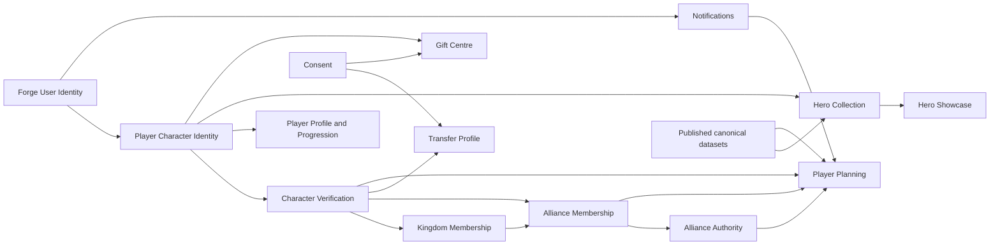

## 4. Canonical identity model

| Concept | Canonical meaning | Trust and permission consequence |
| --- | --- | --- |
| Authenticated Forge user | A server-validated Supabase Auth principal. | May access user-owned Forge data; proves no game-character ownership. |
| Forge profile | User-level display and preferences independent of any character. | Never grants character, Kingdom or Alliance rights. |
| Game character | A server-observed Kingshot character keyed internally and associated with a normalised external Player ID. | Existence only; public lookup is not ownership evidence. |
| Linked player character | A current association asserted by an authenticated Forge user. | Allows low-risk personal setup; cannot receive verified-only permissions. |
| Verified player character | A linked association with a current server-authoritative verification decision from an approved provider/reviewer. | Eligible for verified-only operations subject to membership and role checks. |
| Primary character | The user-selected default among current links. | A convenience default, not stronger ownership or permission. |
| Active character | The character explicitly resolved for the current request or UI context. | Every character-scoped mutation must resolve and authorise it server-side; it need not be primary. |
| Secondary character | Any current linked character that is not primary. | Has independent profile, privacy, memberships, Heroes, Transfer state and verification. |
| Public character identity | A server-built projection keyed by an opaque public alias. | Contains only approved public fields; never exposes internal user IDs or foreign keys. |
| Revoked character association | A current link whose previous verification was removed. | No verified-only permission; downstream access is invalidated immediately. |
| Disputed character association | A link under ownership conflict or material challenge. | High-risk operations freeze; review and recovery are required. |
| Former character association | An ended link retained for audit and history. | No current access; historical records remain attributable and visibility-constrained. |

Rules:

1. A player lookup only proves that the character exists.
2. Linking does not prove ownership.
3. A linked character cannot receive verified-only permissions.
4. Verification state is server authoritative and derived from current decisions, expiry and disputes.
5. A client must never self-assert verification, membership or Alliance rank.
6. One Forge user may manage multiple characters within a configurable policy limit.
7. A character must not be actively verified to more than one Forge user. A recovery/dispute process may create competing pending claims, but it must not create two concurrent effective verified associations.
8. External Player ID is sensitive account context. Public exposure requires a separate approval decision; the default public projection omits it.
9. Character observation data and ownership association are separate records so refreshes do not rewrite ownership history.

## 5. Identity lifecycle

### Canonical states

- `unlinked`: no current user-character link; may still have historical associations.
- `link_pending`: an authenticated link request is being validated.
- `linked_unverified`: association exists without effective ownership verification.
- `verification_pending`: an approved verification case is open.
- `verified`: a current effective decision proves ownership under an approved method.
- `verification_expired`: the prior decision has passed its approved validity period.
- `verification_revoked`: an authorised reviewer has removed the prior decision.
- `disputed`: ownership or integrity is contested and high-risk access is frozen.
- `reverification_pending`: a new case is evaluating an expired, revoked or disputed association.
- `former`: the association ended; history remains.

`verified_restored` is an audit action and decision outcome, not a long-lived state. It transitions a successful recovery or reverification case back to `verified` while preserving restoration provenance.

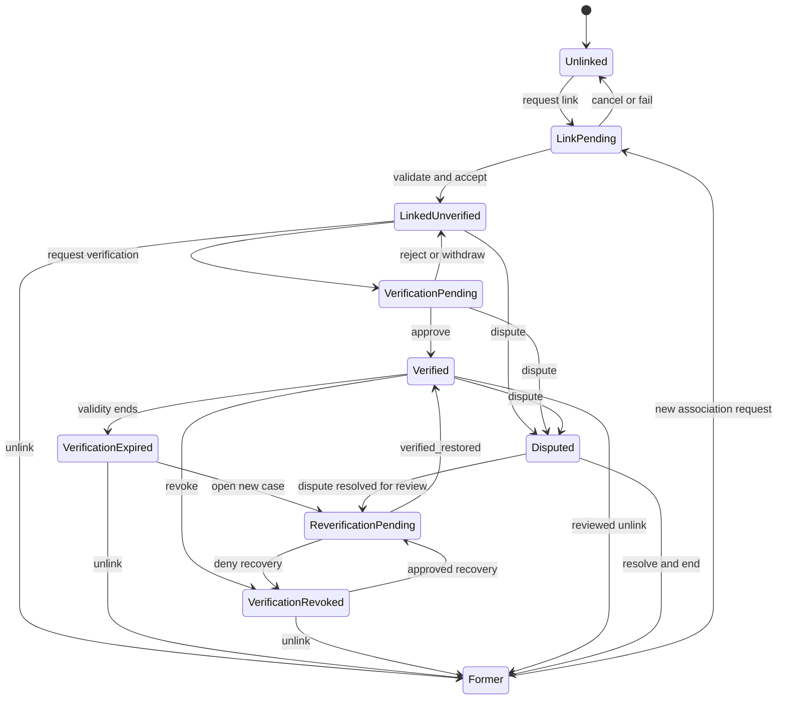

### Transition requirements

| Transition | Actor and server authorisation | Prerequisites and validation | Result, audit and notification | Failure states | Reversible |
| --- | --- | --- | --- | --- | --- |
| Unlinked → Link pending | Authenticated user; server resolves actor and rate limit. | Normalised Player ID; character lookup succeeds; within configurable link limit; no current link by actor; no conflicting effective verification. | Create idempotent request; audit `link_requested`; owner notification only if not completed synchronously. | Invalid ID, not found, rate limited, already linked, verified conflict, provider unavailable. | Yes, cancel before acceptance. |
| Link pending → Linked unverified | Character Identity service in one transaction. | Re-fetch/validate observation; unique active user-character pair; primary invariant; request still current. | Create/update character observation and association; default private; audit `link_accepted`; notify owner. | Concurrency conflict, limit reached, identity conflict, stale request. | Yes, via unlink; history retained. |
| Link pending → Unlinked | Requesting user or server timeout/failure policy. | Request is still pending and actor owns it, or server marks terminal failure. | Close request; audit `link_cancelled` or `link_failed`; notify for asynchronous failure. | Already accepted; actor mismatch. | New request may be created. |
| Linked unverified → Verification pending | Linked owner; server checks provider availability and policy. | Approved provider category; no active case; required acknowledgements; link not disputed. | Open case; audit `verification_requested`; notify owner and reviewer queue where applicable. | Provider disabled, duplicate case, unsupported proof, rate limit. | Owner may withdraw before decision. |
| Verification pending → Verified | Approved automated verifier or authorised reviewer; separation-of-duty policy applies. | Evidence belongs to case; challenge current; provider policy satisfied; no competing effective verification; decision reason recorded. | Append decision; set effective state; audit `verification_approved`; notify owner and affected competing claimant without disclosing evidence. | Insufficient/expired evidence, conflict, reviewer forbidden, stale case. | Yes, only through expiry, revocation or dispute; decision remains immutable. |
| Verification pending → Linked unverified | Owner withdraws or authorised verifier rejects. | Pending case; valid reason; no later decision. | Append withdrawal/rejection decision; audit; notify owner. | Stale case, actor forbidden. | A new case may be opened subject to policy. |
| Verified → Verification expired | Scheduled server policy or read-time state derivation. | Approved expiry instant reached; no newer decision. | Effective state becomes expired; audit once; invalidate verified-only access; notify owner before and at expiry where configured. | Duplicate expiry event is idempotent. | Yes, through reverification. |
| Verified → Verification revoked | Authorised verification reviewer or explicit emergency support intervention. | Recorded reason and evidence reference; actor cannot revoke own conflict without oversight; expected revision. | Append revocation; freeze verified-only access; audit high-sensitivity event; notify owner and affected feature owners. | Forbidden actor, stale decision, missing reason. | Only through approved recovery/reverification, never by deleting revocation. |
| Any active state → Disputed | Linked owner, competing claimant, moderator, verifier or risk service; server applies abuse controls. | Material dispute category; target association exists; duplicate dispute collapses idempotently. | Open dispute; freeze high-risk actions; audit; notify affected owners and review queue with minimal disclosure. | Unsupported complaint, rate limit, duplicate resolved claim. | Yes, through reviewed resolution. |
| Expired/revoked/disputed → Reverification pending | Owner after allowed waiting/recovery gate, or authorised reviewer. | Prior state permits recovery; open dispute resolution if applicable; approved provider; no active case. | Open recovery case linked to prior decision; audit; notify. | Recovery blocked, duplicate case, provider disabled. | May be withdrawn or denied. |
| Reverification pending → Verified restored → Verified | Approved verifier/reviewer. | New evidence meets current policy; conflict resolved; expected case revision. | Append immutable restored decision and `verified_restored` audit event; effective state `verified`; notify owner and dependent features. | Insufficient evidence, unresolved conflict, stale case. | Later expiry/revocation/dispute only. |
| Active association → Former | Owner for unverified/expired links; reviewed command for verified/disputed links; server enforces downstream checks. | No blocking operation; primary replacement chosen if required; retention notices acknowledged. | End association, revoke sessions/subscriptions scoped to it, retain history; audit `link_ended`; notify owner. | Last-primary rule unresolved, open transfer/planning action requiring closure, actor forbidden. | New link creates a new association term; old history is not reopened. |
| Former → Link pending | Authenticated user. | Normal link checks plus prior-history and conflict review. | New request references prior association where appropriate; audit. | Link limit, unresolved dispute, effective verification elsewhere. | Same as new request. |

## 6. Verification framework

Verification is provider-neutral. This architecture defines trust mechanics but does not approve a live-game ownership-proof mechanism.

### Verification records

| Record | Purpose | Rule |
| --- | --- | --- |
| Verification claim | States that one linked Forge user owns one character for a defined purpose. | One open case per association and verification purpose. |
| Challenge | Provider-generated, time-bounded action or prompt. | Stored without reusable secrets; expiry and attempt limits required. |
| Evidence | Metadata and protected evidence submitted or observed for the challenge. | Minimal collection; encrypted/private storage where needed; never public. |
| Verifier | Approved automated adapter or authorised reviewer identity. | Provider and reviewer capability are server configured, not user supplied. |
| Decision | Immutable approve, reject, expire, revoke or restore outcome with policy version and reason. | Effective status derives from the latest valid decision and open disputes. |
| Expiry | The point at which a positive decision ceases to grant verified permissions. | Policy is explicit and versioned. |
| Revocation | Authorised removal of a prior positive decision. | Requires reason, audit and downstream invalidation. |
| Dispute | Competing ownership or integrity challenge. | Freezes high-risk rights without deleting prior evidence. |
| Recovery | A controlled route to a new case after loss, revocation or dispute. | Never bypasses uniqueness or reviewer controls. |
| Audit record | Append-only explanation of every case transition and support action. | Separate from evidence; safe summaries only. |

### Future proof categories, not approvals

- official provider verification;
- a controlled, time-limited profile challenge;
- an authenticated external account with an approved identity contract;
- manually moderated evidence under a documented reviewer policy.

No category may be implemented until Clark and Aegis approve the provider, proof method, data collected, retention, expiry, abuse controls, failure modes, accessibility, legal basis, incident handling and test environment. A security review must confirm that the provider contract is documented and authorised.

### Prohibited verification material and behaviour

Forge must never request, store or transmit:

- game passwords;
- game session cookies;
- bearer tokens supplied by users;
- reverse-engineered authentication material;
- unsupported or evasive automation;
- reusable secrets collected by browser code.

The browser may collect a provider-approved challenge response but cannot decide its validity, set verification state or receive server credentials.

## 7. Multiple-character model

### Rules

1. The maximum number of current links is a server-side configuration value, not a database or UI constant.
2. Every user with at least one current link has exactly one primary association.
3. Primary is a convenience default. Every API request still names or resolves the active character.
4. Primary switching is a single transaction with optimistic concurrency and one audit event.
5. A secondary character has independent verification, privacy, profile, progression, Kingdom and Alliance terms, Hero Collection, Showcase, Transfer listing, consent and subscriptions.
6. Character switching must clear stale client caches and re-fetch an authoritative context token/response; client state alone cannot change scope.
7. Unlinking ends the association rather than deleting character or historical records.
8. Verified conflicts open a dispute; a second effective verified association is forbidden by a unique constraint and service policy.
9. A deleted Forge user follows approved account-deletion policy: user-level preferences may be deleted, associations end, personal content is deleted or pseudonymised, and protected audit history follows retention policy.

### Data ownership by subject

| Subject | Belongs to Forge user | Belongs to game character | Belongs to membership term | Belongs to time period |
| --- | --- | --- | --- | --- |
| Authentication, global role, quiet hours, channel preference | Yes | No | No | Optional effective dates |
| External Player ID and latest observed name/kingdom/level | No | Yes | No | Observation timestamp/history where material |
| Link, verification case and primary selection | Association between both | Association between both | No | Effective interval |
| Character profile, progression, Hero Collection, Showcase, Transfer listing | Authored/controlled by user | Yes | No | Progression/listing lifecycle where relevant |
| Kingdom residence and Alliance tenure | No | Yes | Yes | Effective interval |
| Alliance rank | No | Yes | Yes | Effective interval; never overwrite history |
| Availability, assignment, attendance and requisition | User supplies intent through character | Yes | Scoped by membership | Planning period/campaign |
| Consent | User grants | May be character-specific | May depend on membership | Policy version and effective interval |

### Primary transition

The command accepts the target association and expected user-character-set revision. The server locks or conditionally updates the user’s current association set, verifies the target is current, changes old and new primary flags atomically, increments the set revision, appends one audit event and returns the complete safe character list. A retry with the same idempotency key returns the prior result.

## 8. Kingdom membership lifecycle

Canonical terminology:

| State | Evidence | Visibility and edit authority | History | Planning access | Transfer representation |
| --- | --- | --- | --- | --- | --- |
| Unrecorded | None. | No membership projection. | No term. | None. | No assumption. |
| Observed | Dated external observation that reports a Kingdom. | Private by default; server/provider may refresh; owner cannot promote it. | Preserve material observations or provenance needed for decisions. | None. | A changed observation may trigger review but does not close a confirmed term by itself. |
| Claimed | Authenticated owner assertion for a linked character. | Owner and authorised reviewers; owner may withdraw. | Retain claim outcome. | None. | May propose destination/current change; no authority. |
| Confirmed current | Approved membership evidence under a versioned policy and a currently verified character. | Safe scope projection; transitions by approved verifier/reviewer only. | Immutable term start and supporting decision. | May satisfy the Kingdom prerequisite, but Alliance membership/role are still required. | Transfer closes the term at an effective time and creates a new observed/claimed term before confirmation. |
| Former | A confirmed or claimed term has ended. | Historical visibility is no broader than the term’s current policy or approved historical policy. | Retain interval and end reason. | None. | Provides transfer history without implying current residence. |
| Disputed | Evidence conflicts or the current term is challenged. | Restricted to owner and authorised review/support roles. | Preserve prior term and dispute events. | Suspended for high-risk Planning until resolved. | Transfer completion remains unconfirmed until resolution. |

An external player lookup never proves current Kingdom membership. At most it creates an `observed` fact. The policy that can confirm membership is a separate approval decision.

## 9. Alliance membership lifecycle

Alliance membership separates an application from a tenure and separates rank from tenure.

### Application lifecycle

`submitted` → `under_review` → `approved` or `rejected`; the owner may move `submitted` or `under_review` to `cancelled`. Approval creates a tenure in the same transaction; it does not make the application itself the current membership record.

### Tenure lifecycle

`current` → `departure_pending` → `former`, or `current` → `former` for permitted immediate self-leave, or `current` → `removed`. Any material conflict may open `disputed`; a justified restoration creates a new current tenure linked to the old one rather than rewriting it. Rank changes close the current rank term and create another.

### Rules

| Concern | Rule |
| --- | --- |
| Eligibility | A current verified character is required. The Alliance policy may also require confirmed Kingdom membership. |
| Kingdom match | Default policy requires the character’s confirmed current Kingdom to equal the Alliance Kingdom. Exceptions require an explicit transfer/recruitment policy and cannot silently grant operational access. |
| Duplicate membership | One current Alliance tenure per character. One open application per character by default; configurable future policy may allow more only if no operational ambiguity results. |
| Historical retention | Applications, decisions, tenures, removals and rank terms are append-only/effective-dated. Personal messages follow approved retention. |
| Approval | R4 or R5 capability by default; server re-checks eligibility in the approval transaction. |
| Role change | Close/open rank terms atomically; record actor, reason, old/new rank and policy version. R4 cannot grant R4/R5 unless separately approved; R5 succession has a dedicated guarded command. |
| Removal | R4 may remove ranks below its permitted ceiling; R5 may remove lower ranks; peer/leader removal requires a higher-risk succession or support process. |
| Self-leave | Immediate for ordinary members unless an approved operational lock requires `departure_pending`; no leader may abandon the final R5 role without succession. |
| Transfer | Confirmed Kingdom departure suspends or ends incompatible Alliance tenure according to Alliance policy; it never silently carries authority to another Alliance. |
| Dispute and restoration | Dispute freezes high-risk rights. Restoration creates new effective terms after authorised review. |

## 10. Alliance authority model

Alliance authority is a resource-scoped capability decision evaluated from the active character’s current verified association, current Alliance tenure, current rank term and resource scope. Global Forge roles do not automatically grant Alliance leadership. Client-side checks are presentation hints only. Every privileged action requires server enforcement, and role escalation through user-controlled input must be impossible.

### Role meanings

| Role | Meaning |
| --- | --- |
| Regular Alliance member | Confirmed Forge membership where no trusted R-rank has been assigned. Lowest privilege. |
| R1 | Base recognised Alliance rank; same management authority as a regular member unless policy grants a narrow feature capability. |
| R2 | Experienced member; may receive limited operational view/coordination capabilities. |
| R3 | Trusted operational member; may coordinate assigned work but not administer membership or senior roles. |
| R4 Alliance Management | Membership and operational manager within bounded delegation rules. |
| R5 Alliance Leader | Alliance-scoped leader and role/succession authority. |
| Forge Owner/Admin | Global platform oversight, schema/security operations and support-policy administration; no automatic Alliance leadership. |
| Moderator | Dispute/moderation review within explicit policy; no routine Alliance operations. |
| Emergency/support intervention | Time-bounded, reason-bound grant approved under support policy; every read/write is marked and audited. |

### Permission matrix

Legend: `Own` = own data only; `View` = scoped read; `Limited` = policy-bounded coordination; `Manage` = normal management; `Oversight` = read/diagnose under global duty; `Intervene` = explicit support grant and reason; `—` = no capability.

| Capability | Member | R1 | R2 | R3 | R4 | R5 | Owner/Admin | Moderator | Support grant |
| --- | --- | --- | --- | --- | --- | --- | --- | --- | --- |
| View safe roster | View | View | View | View | View | View | Oversight | View for case | Intervene |
| View private operational data | Own | Own | Limited | View | View | View | Oversight | Case-only | Intervene |
| Approve membership | — | — | — | — | Manage | Manage | — | — | Intervene |
| Reject membership | — | — | — | — | Manage | Manage | — | — | Intervene |
| Change Alliance roles | — | — | — | — | Limited below R4 | Manage below R5; guarded succession for R5 | — | — | Intervene |
| Remove members | — | — | — | — | Limited below R4 | Manage below R5 | — | — | Intervene |
| Manage availability definitions | Own response | Own response | Own response | Limited | Manage | Manage | — | — | Intervene |
| Create/close campaigns | — | — | — | Limited draft if delegated | Manage | Manage | — | — | Intervene |
| Assign players | — | — | — | Limited | Manage | Manage | — | — | Intervene |
| View formations | Own/assigned | Own/assigned | Assigned team | View if delegated | View | View | Oversight | Case-only | Intervene |
| Manage requisitions | Own request | Own request | Own request | Limited | Manage | Manage | — | — | Intervene |
| Issue announcements | — | — | — | Limited if delegated | Manage | Manage | — | Moderation-only | Intervene |
| View Alliance audit history | Own events | Own events | Own events | Limited operational | View | View | Oversight | Case-only | Intervene |

Capabilities are not encoded as rank comparisons alone. The server maps rank plus resource, action, delegation, membership state and policy version to a decision. Denials are safe by default. Rank data supplied in a request body is ignored except as a requested target for a guarded role-change command.

## 11. Unified visibility model

### Canonical scopes

| Scope | Audience |
| --- | --- |
| `public` | Anyone through a dedicated safe projection. |
| `kingdom` | Authenticated characters with confirmed current membership in the same Kingdom. |
| `alliance` | Authenticated characters with current membership in the same Alliance. |
| `leadership` | Characters with the required Alliance-scoped leadership capability. |
| `private` | The owning Forge user and authorised server processes. |
| `restricted` | Explicit Forge oversight/support roles under reason-bound policy; never a public or ordinary admin convenience scope. |

Visibility is an enum validated by entity-specific allowed values. It is not a collection of independent booleans. Authorisation also applies participant, ownership and support overlays; a scope alone never grants mutation rights.

### Entity visibility policy

| Entity | Default | Allowed scopes | Who may change | Inheritance and history | Public projection and identifier rule |
| --- | --- | --- | --- | --- | --- |
| Character identity | `private` | public, kingdom, alliance, private | Current linked owner; server constrains fields | Does not inherit profile visibility; historical observations keep original classification | Opaque public alias; approved name/avatar/Kingdom only; external Player ID deferred; no user/link IDs |
| Character profile | `private` | public, kingdom, alliance, private | Current linked owner | Child sections may narrow but not broaden parent without explicit save; audit visibility changes | One server projection; no internal IDs, verifier IDs or private notes |
| Progression record | `private` | public, kingdom, alliance, private | Current linked owner at creation or later audited change | Each immutable record retains its chosen scope; later narrowing affects projection, not historical audit | Only approved metrics and dates; no notes classified private |
| Hero Collection | `private` | kingdom, alliance, private | Current verified/link owner under policy | No automatic inheritance from profile | Public collection is not supported initially |
| Hero Showcase | `private` | public, kingdom, alliance, private | Current owner | Aggregate scope; slots inherit and cannot broaden it | Canonical Hero public key plus approved character progression fields only |
| Transfer listing | `private` | public, kingdom, alliance, leadership, private | Verified owner; server checks listing state and consent | Archived versions retain original classification for audit but leave active projections | Public listing omits contact/private notes/internal keys; opaque listing/public alias |
| Kingdom membership | `private` | public, kingdom, alliance, private | Confirmation policy controls; owner may only narrow display | Term records retain evidence classification; public current summary is separate | No evidence, actor or internal user IDs |
| Alliance membership | `alliance` | public, alliance, leadership, private | Owner may narrow personal display; Alliance policy controls roster minimum | Former terms do not remain publicly current; historical projection separately approved | Safe roster identity and rank only; no application/review data |
| Availability | `leadership` | alliance, leadership, private | Character for response; leader for event default | Responses may narrow; closed-period records retain classification | Never public or Kingdom-wide; participant sees own and assigned-team data only |
| Formations | `leadership` | alliance, leadership, private | Character for own formation; leader for shared plan | Assignment may grant specific participant access without broadening scope | Never public; canonical Hero keys only |
| Assignments | `alliance` | alliance, leadership, private | Authorised leader; participant controls response not scope | Participant access is explicit; history keeps original scope | Never public; avoid unnecessary Player ID |
| Requisitions | `leadership` | alliance, leadership, private | Requester for own request; leader for campaign default | Financial/spending notes may be forced private/restricted | Never public; aggregated projection must meet minimum group size |
| Notification preferences | `private` | private, restricted | Forge user only; support intervention cannot silently opt in | No inheritance from character/profile visibility | No public projection |

### Public projection model

All anonymous reads pass through a named server projection contract. The projection service:

1. resolves an opaque public alias;
2. loads only records whose effective scope is `public`;
3. applies status, expiry and dispute rules;
4. selects an explicit allowlist of fields;
5. removes internal user IDs, association IDs, membership foreign keys, verifier data, consent evidence, contact details and audit metadata;
6. returns `404` for absent and non-public resources to reduce enumeration;
7. applies cache, rate-limit and abuse policy;
8. records security telemetry without logging sensitive payloads.

Database views used for public projection must be reviewed for invoker security, explicit grants and RLS behaviour. Public clients must not join raw Player tables.

## 12. Server and client responsibility

| Concern | Server responsibility | Client responsibility |
| --- | --- | --- |
| Authentication | Validate bearer token, resolve current user and session, reject expired/revoked sessions for sensitive actions. | Send the current access token and render sign-in/session-expiry outcomes. |
| Actor resolution | Resolve user, global oversight role, active character and support grant from server data. | Select intended character and send its opaque owner-facing identifier. |
| Authorisation | Evaluate ownership, verification, membership, Alliance capability, visibility and support policy. | Show non-authoritative hints and explain denials. |
| Ownership | Enforce current user-character link and effective verification where required. | Never assert `user_id`, owner or verification state. |
| Verification | Create cases, validate provider responses, derive effective status, enforce expiry/revocation/dispute. | Collect approved user intent/evidence and render authoritative outcomes. |
| Membership invariants | Enforce current-term uniqueness, Kingdom match, application rules and rank ceilings. | Submit requests and confirmations; do not infer eligibility from cached lists. |
| Role escalation | Ignore actor/rank claims in the body; calculate capability and permitted target rank. | Offer only allowed choices as a convenience. |
| Validation | Parse `unknown` input, apply domain and canonical-dataset constraints, reject unknown fields. | Provide labels, ranges and local assistance without replacing server validation. |
| Concurrency | Require expected revision, use constraints/transactions and return current revision on conflict. | Send the last observed revision and refresh/reconcile on `409`. |
| Idempotency | Persist or derive idempotent outcomes for create/transition commands. | Generate and retain a key for retryable user intent. |
| Audit | Append actor, action, resource, reason and safe before/after summary in the same transaction. | May display owner-safe audit; cannot write audit rows. |
| Projection | Apply visibility, field allowlists, expiry and identifier rules. | Render the returned projection without secondary raw-table joins. |
| Sensitive data | Redact provider evidence, internal identifiers, support metadata and contact details. | Avoid storing sensitive responses in local storage or analytics. |

### Direct browser writes to retire

The following current operations must move behind authenticated server APIs before their milestone is considered safe:

- `profiles` display-name and self-reported Alliance updates where they interact with Player identity;
- character link creation, external-data refresh, privacy change and unlink;
- `player_profiles` create/update;
- progression snapshot creation and visibility change;
- `player_heroes` and Hero child-table create/update/delete;
- Hero Showcase clear and replacement;
- `transfer_profiles` create/update/delete;
- direct membership view reads that expose sensitive fields;
- client-invoked Alliance membership RPC transitions.

Low-risk public reads may use a reviewed Data API projection where grants, RLS and invoker semantics are reproducible and tested. Privileged mutations still pass through Forge server services. Service credentials remain server-only. RLS and least-privilege grants remain defence in depth even when a Vercel API is the primary boundary.

## 13. API architecture

### Conventions

- Vercel routes live under `/api` and delegate immediately to a domain service; transport files contain no business policy.
- `/api/player/me/...` resolves the authenticated Forge user. A body cannot select another Forge user.
- `/api/player/public/...` returns only safe projections and uses opaque public aliases.
- `/api/alliances/{allianceId}/...` is resource-scoped and requires a current character/tenure context where authenticated.
- `/api/player-support/...` requires explicit global capability and, for intervention, a time-bounded support grant with reason.
- Owner-facing identifiers are opaque Forge IDs. External Player IDs appear only where the contract explicitly allows them.
- JSON success envelope: `{ status: "success", data: T, meta: { requestId, revision? } }`.
- JSON error envelope: `{ status: "error", error: { code, message, requestId, retryable, details? } }`.
- Unknown request fields are rejected for mutations. Timestamps are UTC ISO-8601. Lists are cursor-paginated.
- Create and state-transition commands use an `Idempotency-Key` header. Mutable aggregate updates carry `expectedRevision` or an equivalent `If-Match` value.

Shape notation below is descriptive, not implementation code. `CharacterRef` is an owner-facing opaque character identifier; `PublicAlias` is a public opaque route identifier.

### Public and authenticated Player reads

| Method and route | Purpose; authentication; permission; scope | Request → response | Validation and errors | Concurrency, idempotency and audit | Sensitive-data behaviour |
| --- | --- | --- | --- | --- | --- |
| `GET /api/player/public/characters/{publicAlias}` | Public character/profile projection; anonymous; effective `public` scope. | Path `PublicAlias` → `PublicCharacterProfile`. | Alias format; not-public returns `PLAYER_CHARACTER_NOT_FOUND`; rate limits. | Cache validator; no idempotency; security telemetry only. | Explicit allowlist; no user/link IDs, verifier data, contact, private notes or Player ID by default. |
| `GET /api/player/public/characters/{publicAlias}/progression` | Shared progression; anonymous; public records for same alias. | Cursor, limit → page of `PublicProgressionRecord`. | Bounded limit; invalid cursor; hidden parent is `404`. | Immutable record cursor; cache validator. | Omits private notes and internal character key. |
| `GET /api/player/public/characters/{publicAlias}/showcase` | Public Hero Showcase. | Alias → ordered `PublicShowcase`. | Profile/showcase public; canonical Hero key active. | Cache by Showcase revision; no audit. | No owner/user IDs; only approved progression fields. |
| `GET /api/player/public/transfers` | Search active public Transfer listings. | Safe filters, cursor, limit → page of `PublicTransferCard`. | Allowlisted filters; listed/not-expired only; rate limits. | Read model cursor; no mutation audit. | No Discord/contact/private notes, user IDs or membership FKs. |
| `GET /api/player/public/transfers/{publicAlias}` | One safe Transfer listing. | Listing alias → `PublicTransferDetail`. | Effective listed state and consent; otherwise `404`. | Cache by listing revision. | Contact requires a separate authorised flow; no raw internal identifiers. |
| `GET /api/player/me/context` | Resolve actor, character list, active/primary context and safe capability hints; authenticated; self. | Optional `characterRef` → `PlayerContext`. | Current link required for named character. | Returns character-set and resource revisions; read audit only for support use. | Owner-safe; no verification evidence or hidden support flags. |
| `GET /api/player/me/characters` | List current and optionally former associations; authenticated; self. | `includeFormer`, cursor → `CharacterAssociationSummary[]`. | Boolean/cursor validation. | Stable cursor; no audit. | Former associations are owner-only; no other claimant data. |
| `GET /api/player/me/characters/{characterRef}` | Full owner-safe character context. | CharacterRef → observation, link, verification summary and allowed actions. | Ownership enforced; not found is `404`. | Returns revision values. | Evidence and internal reviewer identifiers omitted. |
| `GET /api/player/me/characters/{characterRef}/audit` | Owner-safe history; authenticated; owner. | Filters/cursor → redacted audit page. | Allowlisted action/time filters. | Append-only cursor. | Support notes, evidence and other actors are redacted. |

### Character and profile mutations

| Method and route | Purpose; authentication; permission; scope | Request → response | Validation and errors | Concurrency, idempotency and audit | Sensitive-data behaviour |
| --- | --- | --- | --- | --- | --- |
| `POST /api/player/me/link-requests` | Link a character; authenticated; self. | `{ playerId, makePrimary? }` → accepted association or pending request. | Numeric/length normalisation, lookup, link limit, uniqueness; not found/already linked/conflict/rate errors. | Transaction plus unique constraints; idempotency required; audit request and outcome. | Player ID is owner-only and redacted from logs. |
| `DELETE /api/player/me/link-requests/{requestId}` | Cancel pending link. | `expectedRevision` → terminal request. | Actor owns pending request; invalid transition otherwise. | Conditional update; idempotent cancellation; audit. | No claimant details returned. |
| `POST /api/player/me/characters/{characterRef}/refresh` | Refresh server-observed public character facts. | `{ expectedRevision }` → refreshed safe observation. | Link ownership, refresh rate, approved provider, response schema. | Provider call outside short write transaction; idempotency recommended; audit changed material fields. | Raw provider payload never returned or logged. |
| `PUT /api/player/me/characters/{characterRef}/primary` | Switch primary. | `{ expectedSetRevision }` → complete character summary. | Target current; exactly-one-primary invariant. | Transaction; idempotency required; unique constraint; audit old/new primary. | No additional exposure. |
| `DELETE /api/player/me/characters/{characterRef}/link` | End association. | `{ expectedRevision, reason, successorPrimary? }` → former summary. | State-specific unlink policy, successor, open dispute/operation checks. | Transaction; idempotency required; append history and audit. | Audit retained; dependent subscriptions invalidated. |
| `GET /api/player/me/characters/{characterRef}/profile` | Owner profile read. | CharacterRef → editable profile and revision. | Current link ownership. | Read revision. | Owner-safe fields only. |
| `PUT /api/player/me/characters/{characterRef}/profile` | Replace character profile and visibility. | `{ expectedRevision, visibility, fields }` → saved profile. | Field lengths, vocabularies, visibility allowed; no membership assertions. | Optimistic update; idempotency optional for exact replacement; audit material/privacy change. | Self-reported text is untrusted; no HTML; no internal IDs. |
| `POST /api/player/me/characters/{characterRef}/progression` | Add immutable progression record. | `{ metrics, notes?, visibility }` → created record. | Canonical ranges/policy version; consistent VIP rule; character ownership. | Insert transaction; idempotency required; unique request key; audit. | Notes private unless explicitly supported by projection policy. |
| `PUT /api/player/me/characters/{characterRef}/progression/{recordId}/visibility` | Change projection scope without rewriting metrics. | `{ expectedRevision, visibility }` → updated projection metadata. | Owner, allowed scope. | Optimistic update and audit; metric row/history immutable. | Narrowing removes it from caches/projections promptly. |

### Verification APIs

| Method and route | Purpose; authentication; permission; scope | Request → response | Validation and errors | Concurrency, idempotency and audit | Sensitive-data behaviour |
| --- | --- | --- | --- | --- | --- |
| `POST /api/player/me/characters/{characterRef}/verification-cases` | Open an approved provider-neutral case; linked owner. | `{ providerCategory, acknowledgements, purpose }` → case/challenge summary. | Provider approved/enabled, no open case, link eligible. | Transaction; idempotency required; unique open-case constraint; audit/notify. | No server secret or reusable credential reaches client. |
| `GET /api/player/me/verification-cases/{caseId}` | Owner-safe case state. | Case ID → status, expiry, required next action. | Actor owns association. | Revision returned. | Evidence bodies and reviewer identities redacted. |
| `POST /api/player/me/verification-cases/{caseId}/submissions` | Submit an approved challenge response/evidence reference. | Provider-defined safe payload plus `expectedRevision` → pending result. | Strict provider schema, size/type limits, challenge current, malware/content checks where relevant. | Idempotency required; append submission; audit. | Protected storage; no secrets in response/logs. |
| `POST /api/player/me/characters/{characterRef}/disputes` | Open ownership/integrity dispute. | `{ category, safeStatement }` → dispute summary. | Linked/former relevance, abuse limits, category allowlist. | Idempotent duplicate; transaction freezes high-risk rights; audit/notify. | Other claimant and evidence details withheld. |
| `POST /api/player-support/verification-cases/{caseId}/decisions` | Approve/reject/restore; approved verifier/reviewer capability. | `{ expectedRevision, outcome, policyVersion, reason, evidenceRefs }` → decision/effective status. | Separation of duty, evidence/case validity, verified uniqueness. | Required transaction, idempotency and immutable decision/audit; notify. | Restricted endpoint; safe summaries only outside review role. |
| `POST /api/player-support/characters/{characterRef}/revocations` | Revoke effective verification. | `{ expectedRevision, reason, evidenceRefs }` → revoked status. | High-risk capability/support grant, non-empty reason, current verified decision. | Transaction; idempotency; append-only revocation/audit; downstream invalidation. | Restricted; never returns evidence to ordinary admin/UI. |

Actual submission shapes remain undefined until a provider and proof method are separately approved.

### Kingdom and Alliance membership APIs

| Method and route | Purpose; authentication; permission; scope | Request → response | Validation and errors | Concurrency, idempotency and audit | Sensitive-data behaviour |
| --- | --- | --- | --- | --- | --- |
| `GET /api/player/me/characters/{characterRef}/kingdom-terms` | Owner membership history. | Cursor → term summaries. | Linked/former owner. | Effective-dated cursor. | Evidence/reviewer details omitted. |
| `POST /api/player/me/characters/{characterRef}/kingdom-claims` | Claim current Kingdom. | `{ kingdomPublicKey, statement, expectedRevision }` → claim. | Linked character, Kingdom exists, no conflicting open claim. | Idempotency required; unique open claim; audit. | Claim statement restricted. |
| `POST /api/player-support/kingdom-claims/{claimId}/decisions` | Confirm/reject/dispute claim. | `{ outcome, policyVersion, reason, expectedRevision }` → term/decision. | Approved verifier capability/evidence policy; verified character for confirmation. | Transaction, idempotency, term uniqueness, audit/notify. | Restricted evidence. |
| `POST /api/alliances/{allianceId}/applications` | Apply with active character. | `{ characterRef, message?, expectedCharacterRevision }` → application. | Verified current character, Kingdom policy, recruitment/open-request/current-tenure rules. | Transaction; idempotency; unique open application; audit/notify leaders. | Message leadership-only; no user ID. |
| `DELETE /api/alliances/{allianceId}/applications/{applicationId}` | Cancel own application. | `{ expectedRevision }` → cancelled application. | Applicant ownership and cancellable state. | Conditional/idempotent transition; audit/notify. | Safe summary only. |
| `GET /api/alliances/{allianceId}/applications` | Leadership queue. | Status/cursor filters → safe application page. | Current Alliance capability `membership.review`. | Stable cursor; leadership read telemetry. | Minimal character/application fields; no unrelated profile data. |
| `POST /api/alliances/{allianceId}/applications/{applicationId}/decision` | Approve/reject. | `{ outcome, initialRank?, reason, expectedRevision }` → application and optional tenure. | R4/R5 capability, rank ceiling, eligibility re-check, Kingdom/current-tenure rules. | Required transaction; idempotency; unique current tenure; audit/notify. | Request body cannot supply actor/alliance; notes restricted. |
| `POST /api/alliances/{allianceId}/memberships/{tenureId}/leave` | Self-leave/request departure. | `{ mode, expectedRevision, reason? }` → former/departure-pending term. | Active character owns tenure; leader succession/operational lock checks. | Transaction; idempotency; close rank terms; audit/notify. | Reason visibility restricted. |
| `POST /api/alliances/{allianceId}/memberships/{tenureId}/removal` | Leadership removal. | `{ expectedRevision, reason }` → removed term. | Capability, target rank ceiling, no self-escalation/succession bypass. | Transaction; idempotency; audit/notify; invalidate access. | Reason member/leadership-safe by policy. |
| `PUT /api/alliances/{allianceId}/memberships/{tenureId}/rank` | Change rank. | `{ targetRank, expectedRevision, reason }` → new rank term. | Capability and target ceiling; R5 succession dedicated gate. | Required transaction; idempotency; one current rank term; audit/notify. | Never trusts caller-supplied current rank. |
| `POST /api/alliances/{allianceId}/memberships/{tenureId}/restore` | Justified restoration after dispute/removal. | `{ expectedRevision, reason, targetRank }` → new tenure/rank term. | R5 or explicit support intervention; eligibility and uniqueness re-check. | Transaction; idempotency; old term remains immutable; audit/notify. | Support marker and reason restricted. |

### Hero, Transfer and consent APIs

| Method and route | Purpose; authentication; permission; scope | Request → response | Validation and errors | Concurrency, idempotency and audit | Sensitive-data behaviour |
| --- | --- | --- | --- | --- | --- |
| `GET /api/player/me/characters/{characterRef}/heroes` | Owner Hero Collection. | Filters/cursor → collection page. | Current link owner; published Hero references. | Revision/cursor. | No cross-character data. |
| `PUT /api/player/me/characters/{characterRef}/heroes/{heroKey}` | Replace one character-owned Hero progression aggregate. | `{ expectedRevision, owned, progression, notes? }` → saved aggregate. | Canonical Hero active/key; ranges; child refs belong to Hero definition. | Required transaction across children; exact replacement idempotent; audit material change. | Notes private; canonical facts not accepted in body. |
| `DELETE /api/player/me/characters/{characterRef}/heroes/{heroKey}` | Remove/archive owned Hero state. | `{ expectedRevision, confirmation }` → removal outcome. | Owner, Showcase rule, retention policy. | Transaction removes slots/archives aggregate; idempotency; audit. | No public remnants after projection invalidation. |
| `PUT /api/player/me/characters/{characterRef}/showcase` | Atomic ordered Showcase replacement. | `{ expectedRevision, visibility, heroKeys[] }` → complete Showcase. | Distinct eligible owned Heroes; 0–6; valid order. | Required transaction; idempotent replacement; unique positions; one audit event. | Returns presentation fields only; cannot mutate progression. |
| `GET /api/player/me/characters/{characterRef}/transfer-listing` | Owner Transfer state. | CharacterRef → listing, contact policy, revision. | Verified owner. | Revision. | Owner-safe full fields; no support metadata. |
| `PUT /api/player/me/characters/{characterRef}/transfer-listing` | Create/replace listing. | `{ expectedRevision?, status, visibility, preferences, dates, messages }` → listing. | Verified, current membership references, date/status/contact/visibility policy. | Transaction; idempotency; optimistic revision; audit/notify. | Private notes/contact stored separately or projected separately. |
| `DELETE /api/player/me/characters/{characterRef}/transfer-listing` | Withdraw/archive listing. | `{ expectedRevision, reason }` → archived summary. | Owner and valid state. | Idempotent terminal transition; audit and cache invalidation. | History retained per policy; public projection removed. |
| `GET /api/player/me/characters/{characterRef}/consents` | Owner consent summary. | Optional purpose filter → current grants. | Linked owner. | Effective records. | Evidence metadata minimised. |
| `PUT /api/player/me/characters/{characterRef}/consents/{purpose}` | Grant/withdraw exact purpose/version. | `{ enabled, documentVersion, acknowledgement, expectedRevision }` → consent state. | Supported purpose/version; verified requirement if feature demands it. | Transaction; idempotency required; append new consent term/audit; withdrawal immediate. | Never returns hidden evidence or feature credentials. |

### Future Planning and support APIs

These are boundary reservations, not implemented contracts. Detailed shapes require the relevant milestone decision.

| Method and route | Purpose; authentication; permission; scope | Request → response | Validation and errors | Concurrency, idempotency and audit | Sensitive-data behaviour |
| --- | --- | --- | --- | --- | --- |
| `POST /api/alliances/{allianceId}/planning-periods` | Create operational period; R4/R5 or delegated R3; Alliance. | Identity, dates, canonical event ref → period. | Current verified membership, capability, date overlap policy. | Transaction/idempotency/audit. | No public projection. |
| `PUT /api/alliances/{allianceId}/planning-periods/{periodId}/availability/{characterRef}` | Submit own availability or authorised proxy correction. | Windows/segments, revision → response. | Participant membership and period state; proxy reason/capability. | Optimistic replacement/idempotency/audit. | Leadership/participant projection only. |
| `POST /api/alliances/{allianceId}/planning-periods/{periodId}/rallies` | Create rally. | Time/objective/leader → rally. | Capability, server time, eligible leader. | Transaction/idempotency/audit. | Operational timing never public. |
| `PUT /api/alliances/{allianceId}/planning-periods/{periodId}/formations/{formationId}` | Save character/team formation. | Canonical keys/positions/revision → formation. | Ownership/delegation and Hero eligibility. | Transaction/optimistic concurrency/audit. | Scoped participant/leadership view. |
| `POST /api/alliances/{allianceId}/planning-periods/{periodId}/assignments` | Assign eligible characters. | Target/resource/role → assignment. | Capability, current membership, no conflicting exclusive assignment. | Transaction/idempotency/audit/notify. | Assigned participant and leadership only as policy requires. |
| `PUT /api/alliances/{allianceId}/planning-periods/{periodId}/attendance/{characterRef}` | Declare/record attendance. | Intent or outcome/revision → attendance. | Self vs leader action separated. | Optimistic update; outcome append/audit. | Operational/private; no public history. |
| `POST /api/alliances/{allianceId}/planning-periods/{periodId}/requisitions` | Submit request or leadership target. | Resource/amount/note → requisition. | Membership, canonical resource key, limits. | Transaction/idempotency/audit. | Sensitive notes and spending patterns restricted. |
| `GET /api/alliances/{allianceId}/planning-periods/{periodId}/war-room` | Authorised readiness projection. | Filters → derived summary with as-of/revision. | Leadership capability; projection policy. | Read model version; access telemetry. | Aggregation thresholds and field minimisation. |
| `GET /api/player-support/audit` | Search restricted Player audit. | Resource/action/time/correlation filters → page. | Global audit capability or case-bound support grant. | Append-only cursor; access itself audited. | Restricted fields; no raw evidence/secrets. |
| `POST /api/player-support/interventions` | Open/close time-bounded support access. | Scope, capability, reason, expiry, approval reference → grant. | Dual approval for high-risk scopes; no self-approval. | Transaction/idempotency/audit/notify affected owner where policy permits. | Grant is restricted; all use carries support marker. |

## 14. Error model

Expected workflow failures use stable codes and never fall through to a generic `500`.

| Code | HTTP | Meaning and client action |
| --- | --- | --- |
| `PLAYER_AUTH_REQUIRED` | 401 | Missing, invalid or expired session; sign in or refresh session. |
| `PLAYER_ACTION_FORBIDDEN` | 403 | Authenticated actor lacks ownership or capability; do not retry unchanged. |
| `PLAYER_CHARACTER_NOT_FOUND` | 404 | Character/resource absent or intentionally hidden. |
| `PLAYER_CHARACTER_ALREADY_LINKED` | 409 | Current association already exists or Player ID conflicts; show conflict/recovery path. |
| `PLAYER_OWNERSHIP_UNVERIFIED` | 403 | Action requires effective verification; offer approved verification journey. |
| `PLAYER_VERIFICATION_PENDING` | 409 | Case already open; show current case. |
| `PLAYER_VERIFICATION_EXPIRED` | 403 | Positive decision expired; offer reverification. |
| `PLAYER_VERIFICATION_REVOKED` | 403 | Positive decision was revoked; show the approved recovery route if available. |
| `PLAYER_VERIFICATION_DISPUTED` | 423 | High-risk action frozen pending dispute resolution. |
| `PLAYER_MEMBERSHIP_CONFLICT` | 409 | Current/open membership invariant would be violated. |
| `PLAYER_KINGDOM_MISMATCH` | 422 | Character does not meet Alliance Kingdom policy. |
| `PLAYER_ALLIANCE_ROLE_INSUFFICIENT` | 403 | Resource-scoped Alliance capability denied. |
| `PLAYER_CONCURRENCY_CONFLICT` | 409 | Expected revision is stale; response includes safe current revision. |
| `PLAYER_INVALID_TRANSITION` | 409 | Lifecycle transition is not allowed from current state. |
| `PLAYER_VALIDATION_FAILED` | 422 | Well-formed request violates field/domain rules; safe field errors supplied. |
| `PLAYER_REQUEST_MALFORMED` | 400 | Invalid JSON, unsupported field or missing structural input. |
| `PLAYER_RATE_LIMITED` | 429 | Rate limit reached; include safe `Retry-After`. |
| `PLAYER_PROVIDER_UNAVAILABLE` | 503 | Approved external provider unavailable; retry policy applies. |
| `PLAYER_IDEMPOTENCY_CONFLICT` | 409 | Same idempotency key was reused with different intent. |
| `PLAYER_SUPPORT_APPROVAL_REQUIRED` | 403 | High-risk support action lacks an active approved intervention. |

Unexpected faults return `PLAYER_INTERNAL_ERROR` with HTTP 500, a request ID and no internal message. Server logs retain the request/correlation ID and redacted diagnostic context.

## 15. Concurrency and idempotency

| Operation | Control | Transaction | Idempotency | Constraint/history |
| --- | --- | --- | --- | --- |
| Character linking | Per-user link-set revision plus unique active association checks. | Yes: character observation, link, primary and audit. Provider call occurs before the short transaction. | Required. | Unique active user-character pair; unique effective verified character owner; append link term. |
| Verification decision | Case revision and row lock/conditional update. | Yes: immutable decision, effective status, dispute closure and audit. | Required. | One open case per association/purpose; one effective verified owner; append-only decisions. |
| Primary switch | User link-set revision. | Yes. | Required. | Exactly one primary partial uniqueness/invariant; append audit. |
| Privacy update | Aggregate revision. | Optimistic single aggregate plus audit transaction. | Optional for exact `PUT`. | Allowed-scope check; append privacy event. |
| Alliance approval | Application revision and eligibility re-check. | Yes: application decision, tenure, rank and audit. | Required. | One current tenure per character; one current rank term per tenure. |
| Rank change | Tenure/rank revision and target ceiling. | Yes: close old/open new term and audit. | Required. | Effective-date non-overlap; append-only rank terms. |
| Leave/removal | Tenure revision. | Yes: close tenure/ranks, invalidate grants and audit. | Required. | No two current terms; append end event. |
| Hero Showcase replacement | Showcase revision. | Yes: validate complete list then replace slots atomically. | Exact `PUT` idempotent; key recommended for retries. | Unique slot position and Hero per Showcase; append audit. |
| Transfer listing update | Listing revision. | Optimistic update plus audit; state transitions transactional. | Exact `PUT`; key required for create/terminal transition. | One active listing per character; append lifecycle events. |
| Availability submission | Response revision. | One atomic replacement per character/period. | Required for offline/retry submissions. | Unique response per character/period/segment; history for locked periods. |
| Planning assignment | Planning-period and target revision. | Yes for exclusivity, assignment and notification outbox. | Required. | Unique active exclusive assignment where policy requires; append history. |

Transactions stay short and never hold locks across external provider calls. Multi-row locks use a stable order. Foreign keys and columns used by ownership, membership and RLS checks require indexes. Partial unique indexes should express effective-current invariants where appropriate; exact design waits for schema discovery.

## 16. Audit strategy

Player audit is append-only and operational. It is not Editorial version history and must not use Editorial dataset/version terminology.

Each audit entry contains:

- stable event ID;
- actor ID where retainable and actor type (`user`, `service`, `verifier`, `support`);
- resource type and internal resource ID;
- action and policy version;
- safe before/after summary or changed-field list;
- reason code and safe reason text where required;
- correlation ID and request ID;
- UTC occurrence time;
- source (`web`, `api`, `scheduled`, `provider`, `support`);
- support-intervention marker and grant reference;
- privacy classification;
- optional parent event or causation ID.

Audit entries are inserted in the same transaction as the state change. Updates and deletes are denied to application roles. Corrections append a compensating event. Evidence bodies, tokens, cookies, raw provider payloads and unnecessary personal text never enter audit summaries.

Covered actions include links, unlinking, primary changes, verification requests/decisions/expiry/revocation/disputes/recovery, profile and progression visibility, Kingdom terms, Alliance applications/tenures/ranks, Transfer lifecycle/contact consent, purpose consent, and future leadership Planning actions.

Access tiers:

- owner-safe history: the owner’s actions and safe status changes;
- Alliance operational history: authorised leadership events for that Alliance;
- verification review: restricted case evidence metadata and decisions;
- platform security/support: reason-bound access, with audit-of-audit reads;
- public: no audit projection.

Retention is a Clark/Aegis decision by privacy class. Until approved, the design must not claim indefinite retention or automatic deletion.

## 17. Hero Collection and Showcase rules

1. Canonical Hero records and published Hero Skills remain read-only to Player features.
2. Character-owned Hero progression is a separate aggregate keyed by character and canonical Hero key.
3. Hero level, stars, power, skills, equipment and special gear belong to one character.
4. A Showcase references only Heroes currently marked owned and eligible in that same character’s collection.
5. The current product maximum is six Showcase slots. The server owns this policy; changing it requires compatibility and UI review.
6. Slot positions are contiguous from 1 and unique within the Showcase. A Hero appears at most once.
7. Showcase visibility belongs to the Showcase aggregate; slots inherit it.
8. `PUT .../showcase` validates the complete target list and replaces it in one transaction. Clearing then writing sequentially is prohibited.
9. Showcase commands accept only presentation data: ordered canonical Hero keys and visibility. They cannot write progression fields.
10. Removing a character-owned Hero either removes its Showcase slot in the same confirmed transaction or is rejected until the owner updates the Showcase. Partial orphaning is forbidden.
11. Archiving a canonical Hero does not delete player history. Active projections omit or mark the unavailable reference according to canonical compatibility policy.
12. Collection aggregate updates write parent and child progression records transactionally to prevent partial skill/equipment state.

The public Showcase API returns only canonical public Hero data plus explicitly approved character-owned fields. It does not expose collection notes, internal IDs or private progression.

## 18. Transfer Hub integration

### Prerequisite and lifecycle

Creating or publishing a Transfer listing requires an effectively verified character. Canonical target lifecycle:

`draft` → `listed` → `paused` → `listed`; `listed` or `paused` may move to `matched`; `matched` may move to `completed`; non-terminal states may move to `withdrawn`; expired or completed records become `archived` projections while history remains.

Existing `looking`, `transferred` and other values require an explicit mapping during migration. No current value is silently reinterpreted.

### Separation and privacy

- Public listing data and private owner/recruiter/contact data have separate projections and should be physically separated where schema discovery supports it.
- Discord/contact details are never anonymous-public. Direct contact requires a current consent/grant and an authorised recruiter relationship or approved contact request flow.
- `private_notes` never leave the owner/support boundary.
- Current Kingdom and Alliance are references to effective membership terms, not free-text truth. Public cards may show a safe snapshot needed for historical consistency.
- The public route uses an opaque listing alias or public character alias, never player name, user ID or internal row ID.
- `available_until` drives expiry; a scheduled transition removes expired listings from public reads idempotently.
- Withdrawal or consent revocation removes contact access and public projection immediately while retaining approved audit/history.
- Transfer completion closes or proposes changes to membership terms through their owning domains; Transfer cannot rewrite membership directly.

The architecture does not redesign the Transfer Hub UI. It hardens identity, persistence and projection boundaries underneath the existing journey.

## 19. Gift Centre integration

Codex B owns the Gift Centre safety boundary. Player Domain supplies, through a stable server interface:

- the exact active character selected by the authenticated user;
- owner-safe character name, Kingdom and external Player ID for explicit manual confirmation;
- server-authoritative link and verification status;
- immediate link/revocation/dispute events;
- purpose-specific, versioned consent state;
- an owner-safe reference for manual-redemption history and future reminders;
- provider-neutral eligibility inputs without implementing redemption.

Gift Centre decides feature-specific eligibility and retains its own safety gates. A linked character is not sufficient for any verified-only action. Switching active character requires renewed confirmation. Consent for one character or purpose never transfers to another.

Live auto-redemption remains prohibited. Player Domain must not collect game passwords, session cookies, user-supplied bearer tokens or unofficial authentication material. It must not enable unsupported provider access or weaken Codex B’s disabled-by-default provider policy.

## 20. Notification ownership

The future notification platform, not Player Planning, owns:

- user-level channel preferences and quiet hours;
- character-specific subscriptions;
- versioned consent per channel/purpose where required;
- Alliance announcement intent and target snapshot;
- event reminder schedules;
- delivery attempts, provider result categories and terminal outcome;
- bounded retries, dead-letter/failed state and operator diagnostics;
- retention and deletion/pseudonymisation policy.

Feature domains publish notification intent through an outbox/event contract in the same transaction as the triggering state change. They do not send directly inside the domain transaction. Notification delivery re-checks current consent and, for Alliance-scoped messages, membership eligibility before send.

Membership removal, verification revocation, dispute or character unlink immediately disables affected subscriptions and future deliveries. Transfer between Alliances removes old-Alliance subscriptions and never auto-enrols the new Alliance. Quiet hours are user-level unless the user deliberately overrides them for a specific urgent class approved by policy.

Delivery records are private/restricted. Leadership may see aggregate delivery status for announcements, not personal channel addresses or unrelated failures.

## 21. Player Planning extension points

These boundaries prove that the identity foundation can support future Planning. They do not approve detailed planner implementation.

| Capability | Identity prerequisite | Membership/authority prerequisite | Visibility | Audit and retention | Likely API/transaction boundary |
| --- | --- | --- | --- | --- | --- |
| Planning period | Verified active character for actor. | Current Alliance; R4/R5 or delegated campaign-create capability. | Alliance metadata; leadership configuration. | Create/activate/close audited; retained per operational policy. | Alliance-scoped create/update; transaction for lifecycle and outbox. |
| KvK campaign | Same as planning period; canonical KvK/event key required. | Alliance/Kingdom policy and campaign-management capability. | Alliance/leadership; safe aggregates may later be Kingdom-scoped by approval. | Configuration, lock and close actions audited; no canonical-score duplication. | Campaign command validates published canonical reference and period state. |
| Availability | Verified character. | Current eligible membership; leaders define segments, character submits own response. | Leadership by default; participant/assigned-team overlays. | Response changes audited when locked/material; personal timing retention minimised. | Atomic per-character response replacement; idempotent offline retry. |
| Rally | Verified leader and participants. | Current Alliance; creator/manager capability; participant eligibility. | Leadership and assigned participants. | Times, leader, status and participant changes audited through completion. | Short transaction for create/status/roster; server-authoritative time. |
| Synchronized launch | Verified participating character. | Rally/operations capability for plan changes. | Assigned participants and leadership only. | Timing/version changes audited; short post-event retention unless incident. | Optimistic plan revisions; atomic publish/lock. |
| Formation | Verified character; eligible character-owned Hero data. | Current membership; self-edit or delegated leadership permission. | Private draft; assigned participant/leadership when shared. | Share/lock changes audited; archived with campaign. | Transactional ordered replacement; canonical keys validated. |
| Assignment | Verified target character. | Current membership; assign capability and rank/delegation rules. | Target participant plus leadership; Alliance summary where safe. | Create/replace/cancel and response audited. | Transaction enforces exclusivity and notification outbox. |
| Confirmation | Verified assigned character. | Current assignment and membership. | Participant and leadership. | Immutable response events or versioned current response; campaign retention. | Idempotent accept/decline command with expected assignment revision. |
| Attendance | Verified character for declaration; authorised leader for outcome. | Membership current at event time or historical eligibility policy. | Leadership; own result to participant. | Distinguish self-declared intent from leader-recorded outcome; retain approved period. | Separate intent and outcome commands; no silent overwrite. |
| Requisition | Verified requesting/target character. | Current membership; requester self-service or leader capability. | Leadership/private by default. | Request/decision/fulfilment audited; sensitive notes minimised. | Transaction for status/amount and outbox; canonical resource key. |
| War Room projection | No new identity; derives from verified scoped records. | Leadership read capability. | Leadership/restricted only. | Access telemetry and projection version; source records retain their own policy. | Read model with as-of timestamp; no writes or hidden default seeding on read. |

Planning records reference identity, membership, rank and canonical datasets by stable Forge keys. They never cache a permission decision as permanent truth; each privileged mutation re-evaluates current authority.

## 22. Original logical data model

These names are original Forge vocabulary derived from the boundaries above. They are logical targets, not created schema. Physical types, existing object identities and migration mechanics remain conditional on the approved read-only schema inventory.

Logical primary keys are opaque UUIDs unless a retained Forge table already has a compatible stable key. Mutable aggregates carry a positive `revision`. Effective-dated records use `effective_from` and nullable `effective_to`; timestamps are UTC-aware. Every foreign key requires an index unless a reviewed access pattern proves otherwise.

### Logical ERD

```mermaid
erDiagram
  AUTH_USERS ||--|| PROFILES : owns
  AUTH_USERS ||--o{ FORGE_CHARACTER_LINKS : creates
  AUTH_USERS ||--o{ PLAYER_COMMAND_RECEIPTS : issues
  GAME_CHARACTERS ||--o{ FORGE_CHARACTER_LINKS : associated_with
  FORGE_CHARACTER_LINKS ||--o{ CHARACTER_VERIFICATION_CASES : evaluated_by
  CHARACTER_VERIFICATION_CASES ||--o{ CHARACTER_VERIFICATION_CHALLENGES : issues
  CHARACTER_VERIFICATION_CASES ||--o{ CHARACTER_VERIFICATION_EVIDENCE : receives
  CHARACTER_VERIFICATION_CASES ||--o{ CHARACTER_VERIFICATION_DECISIONS : concludes
  FORGE_CHARACTER_LINKS ||--o{ CHARACTER_VERIFICATION_DISPUTES : contested_by
  GAME_CHARACTERS ||--|| CHARACTER_PROFILES : presents
  GAME_CHARACTERS ||--o{ CHARACTER_PROGRESSION_RECORDS : records
  GAME_CHARACTERS ||--o{ CHARACTER_KINGDOM_TERMS : resides_during
  KINGDOMS ||--o{ CHARACTER_KINGDOM_TERMS : contains
  GAME_CHARACTERS ||--o{ ALLIANCE_APPLICATIONS : submits
  ALLIANCES ||--o{ ALLIANCE_APPLICATIONS : receives
  GAME_CHARACTERS ||--o{ CHARACTER_ALLIANCE_TERMS : joins
  ALLIANCES ||--o{ CHARACTER_ALLIANCE_TERMS : contains
  CHARACTER_ALLIANCE_TERMS ||--o{ ALLIANCE_RANK_TERMS : grants
  GAME_CHARACTERS ||--o{ CHARACTER_HERO_STATES : owns
  HEROES ||--o{ CHARACTER_HERO_STATES : defines
  CHARACTER_HERO_STATES ||--o{ CHARACTER_HERO_SKILL_STATES : has
  CHARACTER_HERO_STATES ||--o{ CHARACTER_HERO_EQUIPMENT_STATES : equips
  CHARACTER_HERO_STATES ||--o{ CHARACTER_HERO_SPECIAL_GEAR_STATES : equips
  GAME_CHARACTERS ||--|| CHARACTER_SHOWCASES : curates
  CHARACTER_SHOWCASES ||--o{ CHARACTER_SHOWCASE_SLOTS : orders
  CHARACTER_HERO_STATES ||--o| CHARACTER_SHOWCASE_SLOTS : appears_in
  GAME_CHARACTERS ||--o{ TRANSFER_LISTINGS : publishes
  TRANSFER_LISTINGS ||--o| TRANSFER_PRIVATE_DETAILS : protects
  AUTH_USERS ||--o{ CONSENT_TERMS : grants
  GAME_CHARACTERS ||--o{ CONSENT_TERMS : scopes
  AUTH_USERS ||--|| NOTIFICATION_PREFERENCES : configures
  GAME_CHARACTERS ||--o{ NOTIFICATION_SUBSCRIPTIONS : receives
  NOTIFICATION_SUBSCRIPTIONS ||--o{ NOTIFICATION_DELIVERIES : produces
  CHARACTER_ALLIANCE_TERMS ||--o{ PLANNING_ASSIGNMENTS : authorises
  ALLIANCES ||--o{ ALLIANCE_PLANNING_PERIODS : owns
  ALLIANCE_PLANNING_PERIODS ||--o{ ALLIANCE_CAMPAIGNS : contains
  ALLIANCE_PLANNING_PERIODS ||--o{ CHARACTER_AVAILABILITY_RESPONSES : collects
  ALLIANCE_PLANNING_PERIODS ||--o{ ALLIANCE_RALLIES : schedules
  ALLIANCE_PLANNING_PERIODS ||--o{ PLANNING_ASSIGNMENTS : contains
  ALLIANCE_PLANNING_PERIODS ||--o{ PLANNING_REQUISITIONS : contains
  ALLIANCE_PLANNING_PERIODS ||--o{ ATTENDANCE_ENTRIES : records
  GAME_CHARACTERS ||--o{ CHARACTER_AVAILABILITY_RESPONSES : submits
  GAME_CHARACTERS ||--o{ CHARACTER_FORMATIONS : prepares
  ALLIANCE_PLANNING_PERIODS ||--o{ CHARACTER_FORMATIONS : contains
  ALLIANCE_RALLIES ||--o{ RALLY_PARTICIPANT_TERMS : includes
  GAME_CHARACTERS ||--o{ RALLY_PARTICIPANT_TERMS : accepts
  GAME_CHARACTERS ||--o{ PLANNING_ASSIGNMENTS : receives
  PLANNING_ASSIGNMENTS ||--o{ ASSIGNMENT_RESPONSES : receives
  GAME_CHARACTERS ||--o{ ASSIGNMENT_RESPONSES : submits
  GAME_CHARACTERS ||--o{ ATTENDANCE_ENTRIES : attends
  GAME_CHARACTERS ||--o{ PLANNING_REQUISITIONS : requests
  PLAYER_AUDIT_ENTRIES }o--|| AUTH_USERS : may_identify_actor
  SUPPORT_INTERVENTION_GRANTS }o--|| AUTH_USERS : grants_to
```

### User, identity and verification entities

| Logical entity | Purpose, owner and visibility | Key fields and primary key | Foreign keys and important constraints | Lifecycle, revision, audit and retention | RLS intent, public need and current mapping |
| --- | --- | --- | --- | --- | --- |
| `profiles` (retained) | User-level Forge display/preferences; User Identity; private with approved public profile fields elsewhere. | PK `id` aligned to Auth user; `forge_id`, display fields, `revision`. | `id` → Auth user; unique `forge_id`; Alliance text cannot grant membership. | User account lifecycle; audit role/critical privacy changes; account-retention policy. | Owner read/update through server; no raw public row. Existing table retained; deprecate authoritative use of `alliance`. |
| `forge_user_roles` (retained) | Global Forge platform role; Permissions platform; restricted. | PK/unique user assignment determined by inventory; `user_id`, role, revision/effective dates if history added. | User FK; allowed global roles; never stores Alliance rank. | Global-role audit separate from Player membership. | Direct client mutation denied. Existing table retained; not repurposed. |
| `game_characters` | One observed Kingshot character independent of Forge ownership; Character Identity; private/internal with safe projections. | PK `id`; normalised external Player ID, latest observed name/avatar/Kingdom/level, observation source/time, revision. | Unique normalised external Player ID; provider schema validation. | Observation changes versioned where material; character not deleted on unlink. | Server-only raw access; selected safe fields in public projection. New target split from `player_accounts`; migration required. |
| `character_link_requests` | Idempotent pending/terminal link intent; Character Identity; private. | PK `id`; actor user, submitted Player ID hash/reference, status, failure code, expires, request key, revision. | User FK; optional character FK; unique active request key; no raw provider response. | Pending/accepted/cancelled/failed/expired; short retention plus audit. | Owner-safe summary only; no public projection. New entity; migration required. |
| `forge_character_links` | Effective-dated association between user and character, including primary convenience flag; Character Identity; private. | PK `id`; user, character, state, primary flag, effective interval, end reason, revision. | FKs to user/character; unique current user-character pair; exactly one primary per user with current links; configurable count enforced server-side. | Lifecycle from section 5; append audit; former terms retained per policy. | Owner/server read; no raw public projection. Replaces association responsibilities in `player_accounts`; compatibility phase required. |
| `character_verification_cases` | One provider-neutral verification/recovery review; Verification; restricted. | PK `id`; link, purpose, provider category/config version, status, opened/expiry/closed times, revision. | Link FK; unique open case per link/purpose; approved provider category only. | Open/pending/decided/withdrawn/expired; append decisions/audit; retention by case class. | Owner-safe case summary; reviewer/restricted details. New migration. |
| `character_verification_challenges` | Time-bounded challenge metadata; Verification; restricted. | PK `id`; case, challenge type, issued/expires, attempt count, protected payload reference. | Case FK; attempt and expiry constraints; never stores reusable credential. | Issued/completed/expired/cancelled; immutable issuance. | Reviewer/provider access; owner-safe instructions; no public projection. New migration. |
| `character_verification_evidence` | Protected evidence metadata/content reference; Verification; restricted. | PK `id`; case, submitter, evidence class, protected object reference/hash, collected time, classification. | Case/user FKs; content type/size/checksum constraints. | Append-only; deletion/pseudonymisation follows approved evidence retention. | Direct Data API denied; signed/controlled reviewer access only. New migration/storage policy if approved. |
| `character_verification_decisions` | Immutable verification outcomes and policy version; Verification; restricted. | PK `id`; case, outcome, verifier actor/type, reason, policy version, effective/expiry time. | Case FK; one terminal decision per case; positive decision uniqueness enforced through effective link status. | Append-only approve/reject/revoke/restore/expire record; never updated/deleted. | Owner-safe status projection; reviewer details restricted. New migration. |
| `character_verification_disputes` | Ownership/integrity conflict and resolution; Verification; restricted. | PK `id`; link/character, category, opened by/type, state, resolution reference, revision. | Character/link FKs; one active equivalent dispute constraint. | Open/review/resolved/dismissed; freezes rights; evidence-retention policy. | Claimants see safe own summary; support/reviewer full. New migration. |
| `player_command_receipts` | Durable idempotency result for sensitive commands; server platform; restricted. | PK `id`; actor, command scope, key hash, request hash, status, safe result reference, expiry. | Unique actor/scope/key; request-hash mismatch is conflict. | Pending/completed/failed-terminal; bounded retention. | Server-only; no public projection. New shared Player server entity. |

### Profile, membership, Hero, Transfer and privacy entities

| Logical entity | Purpose, owner and visibility | Key fields and primary key | Foreign keys and important constraints | Lifecycle, revision, audit and retention | RLS intent, public need and current mapping |
| --- | --- | --- | --- | --- | --- |
| `character_profiles` | Per-character authored profile; character owner; canonical visibility scope. | PK `id`; character, authored fields, visibility, public alias, revision. | Unique character; unique opaque public alias; field/visibility checks. | Active/archived with link policy; audit visibility; retention/account-deletion policy. | Owner server access; safe public projection. Replaces `player_profiles`; migrate and deprecate embedded `forge_id` ownership assumption. |
| `character_progression_records` | Immutable time-based progression; character owner; per-record scope. | PK `id`; character, recorded time, validated metrics, notes, visibility, projection revision. | Character FK; domain range checks; idempotency/request uniqueness. | Metrics append-only; visibility metadata versioned/audited; retention owner/privacy policy. | Owner read; safe scoped projections. Maps from `player_progression_snapshots`; migration required after validation reconciliation. |
| `character_kingdom_terms` | Observed/claimed/confirmed/former/disputed Kingdom intervals; Kingdom Domain. | PK `id`; character, Kingdom, state, evidence/decision ref, effective interval, revision. | Character/Kingdom FKs; at most one confirmed current term; non-overlap policy. | Effective-dated; append/end rather than overwrite; membership audit retention. | Scoped safe projection; evidence restricted. Replaces `player_kingdom_memberships`; migration and state classification required. |
| `alliance_applications` | Application intent and decision; Alliance Domain; owner/leadership. | PK `id`; Alliance, character, message, status, decision actor/reason, revision. | Alliance/character FKs; one open application per policy; verified eligibility. | Submitted/review/approved/rejected/cancelled; message retention minimised; audit. | Applicant and reviewer policies; no public projection. Splits request state from `alliance_memberships`; migration. |
| `character_alliance_terms` | Current/former/removed/disputed tenure; Alliance Domain; alliance/private. | PK `id`; Alliance, character, source application, state, effective interval, end reason, revision. | Alliance/character/application FKs; one current tenure per character; term non-overlap. | Effective-dated immutable history; audit and access invalidation. | Member/leadership safe projections. Replaces tenure responsibilities in `alliance_memberships`; migration. |
| `alliance_rank_terms` | R1–R5 or unranked capability source over a tenure; Alliance Authority; alliance/leadership. | PK `id`; tenure, rank, effective interval, granted by/reason, policy version. | Tenure FK; one current rank term; rank allowlist; grant ceiling enforced server-side. | Close/open on change; append-only history and audit. | Member sees own; roster safe rank; leadership history. New split from `member_role`; migration. |
| `character_hero_states` | Character-owned Hero progression aggregate; Hero Personalisation; private/scoped. | PK `id`; character, canonical Hero key, owned state, base progression, notes, revision. | Character FK; canonical published Hero key; unique character/Hero. | Active/archived; audit material edits; owner retention. | Owner/scoped reads; no broad public collection. Maps from `player_heroes`, excluding Showcase columns; migration. |
| `character_hero_skill_states` | Character-specific skill levels. | PK `id`; character Hero state, canonical skill key, level, revision. | Parent FK; canonical skill belongs to same Hero; unique parent/skill. | Replaced transactionally with aggregate; history policy. | Same as parent. Maps from `player_hero_skills`; migration. |
| `character_hero_equipment_states` | Character Hero equipment positions/levels. | PK `id`; parent, canonical/position key, levels, revision. | Parent FK; unique parent/position; allowed positions. | Transactional aggregate child. | Same as parent. Maps from `player_hero_gear`; migration. |
| `character_hero_special_gear_states` | Character-specific special/exclusive gear progression. | PK `id`; parent, canonical gear key, level, revision. | Parent/canonical FK; unique eligible parent/gear. | Transactional aggregate child. | Same as parent. Maps from `player_hero_exclusive_gear`; migration. |
| `character_showcases` | Presentation aggregate separated from progression; character owner; scoped. | PK `id`; character, visibility, maximum-policy version, revision. | Unique character; allowed scope. | Active/archived; replacement and privacy audited. | Safe public/scoped projection. New target replacing `is_showcase`/ordering on `player_heroes`. |
| `character_showcase_slots` | Ordered references to eligible owned Hero states. | Composite or UUID PK; Showcase, character Hero state, position. | Unique Showcase/position and Showcase/Hero; position 1–6; same character; owned eligibility. | Replaced atomically; no independent public lifecycle. | Inherits Showcase. New migration. |
| `transfer_listings` | Character Transfer intent and public-safe fields; Transfer Domain; private/scoped. | PK `id`; character, status, visibility, dates, preferences/public message, public alias, revision. | Character FK; membership-term refs; one active listing; verified prerequisite; unique alias. | Draft/listed/paused/matched/completed/withdrawn/archived; audit/expiry. | Owner plus safe public/Alliance projections. Replaces public portion of `transfer_profiles`; migration. |
| `transfer_private_details` | Contact data and private notes; Transfer Domain; private/restricted. | PK/listing PK; contact handles, direct-contact policy, private notes, revision. | One-to-one listing; field/encryption/classification checks. | Removed/redacted promptly on withdrawal/consent; retention approval. | Direct Data API/public denied; controlled recruiter projection. Split from `transfer_profiles`; migration. |
| `consent_terms` | Versioned grant/withdrawal for one purpose and optional character; Consent; private/restricted. | PK `id`; user, optional character, purpose, document version, enabled, effective interval, acknowledgement/evidence ref. | User/character FKs; one current term per subject/purpose; supported purpose/version. | Append-only effective terms; withdrawal immediate; privacy retention. | Owner-safe summary; server feature checks; no public projection. New migration. |
| `player_audit_entries` | Append-only Player operational/security audit; Player audit owner; restricted. | PK `id`; actor/type, resource/type, action, safe summaries, reason, correlation/request, source, support marker, classification, occurred time. | Optional user/resource/grant refs; immutable; action/classification allowlists. | Insert-only; retention by class; audit-of-audit access. | No public access; owner/Alliance/support safe projections only. New migration; distinct from `editorial_audit_events`. |
| `support_intervention_grants` | Reason/time/scope-bound emergency support capability; Security; restricted. | PK `id`; grantee, approver(s), resource/action scope, reason, starts/expires/revoked, revision. | User FKs; no self-approval for high risk; bounded duration; least privilege. | Proposed/active/expired/revoked; every use audited. | Server-only evaluation; affected-user notice policy. New migration. |

### Notification and future Planning entities

These entities are reserved logical boundaries. They are not authorised for migration until their milestone.

| Logical entity | Purpose, owner and visibility | Key fields and primary key | Foreign keys and important constraints | Lifecycle, revision, audit and retention | RLS intent, public need and current mapping |
| --- | --- | --- | --- | --- | --- |
| `notification_preferences` | User channels, quiet hours and locale; Notification platform; private. | PK user; channel settings, quiet hours/time zone, revision. | User FK; valid time zone/channel policy. | Active/deleted with account; consent audit. | Owner/server only; no current table; future migration. |
| `notification_subscriptions` | Character/feature/Alliance subscription terms; Notification platform; private. | PK `id`; user, optional character/Alliance, topic, effective interval, consent ref. | Subject FKs; unique current topic/subject; membership/consent checks. | Effective-dated; revoked on membership/link changes. | Owner/server; no public projection. Future migration. |
| `notification_deliveries` | Delivery attempt and outcome; Notification platform; restricted. | PK `id`; notification intent, recipient, channel, state, attempts, scheduled/sent times, safe error. | Subscription/intent refs; bounded attempts; idempotency. | Scheduled/sent/failed/cancelled; retention policy. | Owner-safe summary; provider data restricted. Future migration. |
| `alliance_planning_periods` | Alliance operational time box; Planning; alliance/leadership. | PK `id`; Alliance, canonical event ref, name/dates, state, visibility, revision. | Alliance FK; optional canonical event key; overlap policy. | Draft/active/locked/closed/archived; leadership audit. | Alliance/leadership only. Future migration. |
| `alliance_campaigns` | Optional KvK/event campaign within a period; Operations; alliance/leadership. | PK `id`; period, canonical campaign/event keys, state, revision. | Period/canonical refs; no copied scoring facts. | Draft/active/closed/archived; audit. | No public projection. Future migration. |
| `character_availability_responses` | Character time/segment intent for one period; character/Planning; leadership/private. | PK `id`; period, character, response payload/version, visibility, revision. | Period/character/current tenure refs; unique character/period/segment. | Draft/submitted/locked/superseded; minimise personal timing retention. | Owner and authorised leadership. Future migration. |
| `alliance_rallies` | Rally objective/time/status; Planning; leadership/participants. | PK `id`; period, leader character, objective, server time, state, revision. | Period/leader/tenure refs; eligible leader; time constraints. | Draft/open/confirmed/launched/completed/cancelled; audit. | Assigned/leadership only. Future migration. |
| `rally_participant_terms` | Effective participation and response. | PK `id`; rally, character, role/slot, response, effective interval, revision. | Rally/character/tenure refs; uniqueness/exclusivity policy. | Proposed/accepted/declined/replaced/completed; audit. | Participant and leadership. Future migration. |
| `character_formations` | Ordered character/team formation using canonical keys; character/Planning; private/scoped. | PK `id`; period, character, name, visibility, revision. | Character/period and canonical Hero/troop refs via child positions; unique owner/name policy. | Draft/shared/locked/archived; audit share/lock. | Owner/assigned/leadership. Future migration. |
| `planning_assignments` | Leader assignment of character to task/rally/formation; Planning; alliance/leadership. | PK `id`; period, target character, assignment type/resource, state, revision. | Period/character/tenure refs; exclusivity constraints by type. | Proposed/assigned/accepted/declined/replaced/completed/cancelled; audit. | Target and authorised leadership. Future migration. |
| `assignment_responses` | Immutable participant confirmations. | PK `id`; assignment, actor character, response, occurred time. | Assignment/character refs; one current effective response derived from events. | Append-only confirmations. | Participant/leadership. Future migration. |
| `attendance_entries` | Self-declared intent and leader-recorded outcome kept distinct. | PK `id`; period/event, character, entry type, value, actor, occurred time, revision if correction model. | Period/character/tenure refs; type/actor rule. | Intent versioned; outcomes append/correct with audit. | Character and leadership. Future migration. |
| `planning_requisitions` | Resource/preparation request and fulfilment state; Planning; leadership/private. | PK `id`; period, character, canonical resource key, amount, state, notes classification, revision. | Period/character/canonical refs; non-negative/range constraints. | Draft/submitted/accepted/fulfilled/withdrawn/rejected; audit. | Requester/leadership; no public projection. Future migration. |
| War Room read model | Derived readiness projection, not source truth; Planning; leadership/restricted. | Projection key and source revision/as-of timestamp; no independent business mutation. | Depends on period/source records; rebuildable. | Rebuilt/versioned; short cache retention. | Server read endpoint only. No current object; decide view/materialisation later. |

### Explicit current-object mapping

| Current object/reference | Target treatment |
| --- | --- |
| `profiles` | Retain for Forge user profile. Deprecate its self-reported `alliance` as authority; migration may preserve it as display-only until UI removal. |
| `forge_user_roles` and `forge_role_permissions` | Retain as global platform authority. Do not add Alliance R-ranks to these tables. |
| `player_accounts` | Split character observation into `game_characters` and association into `forge_character_links`; preserve a compatibility read projection during staged migration. Existing verification-like values require evidence classification and default to unverified if provenance is insufficient. |
| `player_profiles` | Migrate authored fields to `character_profiles`; replace boolean public flag with scope; assign opaque public alias; decouple from user-level Forge ID. |
| `player_progression_snapshots` | Migrate to `character_progression_records` after validating ranges and visibility; preserve recorded timestamps. |
| `player_heroes` | Migrate owned/progression state to `character_hero_states`; remove Showcase responsibility. |
| Player Hero child tables | Map skill, gear and special/exclusive gear state to aggregate children after canonical-reference validation. Unknown/orphan rows require quarantine, not silent deletion. |
| `player_kingdom_memberships` | Classify evidence and migrate to `character_kingdom_terms`. A row created from lookup alone becomes observed, not confirmed. |
| `kingdoms` | Retain under Kingdom Domain. Player references stable Kingdom key only. Exact schema requires baseline. |
| `alliances` | Retain under Alliance Domain. Player references stable Alliance key only. Exact schema requires baseline. |
| `alliance_memberships` | Split application, tenure and rank terms. Preserve historical dates/status/reasons where trustworthy. |
| `transfer_profiles` | Split public listing from private/contact detail; map lifecycle explicitly; require verification before future publication. |
| Public Player/Kingdom/Alliance views | Replace or harden with explicit safe projections after owner/security/grant review; never assume view RLS behaviour. |
| Membership RPCs | Inventory and security-review before replacement by server services/short atomic functions. No opaque RPC is accepted as architecture. |
| Favourites | No Player database object is referenced. Current Name/Art favourites remain browser-local Creative data. Future persistent player favourites require a separate preference design. |

## 23. Migration recovery plan

No live Supabase inspection is authorised by this milestone. This section is a plan only.

### Objects apparently absent from checked-in history

The audited migrations do not create:

- `profiles`, `forge_user_roles` or `forge_role_permissions`;
- `player_accounts`, `player_profiles` or `player_progression_snapshots`;
- base `heroes`, `hero_skills`, `hero_exclusive_gear`, `player_heroes` or Player Hero child tables;
- `kingdoms`, `player_kingdom_memberships`, `alliances` or `alliance_memberships`;
- Player/Kingdom/Alliance public views;
- Alliance membership details view or membership RPCs;
- `transfer_profiles`;
- supporting triggers, constraints, grants and RLS policies.

The release document also references a progression-visibility migration that is not in audited Git history. Application references are not authoritative schema evidence.

### Recovery sequence

1. **Approve read-only discovery.** Clark and Aegis authorise a named environment, operator, exact scope and evidence location. No DDL, migration repair or data mutation occurs.
2. **Capture an authoritative inventory.** Record Postgres/Supabase versions, exposed schemas, tables, columns, types, defaults, generated values, keys, constraints, indexes, triggers, functions, views/materialised views, owners, grants, default privileges, RLS flags/policies, storage policies and migration-history rows. Secrets and production row data are excluded.
3. **Create an application expectation manifest.** Derive every referenced object/field/view/RPC from the audited commit, including read/write caller and sensitivity. This is compared with, not treated as superior to, the live inventory.
4. **Classify differences.** Mark each object `exact`, `compatible drift`, `unsafe drift`, `application-only expectation`, `database-only orphan` or `unknown`. Resolve unknown ownership before design.
5. **Build a disposable baseline environment.** Reconstruct the inventory in an isolated local/staging database, with redacted/representative test data only. Validate dependencies and migration ordering there.
6. **Write a reviewed baseline later.** After separate approval, create a human-readable migration set that represents existing production objects without destructive recreation. Existing production must not execute create/drop statements intended only to describe its already-present baseline.
7. **Align migration history deliberately.** Choose and document the supported Supabase migration-history alignment process after checking the installed CLI/docs. Rehearse on a clone, capture hashes and obtain production approval. Do not guess repair commands.
8. **Add forward-only hardening migrations.** Use expand/contract changes, compatibility projections and backfills with validation. Separate baseline recovery from new Player architecture migrations.
9. **Remove compatibility paths last.** Direct browser writes and old views remain only while both paths are tested; do not dual-write without an idempotent reconciliation design.

### RLS, view and RPC review order

1. Auth/user profile and global-role ownership.
2. Raw character observation and user-character links.
3. Verification, evidence and support access.
4. Character profiles/progression and public aliases.
5. Hero Collection children and Showcase.
6. Kingdom terms, then Alliance applications/tenures/ranks.
7. Transfer private/public separation and consent.
8. Public views/projections.
9. Functions/RPCs and triggers.
10. Future notifications and Planning only after their milestones.

For every exposed table or view, review explicit object grants and RLS separately. RLS is required on exposed tables; `TO authenticated` alone is not authorisation. Ownership/membership columns used by policies need indexes. Views require explicit invoker/owner/grant review. Privileged functions must have an empty/safe search path, minimum grants and explicit actor checks; `SECURITY DEFINER` is never added merely to bypass a policy error. See the current Supabase guidance for [Row Level Security](https://supabase.com/docs/guides/database/postgres/row-level-security) and [securing the Data API](https://supabase.com/docs/guides/api/securing-your-api).

Supabase has changed defaults around Data API exposure. Future migrations must explicitly state whether each object is exposed and which roles receive object privileges rather than relying on project defaults.

### Rollback and environment gates

- Every migration has a forward recovery and rollback/compensation plan; destructive rollback is avoided after data transformation.
- Backups and restore rehearsal are required before production baseline alignment or identity split.
- Validation order is local disposable database → isolated staging → preview application → production read-only preflight → Clark/Aegis change approval → production maintenance step.
- Contract, RLS, negative-authorisation, concurrency, idempotency, projection and orphan-data tests are required at each relevant environment.
- Production approval records exact migration hashes, application commit, operator, backup evidence, monitoring and stop conditions.

## 24. Security and privacy model

| Risk | Prevention | Detection | Audit | Recovery |
| --- | --- | --- | --- | --- |
| Forge account takeover | Strong Auth/session policy, re-authentication for high-risk actions, short sensitive-session tolerance, server session validation. | Unusual session/device/action telemetry and repeated verification/link changes. | High-risk actor/session summary without tokens. | Revoke sessions, freeze links, open dispute, owner recovery. |
| Character hijacking | Link is unverified; approved proof required; unique effective verified owner; rate/attempt limits. | Competing claims, rapid relinks, provider anomalies. | Link/case/decision/dispute history. | Freeze verified rights, resolve dispute, restore through new decision. |
| False ownership claim | Provider-neutral challenge/reviewer policy, separation of duty, evidence minimum. | Rejection patterns and conflicting evidence. | Immutable decisions and policy version. | Revoke, notify affected features, recovery case. |
| Alliance role escalation | Resource-scoped server capability, rank ceilings, request actor ignored, current-term uniqueness. | Denied escalation telemetry and unexpected rank transitions. | Old/new rank, actor, reason and policy. | Revoke grant/rank with compensating term; invalidate access; incident review. |
| Membership spoofing | Verified character and approved Kingdom/Alliance lifecycle; lookup never confirms membership. | Conflicting current terms, impossible Kingdom combinations. | Application/tenure/evidence events. | Dispute/freeze, close invalid term, restore corrected term. |
| Public data leakage | One allowlisted projection, opaque aliases, no raw joins, scope checks and cache invalidation. | Projection contract tests, canary fields, access/log review. | Projection policy version and security events, not every anonymous view. | Disable projection, purge cache, narrow scope, incident response/notification. |
| Operational timing leakage | Planning never public; leadership/participant scopes; minimal retention. | Anonymous/cross-Alliance access probes and unusual exports. | Sensitive read telemetry for War Room/support. | Revoke access, rotate public aliases if relevant, purge caches/exports where possible. |
| Transfer-contact exposure | Contact separated, explicit consent/grant, no anonymous contact field. | Contact-read telemetry and scraping limits. | Grant, requester, reason and access summary. | Withdraw grant, delete/redact contact per policy, notify owner. |
| Enumeration | Opaque public aliases, uniform `404`, rate limits, bounded search and no sequential IDs. | Rate/anomaly telemetry by IP/account. | Security events only, privacy-minimised. | Throttle/block, rotate affected aliases if necessary. |
| Replay | Idempotency keys, request hashes, challenge expiry/nonces, revision checks. | Duplicate-key mismatches and expired challenge use. | Command receipt and safe outcome reference. | Return prior result, reject mismatch, revoke compromised challenge. |
| Duplicate requests | Unique constraints and idempotent transactions. | Constraint/idempotency conflict metrics. | One business event plus duplicate telemetry. | Reconcile safely; never create duplicate terms/assignments. |
| Stale permissions | Re-evaluate verification/membership/rank on every privileged mutation and delivery; short cache TTL with event invalidation. | Version mismatch and denied-after-cache telemetry. | Policy/resource revision with action. | Invalidate caches/subscriptions, retry only after fresh authorisation. |
| Revoked user retaining access | Immediate effective-state changes, subscription/outbox re-check, session revocation for severe cases. | Post-revocation access attempts. | Revocation and denied access events. | Disable grants, revoke sessions, incident review. |
| Insecure direct object reference | Actor-derived ownership, resource-scope lookup and opaque IDs; never authorise from route ID alone. | Cross-owner negative tests and access-denial telemetry. | Sensitive denied action summary. | Fix policy, assess exposure, rotate aliases/notify if needed. |
| Browser-tampered payload | Strict unknown-input validation, server-derived actor/role/character facts, canonical-key checks. | Validation-failure patterns. | Material abuse events; do not log full payloads. | Reject safely, rate limit, patch contract if ambiguity found. |
| Support abuse | Least-privilege time-bound grants, reason, dual approval for high risk, no silent impersonation. | Audit-of-audit, unusual support reads/writes and expiry monitors. | Every grant and use marked `support_intervention`. | Revoke grant/session, independent review, correct through compensating events. |
| Verification evidence breach | Data minimisation, protected storage, separate access, encryption and short approved retention. | Storage/access alerts and checksum anomalies. | Evidence metadata access, not content. | Revoke access, contain, rotate provider material if any, notify under policy. |

Security validation must include anonymous, wrong-owner, linked-unverified, expired, revoked, disputed, former-member, wrong-Alliance, insufficient-rank, stale-revision and support-without-grant cases.

## 25. Architecture diagrams

The Player Domain context appears in section 3, the identity lifecycle in section 5 and the logical ERD in section 22. The remaining required diagrams follow.

### Verification lifecycle

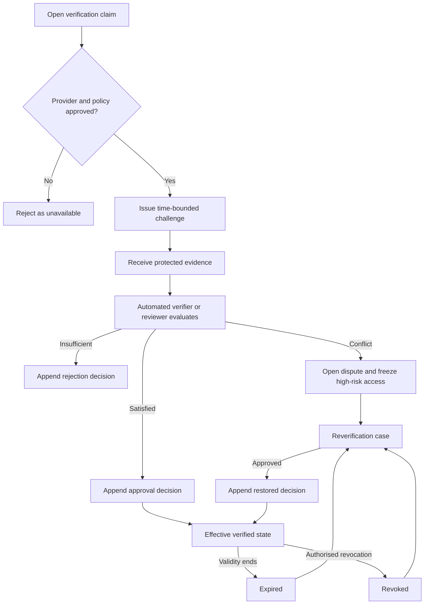

### Kingdom and Alliance membership lifecycle

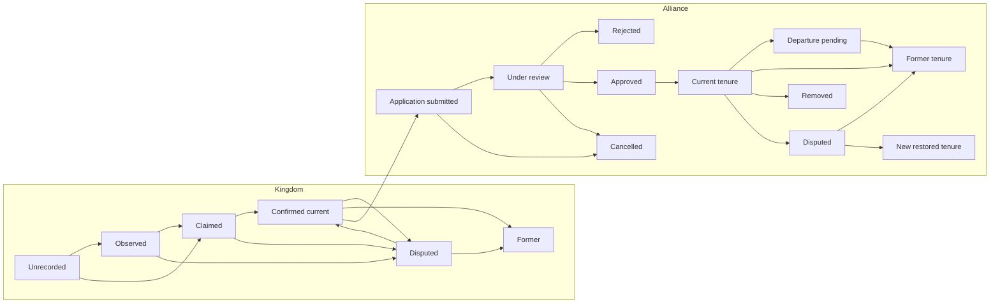

### Authorisation path

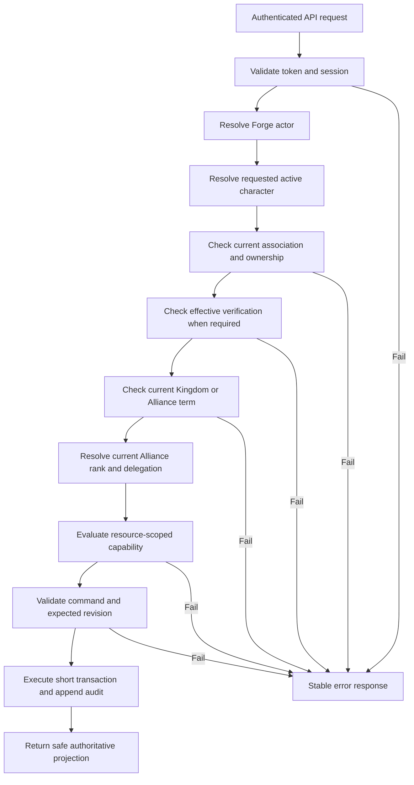

### Character-linking sequence

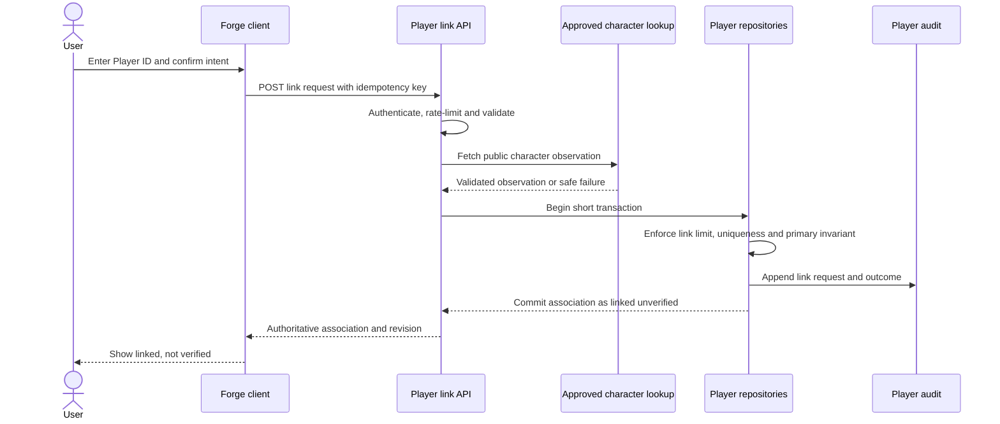

### Verification-decision sequence

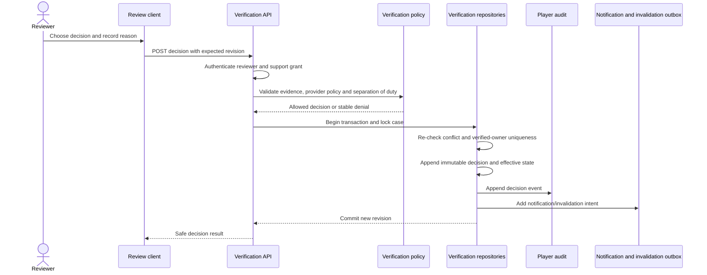

### Alliance-membership approval sequence

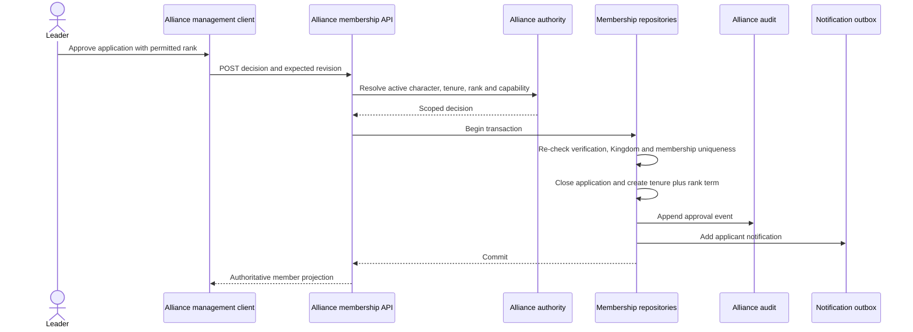

### Public-profile projection sequence

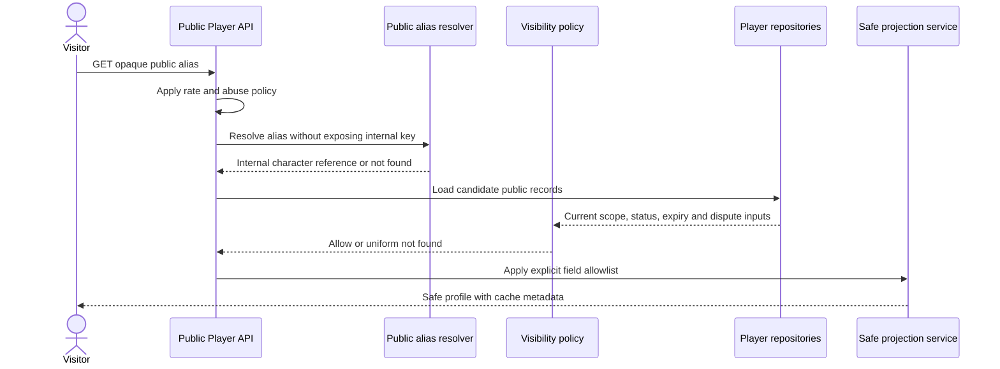

### Future Planning dependency map

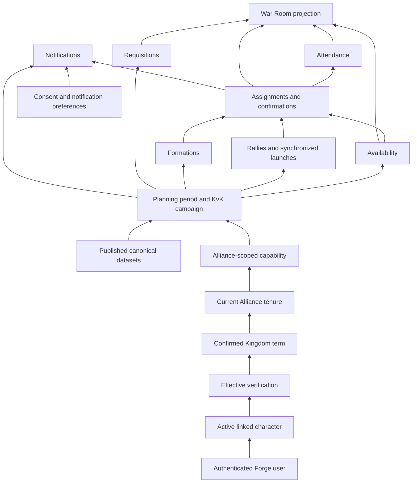

## 26. Implementation roadmap

The recommended order is retained. It separates unknown-schema recovery from new design, places a server boundary before identity mutation, establishes verified character identity before multi-character/membership work, and delays Planning until every prerequisite is enforceable.

### Milestone 1 — Player schema discovery and migration recovery preparation

| Item | Definition |
| --- | --- |
| Objective | Produce an approved read-only schema inventory, application expectation manifest, drift classification, baseline strategy and migration test plan. |
| Dependencies | Clark/Aegis approval A08; named environment/operator; accepted evidence-handling location. |
| Likely files/modules | `docs/reference/database/player-schema-inventory.md`, `docs/operations/player-migration-recovery.md`, a future read-only validation script under `scripts/` only after review. |
| Schema impact | None. No migration, repair or DDL. |
| Security gates | Read-only credential/scope, no row-data export, secrets redacted, evidence hashed, production access logged. |
| Validation | Inventory completeness; application-object cross-check; view/RPC owner/grant/RLS review; disposable reconstruction plan. |
| Exit criteria | Every referenced Player/Kingdom/Alliance/Hero/Transfer object classified; A09 baseline approach approved; no unresolved destructive assumption. |
| Overlap risk | High migration-numbering/shared-database coordination with Codex A; Gift schema assumptions with Codex B. Read-only evidence only. |

### Milestone 2 — Server-side Player API foundation

| Item | Definition |
| --- | --- |
| Objective | Establish authenticated Player transport, typed domain errors, actor/character resolution, repository contracts, validation, audit and idempotency boundaries around the existing compatible schema. |
| Dependencies | Milestone 1; accepted Codex A actor/error conventions or an explicitly isolated Player adapter. |
| Likely files/modules | `api/player/...`, `server/player-identity/...`, `server/player-profile/...`, `shared/domains/player-identity/...`, `shared/domains/player-profile/...`, focused tests; no one large Player service. |
| Schema impact | First forward migrations only after baseline approval, likely `player_audit_entries` and `player_command_receipts`; otherwise compatibility repositories read current objects. |
| Security gates | Bearer validation, server-derived actor, direct table mutation denied for migrated operations, RLS negative tests, service credential server-only. |
| Validation | Unit/contract/API tests for unauthenticated, wrong-owner, malformed, stale revision, idempotent retry and redaction paths. |
| Exit criteria | Character/profile mutation path works only through server API for the migrated slice; stable error envelope and audit proven. |
| Overlap risk | Shared `server/auth`, API error conventions, package/scripts and barrel exports with Codex A. Coordinate; do not edit in-flight Editorial files. |

### Milestone 3 — Verified Character Foundation

| Item | Definition |
| --- | --- |
| Objective | Separate character observation from user link and deliver provider-neutral verification cases, effective status, expiry, revocation, dispute and recovery with one approved proof method. |
| Dependencies | Milestones 1–2; A01–A03, A12, A13 and A15 approved; provider security/privacy review. |
| Likely files/modules | `shared/domains/character-verification/...`, `server/character-verification/...`, `/api/player/me/.../verification-cases`, `/api/player-support/...`, `/my-forge/characters`, `/my-forge/characters/:characterRef/verification`, original Character management/verification components. |
| Schema impact | `game_characters`, `character_link_requests`, `forge_character_links`, verification case/challenge/evidence/decision/dispute records, audit and safe compatibility projection. |
| Security gates | Effective verified-owner uniqueness, no browser assertion, protected evidence, separation of duty, revocation invalidation, prohibited material tests. |
| Validation | Link conflict/race tests; provider challenge expiry/replay; approve/reject/revoke/dispute/recovery transitions; RLS/grants; migration classification of legacy labels. |
| Exit criteria | One approved method proves ownership end to end; linked-only paths cannot gain verified permission; recovery and revocation are operable and audited. |
| Overlap risk | Codex B consumes verification state; integrate by interface only. Codex A global support-role semantics require coordination. |

If no proof method is approved, the framework may be built and tested but Milestone 3 is not complete and later verified-only milestones remain blocked.

### Milestone 4 — Multiple-character support and switching

| Item | Definition |
| --- | --- |
| Objective | Support the approved configurable character limit, one primary, explicit active-character switching and per-character feature context. |
| Dependencies | Milestone 3; A04–A05 approved. |
| Likely files/modules | Character list/context contracts, active-character hook/adapter, `/my-forge/characters`, a shared character switcher, feature adapters for Profile/Progression/Hero/Transfer. |
| Schema impact | Link-set revision and exact-primary invariant; indexes/constraints from the verified split; no feature data shared between characters. |
| Security gates | Server resolves every character reference; cache invalidation on switch; link limit and cross-owner negative tests. |
| Validation | Zero/one/many-character UX; simultaneous primary switches; former link; revoked/disputed character; stale tabs; mobile switcher. |
| Exit criteria | Every current Player journey receives an explicit authoritative active character and cannot mutate another linked/unlinked character accidentally. |
| Overlap risk | Codex B currently reads primary context; its adapter changes belong to Milestone 10, not this branch without agreement. |

### Milestone 5 — Unified visibility and public projections

| Item | Definition |
| --- | --- |
| Objective | Replace fragmented public booleans with approved scopes and one safe public projection keyed by opaque alias. |
| Dependencies | Milestones 2–4; A06, A14 and A16 approved. |
| Likely files/modules | Visibility policy contract/service, projection repositories, `/api/player/public/...`, `/players/:publicAlias`, compatibility redirect from current public route, privacy editor components. |
| Schema impact | Scope/revision/public-alias fields, safe projection views only where approved, compatibility mapping and cache invalidation. |
| Security gates | Allowlist fields, uniform hidden `404`, no user/internal IDs, view invoker/grant/RLS tests, enumeration limits. |
| Validation | Matrix tests for every scope/audience; cache removal after narrowing; old-link compatibility; anonymous/mobile public reads. |
| Exit criteria | Public clients make no raw Player joins; every major entity has an enforced scope and safe projection. |
| Overlap risk | Public-route CSS/App routing may overlap other workstreams; isolate Player routes/components and coordinate shared layout changes. |

### Milestone 6 — Kingdom membership lifecycle

| Item | Definition |
| --- | --- |
| Objective | Deliver observed, claimed, confirmed-current, former and disputed Kingdom terms without treating lookup as proof. |
| Dependencies | Milestones 3–5; approved Kingdom proof/confirmation policy. |
| Likely files/modules | Kingdom membership contracts/server service/repository; character Kingdom history and claim/review UI; Player support review route. |
| Schema impact | `character_kingdom_terms`, decision/evidence references, uniqueness and effective-date constraints; migration from current memberships. |
| Security gates | Verified character for confirmation; no client promotion; cross-Kingdom and historical-scope tests. |
| Validation | Observation change, claim, confirmation, dispute, transfer/end term, concurrent current-term attempt and safe directory projection. |
| Exit criteria | Current Kingdom state has explainable evidence/policy and can safely act as a downstream prerequisite. |
| Overlap risk | Kingdom Domain ownership and public directory projections; no redesign of Kingdom master datasets. |

### Milestone 7 — Alliance membership and authority hardening

| Item | Definition |
| --- | --- |
| Objective | Split applications, tenures and R1–R5 rank terms; enforce resource-scoped capabilities for membership/leadership actions. |
| Dependencies | Milestone 6; A07 and support/succession decisions approved. |
| Likely files/modules | Alliance application/tenure/authority contracts and services, member/reviewer UI, guarded management routes, capability-matrix tests. |
| Schema impact | `alliance_applications`, `character_alliance_terms`, `alliance_rank_terms`, compatibility view/RPC retirement, audit events. |
| Security gates | Verified/current Kingdom eligibility, one current tenure, rank ceilings, R5 succession, no global-role leadership, support intervention controls. |
| Validation | Full permission matrix across current/former/disputed/wrong-Alliance states; concurrent approval; leave/removal/restoration; stale role. |
| Exit criteria | Git reproduces membership/authority; management links reflect server hints; all privileged mutations are server-enforced and audited. |
| Overlap risk | Existing Alliance pages/services and future Operations; coordinate UI replacement without touching Codex B Gift files. |

### Milestone 8 — Hero Collection and Showcase integrity fixes

| Item | Definition |
| --- | --- |
| Objective | Move character Hero mutations server-side, make aggregate saves transactional and separate Showcase presentation from progression. |
| Dependencies | Milestones 2, 4, 5; published canonical Hero contracts stable. |
| Likely files/modules | Hero personalisation contracts/server service, owner Hero APIs, atomic Showcase API, collection/editor components adapted to active character. |
| Schema impact | `character_hero_states` and children mapping; `character_showcases`/slots; removal of Showcase columns after compatibility period. |
| Security gates | Same-character/canonical-key checks, owned-only Showcase, no canonical mutation, transaction/partial-failure tests. |
| Validation | Six-slot/order/duplicate constraints; unowned Hero denial; aggregate rollback on child failure; public projection privacy. |
| Exit criteria | Showcase replacement cannot overwrite progression or partially clear; canonical Hero facts remain read-only. |
| Overlap risk | Hero Domain canonical datasets and Codex A dataset readiness. Consume published contracts; do not change Editorial Hero ownership. |

### Milestone 9 — Transfer Hub identity hardening

| Item | Definition |
| --- | --- |
| Objective | Require verified character, split private/contact data, enforce lifecycle/expiry and replace unsafe public identity routing. |
| Dependencies | Milestones 3–7; A10, A13–A14 approved. |
| Likely files/modules | Transfer listing/private-detail services and APIs, current Transfer editor/list routes adapted to active character, safe public listing/detail route. |
| Schema impact | `transfer_listings`, `transfer_private_details`, public aliases, consent/contact grants, explicit legacy-state mapping. |
| Security gates | Contact never anonymous, consent withdrawal immediate, membership references valid, private-note negative tests, cache purge. |
| Validation | Lifecycle transitions, expiry job idempotency, verified prerequisite, public field allowlist, transfer/membership history interaction. |
| Exit criteria | Public listing contains no private/contact/internal data and uses stable opaque identity; withdrawn/expired records disappear promptly. |
| Overlap risk | Transfer UI/CSS only; no broader Transfer redesign or Alliance-membership shortcut. |

### Milestone 10 — Gift Centre identity and consent integration

| Item | Definition |
| --- | --- |
| Objective | Provide Codex B with exact active-character context, authoritative eligibility inputs, linked Governor confirmation and purpose-specific consent/reminder hooks. |
| Dependencies | Milestones 3–5; Codex B safety foundation accepted; Gift-specific consent approved. |
| Likely files/modules | A narrow Player–Gift adapter contract, consent API integration and existing Gift manual panel adapter; changes coordinated in Codex B ownership. |
| Schema impact | `consent_terms` for approved Gift purposes and optional manual-history/reminder reference owned by Gift/Notification domains. No provider credential table. |
| Security gates | No live automation, password/cookie/token material or unsupported provider; character switch reconfirmation; revocation/unlink disables eligibility. |
| Validation | Wrong-character, linked-unverified, expired/revoked/disputed, consent mismatch/withdrawal and manual-only journey tests. |
| Exit criteria | Manual journey uses exact active context and cannot imply automation or verified ownership incorrectly; Codex B gates remain stronger or unchanged. |
| Overlap risk | High with Codex B-owned files. Implement only through agreed integration commit/workstream; do not cherry-pick conflicting feature code. |

### Milestone 11 — Player availability

| Item | Definition |
| --- | --- |
| Objective | Deliver the first Planning-adjacent vertical slice: one Alliance planning period with private/leadership-scoped character availability. |
| Dependencies | Milestones 3, 4, 7; minimal notification preference/outbox decision; no broad planner implementation. |
| Likely files/modules | Planning period and availability contracts/services/APIs; `/alliances/:allianceId/planning/:periodId/availability`; participant and leadership summary components. |
| Schema impact | `alliance_planning_periods`, `character_availability_responses`, audit/outbox; minimal notification preferences only if approved. |
| Security gates | Verified current member, self-vs-proxy action separation, leadership scope, operational timing privacy, closed-period lock. |
| Validation | Permission matrix, own submission, delegated correction reason, concurrent replacement, lock/close, revoked/former-member access and retention. |
| Exit criteria | Availability works end to end for one Alliance without exposing operational timing publicly or introducing rally/assignment scaffolding. |
| Overlap risk | Notification platform boundary and future Operations. Keep scope to availability and one period lifecycle. |

### Milestone 12 — Player Planning foundation

| Item | Definition |
| --- | --- |
| Objective | Add only the approved next operational aggregates—likely rallies and assignments—on the proven identity, membership, authority and availability base. |
| Dependencies | Milestone 11 exit evidence; canonical event/scoring readiness; explicit scope decision for each Planning capability. |
| Likely files/modules | Feature-specific bounded contracts/services/APIs/routes under Alliance Planning; no single planner service or imported workflow structure. |
| Schema impact | Selected future entities from section 22 only; each gets constraints, audit, retention and RLS/projection review. |
| Security gates | Current authority on every mutation, server time, idempotent assignments, operational privacy, audit and notification re-check. |
| Validation | Complete identity-to-API-to-data-to-projection flows, concurrency/replay, permission matrix, mobile states and failure recovery. |
| Exit criteria | The selected Planning slice is production-ready under Forge Definition of Done; unselected capabilities remain explicitly deferred. |
| Overlap risk | Operations/Event/Calculator domains and Codex B notifications. Establish ownership through ADR/decision before shared platform changes. |

## 27. Overlap analysis

### Codex A — Editorial Platform Completion

Codex A currently owns Editorial APIs, runtime validation, publication transactions, Editorial permission enforcement, persistence, dataset readiness, admin UI and associated tests/migrations. Its protected worktree has advanced beyond the Player audit base.

A read-only coordination check on 17 July 2026 also found in-flight, uncommitted Codex A work for an Editorial **Verification Centre**. That surface evaluates evidence for canonical-dataset capability and environment readiness; it does not prove that a Forge user owns a Kingshot character. The shared word “verification” is therefore a naming and contract collision risk. Player implementation must not import or reuse that workstream's result vocabulary, contracts, services, routes or UI structure. Cross-domain language should qualify the concepts as **dataset readiness verification** and **character ownership verification**, and Clark/Aegis should approve any shared navigation label before integration.

Player architecture depends on Codex A only through stable platform outcomes:

- authenticated Forge actor resolution;
- published canonical dataset reads;
- global Forge oversight roles;
- established server/error/validation conventions;
- append-only principles, not Editorial audit storage.

Player implementation must not modify Codex A’s Editorial APIs, services, dataset definitions/registries, Editorial permission services/default policies, publication repositories, admin components, validation scripts, package configuration or Editorial migrations. If a shared actor/error contract is needed, coordinate an explicit platform interface after Codex A lands; do not copy an in-flight implementation into the Player branch.

Player audit records remain separate from `editorial_audit_events`. Player-owned progression and operational Planning state remain non-canonical and must not enter the Editorial publication workflow. Published Hero, event and scoring facts are consumed by stable canonical keys.

Migration numbering and shared `api`, `server`, `shared` barrel exports are merge-overlap risks. The Player workstream should rebase/merge the accepted release line only after Clark authorises integration, then allocate migrations and shared exports from that accepted head.

### Codex B — Gift Centre

Codex B owns Gift Centre safety contracts, the manual redemption journey, feature/provider gates, provider integration design and feature-specific consent/eligibility. Its branch advanced during this audit and now classifies a separately supplied redemption script as the authoritative official-flow reference while still keeping the live provider disabled. Player architecture neither evaluates nor imports that reference. Player implementation must not modify Gift Centre domain files, manual UI, provider mapping, signing/session logic or provider boundary.

The future integration is a documented interface, not a branch edit:

| Player supplies | Gift Centre retains |
| --- | --- |
| Authenticated active-character context | Redemption feature policy and status vocabulary |
| Server-authoritative link/verification state | Manual journey and any future provider approval gate |
| Safe character confirmation fields | Code eligibility and redemption-specific outcomes |
| Purpose/version consent query | Gift-specific consent wording/version and history |
| Revocation, dispute, unlink and character-switch events | Immediate disablement and feature-specific retry/idempotency rules |
| Notification subscription hook | Reminder content and event intent |

Codex B’s current UI resolves the existing primary character. Multiple-character work will require an agreed active-character adapter, but that change belongs to an integration milestone after both foundations are accepted. No live auto-redemption is enabled by this architecture.

Any planner material mentioned by the Gift Centre audit remains outside this Player workstream's implementation evidence. The Player boundary supplies an independently designed, server-authoritative eligibility projection only; it does not inherit redemption implementation structure, provider protocol details or source-derived contracts.

## 28. Architecture decisions requiring approval

All decisions below are **pending**. A recommendation is architecture advice, not approval.

| ID and decision | Options | Recommendation | Benefits | Risks | Consequence of deferral |
| --- | --- | --- | --- | --- | --- |
| A01 Verification provider | Official provider; controlled profile challenge; authenticated external account; manual moderation; none. | Keep provider-neutral framework and approve none until an authorised, documented provider passes security/privacy review. | Avoids coupling and unsupported authentication. | Delays verified-only features. | Milestone 3 cannot complete; downstream verified-only features remain blocked. |
| A02 Ownership proof method | Provider assertion; time-bound public/profile challenge; account federation; moderated evidence. | Select only after provider review; require time-bound, replay-resistant proof and accessible recovery. | Clear trust claim and abuse controls. | False positives, evidence sensitivity and support load vary. | Case/evidence implementation shapes remain undefined. |
| A03 Verification expiry | Non-expiring; fixed 90/180/365 days; provider-specific; event-driven plus maximum age. | Provider-specific with a configured maximum age and event-driven revocation; no non-expiring default. | Limits stale ownership while respecting proof strength. | Reverification friction and notification burden. | Effective-status policy and expiry jobs cannot be finalised. |
| A04 Maximum linked characters | One; fixed three; fixed five; configurable per environment/role. | Server-configurable with initial default of three and no privileged self-bypass. | Supports real multi-character use without unbounded abuse. | More UI/state complexity and verification cost. | Schema can proceed, but product limits and tests remain unsettled. |
| A05 Primary-character behaviour | Optional primary; exactly one; last-used only; per-feature defaults. | Exactly one primary among current links plus explicit active character per request; last-used is client convenience only. | Predictable migration and safe exact-character actions. | Switching UX and cache invalidation work. | API context and Gift Centre integration remain ambiguous. |
| A06 Unified visibility scopes | Public/private only; six scopes in section 11; per-feature custom scopes. | Approve the six canonical scopes with entity-specific allowlists and participant overlays. | Consistent privacy and reusable policy. | Policy testing complexity; leadership scope depends on membership hardening. | Public projection and schema migrations cannot be finalised. |
| A07 Alliance role model | Existing role names; R1–R5 hierarchy only; capability grants only; R1–R5 plus capability/delegation policy. | R1–R5 as resource-scoped source plus explicit capability/delegation evaluation. | Matches product language without unsafe numeric rank comparisons. | More terms/policy records and leadership UX. | Alliance hardening and Planning leadership features remain blocked. |
| A08 Live-schema discovery | No inspection; manual dashboard notes; approved read-only catalogue/DDL export. | Approve a scripted, read-only, evidence-hashed inventory by a named operator. | Reproducible baseline and lower migration risk. | Production metadata exposure if evidence handling is poor. | No Player migration may be safely created. |
| A09 Production migration baseline | Recreate objects; ignore history; one baseline plus history alignment; incremental reverse-engineering only. | Reviewed baseline in a disposable environment, non-destructive history alignment in production, then forward migrations. | Makes Git reproducible without destructive recreation. | Alignment mistakes can desynchronise environments. | All schema-changing Player milestones remain blocked. |
| A10 Transfer contact retention | Retain with listing; delete on withdrawal; fixed post-withdrawal period; pseudonymise while keeping audit. | Remove active contact access immediately on withdrawal/consent revocation; retain only a minimal pseudonymised audit reference for an approved period. | Minimises exposure and preserves accountability. | Support may have less historical detail. | Transfer migration and contact feature remain private-only/blocked. |
| A11 Notification channels | In-app; email; Discord; push; combinations. | In-app first, email opt-in second; defer Discord/push until consent, provider and operational ownership are approved. | Small safe first slice and clear ownership. | Users may miss in-app reminders. | Notification schema can stay abstract; no delivery milestone. |
| A12 Support intervention powers | None; read-only; unrestricted admin; time-bound scoped read/write with approval. | Read-only by default; time-bound least-privilege write intervention with reason and dual approval for identity/leadership changes. | Supports recovery without hidden super-admin behaviour. | Operational delay in emergencies. | Dispute/recovery edge cases cannot be fully supported. |
| A13 Data retention | One global period; indefinite; immediate deletion; classification-based schedule. | Classification-based schedule for evidence, audit, membership, Transfer contact, Planning timing and delivery records. | Proportionate privacy and operational utility. | Policy/implementation complexity. | Physical deletion/archival and evidence model cannot be completed. |
| A14 Public identity exposure | Expose Forge ID and Player ID; expose Player ID only; opaque alias only; no public profile. | Opaque character alias; omit external Player ID and internal Forge user ID by default. Approve any Player-ID exposure separately. | Reduces enumeration and account-targeting risk. | Existing shared links need redirect/compatibility work. | Public projection may launch only with the conservative alias model. |
| A15 Existing verification-like rows | Trust labels; discard all; evidence-based classification; manual blanket review. | Classify by recoverable evidence; migrate unsupported positive labels as linked/unverified and preserve legacy label only in restricted audit metadata. | Avoids granting unproven ownership. | Existing users may lose apparent verified status and require reverification. | Safe migration rules remain blocked. |
| A16 Public Data API posture | Raw table access with RLS; dedicated API schema/views; Vercel APIs only; hybrid. | Vercel safe projections for public Player data and sensitive mutations; reviewed invoker views only where a clear read benefit exists. | Central field filtering, rate limits and stable errors. | More server runtime responsibility. | Grants/RLS and public route implementation remain unsettled. |

### State labels used by this document

- **Current:** observed in the audited Forge commit; not necessarily safe or reproducible.
- **Proposed:** defined by this architecture and ready for approval/implementation sequencing.
- **Deferred:** intentionally reserved for a later milestone and not a live capability.
- **Prohibited:** must not be implemented without a new approval that explicitly changes this architecture.

### Milestone prohibition

This architecture milestone creates documentation only. It does not implement Player Planning, product code, migrations, Supabase writes, external provider calls or deployment behaviour.

### Licence boundary confirmation

No contributed planner source code, schema, migration, comment, identifier, function/component name, API contract, file structure or distinctive implementation structure was copied or reused in this specification. All target names, boundaries, workflows and contracts are original Forge design.
