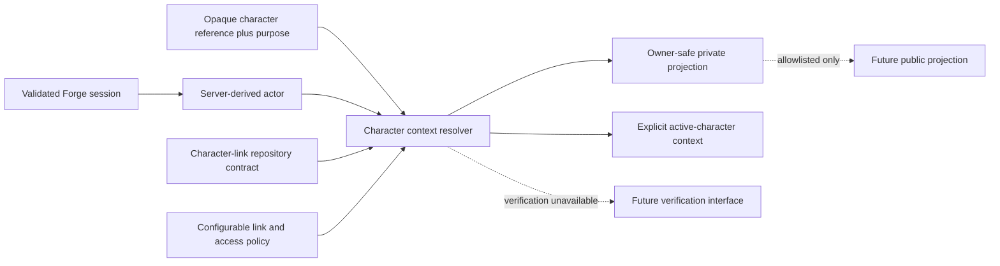

# Player Identity Foundation — Implementation Milestone 1 Proposal

**Status:** Proposed; not authorised for implementation
**Owner:** Player Domain architecture
**Version:** 1.0
**Date:** 17 July 2026
**Last reviewed:** 17 July 2026

## Objective

Establish the smallest server-authoritative Player identity foundation that can represent multiple linked characters safely, resolve one explicit character for a request and define stable private/public projection contracts without implementing ownership verification, Alliance authority, Gift provider logic or Player Planning.

This proposal is an implementation plan only. Work begins only after the [Implementation Entry Criteria](./PLAYER_DOMAIN_IMPLEMENTATION_ENTRY_CRITERIA.md) classify entry as approved.

## User and platform outcome

Forge gains a stable distinction between authenticated Forge User, observed Game Character and Character Link. Server code can answer “which exact character is this actor allowed to use for this purpose?” without treating a link as verified. Consumers can integrate against safe interfaces while verification remains explicitly unavailable.

## In scope

1. Approved read-only schema discovery under PD-012, with sanitised/hashable evidence and no row-data capture.
2. Player identity domain contracts for Forge User, Game Character, Character Link, Primary Character, Active Character and effective verification-unavailable state.
3. Configurable Character Limit Policy interface with no hard-coded architectural maximum and no entitlement/subscription implementation.
4. Server-side actor and exact-character resolution interfaces using opaque references.
5. Private owner and conservative public projection contracts; public Player ID omitted.
6. Primary/active semantics, stable safe errors, revision and idempotency contract expectations.
7. Repository interfaces and test doubles sufficient for contract/authorisation tests; no live persistence unless a later approved sub-milestone adds it.
8. Compatibility plan for current primary-only consumers.
9. Documentation, threat/privacy review and focused automated contract tests.

## Out of scope

- Ownership verification provider, challenge, evidence or positive decision.
- Public verification claims or migration of legacy positive labels as verified.
- Alliance applications, membership, ranks, capabilities or delegation.
- Kingdom membership confirmation.
- Hero Collection/Showcase changes.
- Transfer implementation changes.
- Gift Centre provider, signer, session, queue, redemption or consent implementation.
- Notification delivery.
- Player Availability or any Player Planning capability.
- Support intervention UI/persistence.
- Subscription, supporter-tier, commercial entitlement or billing behaviour.
- Supabase migration creation/application unless separately approved after discovery.
- Production data write, deployment or public release.

## Dependencies and ADR prerequisites

| Dependency | Required state before implementation |
| --- | --- |
| [ADR-0100](./ADR/ADR-0100-separate-user-and-character-identity.md) | Accepted |
| [ADR-0101](./ADR/ADR-0101-separate-link-from-verified-ownership.md) | Accepted |
| [ADR-0102](./ADR/ADR-0102-configurable-multiple-character-policy.md) | Accepted with finite launch policy or explicit link-creation deferral |
| [ADR-0103](./ADR/ADR-0103-primary-and-active-character-semantics.md) | Accepted |
| [ADR-0109](./ADR/ADR-0109-server-authoritative-player-operations.md) | Accepted |
| [ADR-0115](./ADR/ADR-0115-player-schema-recovery-strategy.md) | Accepted before schema discovery command |
| [ADR-0105](./ADR/ADR-0105-public-identity-and-visibility.md) and [ADR-0117](./ADR/ADR-0117-public-player-data-api-posture.md) | Accepted before public/private projection behaviour, or public surface omitted |
| [ADR-0104](./ADR/ADR-0104-character-verification-model.md) | May remain Proposed only through the documented unavailable-interface deferral |
| Active workstreams | Reassessed against accepted release head immediately before implementation |

## Likely modules — names require reservation

These are proposed Forge-native locations, not files created by this milestone:

| Proposed area | Responsibility |
| --- | --- |
| `shared/domains/player-identity/` | Platform-neutral identity terms, safe states, opaque references and policy inputs |
| `server/player-identity/` | Actor/character resolution, authorisation, policy evaluation and projection orchestration |
| `server/player-identity/repositories/` | Persistence contracts/adapters after schema evidence |
| `api/player/` | Thin authenticated HTTP adapters only after contracts are approved |
| `src/features/player-identity/` | Later character-management UI; not required for a server-contract-only first slice |
| `src/context/` compatibility adapter | Temporary bridge from existing primary-only context to explicit resolved context |
| `docs/reference/` | Approved contract/data dictionary and discovery evidence references |

No path is reserved until Aegis compares the accepted release head and Codex A/B/D workstreams.

## API boundaries — contracts before routes

| Boundary | Proposed behaviour | Explicit exclusions |
| --- | --- | --- |
| List own characters | Authenticated owner-safe summaries, primary marker, verification unavailable/unverified state and revisions | No external Player ID unless owner-purpose approved; no other user's link set |
| Resolve private character | Opaque `characterRef` plus server actor → authorised internal subject and safe summary | Client user ID/role/Player ID is never authoritative |
| Resolve active command context | Actor, opaque character reference, purpose and expected revision → allowed/denied context | Primary is not substituted after request creation; no positive verification |
| Select primary | Conditional exact-one transition only if included by approved scope | Does not set global active context or grant permission |
| Public projection contract | Opaque alias → allowlisted fields or uniform not-found | Omit Player ID and Forge user/link identifiers; may remain unimplemented |
| Gift eligibility dependency | Interface can return linked/unverified/unavailable and safe identity only | No provider Player ID projection until verification/purpose decisions are accepted |

Exact HTTP paths and error codes are frozen only after the naming reservation and API review. Documentation examples do not authorise route creation.

## Resolution dependency

## Schema-discovery needs

Read-only discovery must inventory existing Auth/profile role references; Player account/profile/progression objects; character identifiers and uniqueness; primary/public fields; verification-like values; views/functions/RPCs; owners/grants/default privileges; RLS flags/policies; triggers/indexes/constraints; migration history; and downstream foreign keys from Hero, Kingdom, Alliance, Transfer and Gift surfaces.

Evidence excludes secrets and production row content. Discovery stops if environment identity, read-only authority or sanitisation cannot be proven.

## Migration needs

Milestone 1 does not assume a migration. After discovery:

1. If current objects can be accessed safely through a compatibility repository, implement contract tests without structural change.
2. If the schema cannot support safe identity resolution, stop and propose a separately reviewed baseline/hardening migration milestone.
3. Do not create the logical target model before baseline recovery.
4. Never encode a maximum of three links in a check constraint, type or key.
5. Any later migration requires explicit grants/RLS, indexes for policy/foreign-key columns, rollback/compensation and isolated environment validation.

## Security gates

- Server-validated actor; no user-editable metadata for authorisation.
- Exact opaque character reference bound to actor, purpose, revision and idempotency.
- Default deny for wrong owner, former link, revoked/disputed state and stale revision.
- Linked never returned as verified.
- Bounded lookup/link enumeration and safe uniform errors.
- No secret/service key/provider detail in browser, shared contracts, errors or logs.
- RLS/grants reviewed as defence in depth before any persistence path.
- Secret-pattern and bundle-boundary tests.

## Privacy gates

- External Player ID classified and omitted from public projection by default.
- Public alias and field allowlist approved before public contract implementation.
- No endpoint reveals a user's full character-link set to another actor.
- Logs/audit use opaque references and safe summaries.
- Account closure/export and retention impacts documented before production persistence.
- No verification evidence collected.

## Test plan

| Layer | Required cases |
| --- | --- |
| Contract | Zero/one/many links; primary invariant; explicit active context; configurable limit outcome; serialization and error stability |
| Authorisation | Anonymous, wrong user, wrong character, former link, stale revision, tampered Player ID/role, cross-character access |
| Concurrency/idempotency | Simultaneous primary/link intents, replay, key/request mismatch and deterministic prior outcome |
| Projection | Private/public field allowlists, Player ID omission, internal-ID canaries, uniform not-found and alias handling |
| Compatibility | Existing primary-only consumers receive a safe adapter without gaining multi-character authority |
| Security/privacy | Rate/enumeration, log redaction, secret scan, user metadata non-authority and no positive verification state |
| Discovery | Environment proof, inventory completeness/hash, no rows/secrets, repeatable comparison |

No application build is required for a docs-only planning change. The later implementation runs the complete affected repository check chain.

## Rollout plan

1. Accept governance and entry criteria.
2. Perform approved read-only discovery and review evidence.
3. Freeze interface/naming scope against current workstreams.
4. Implement contracts and pure tests behind no public/product route.
5. Implement server resolver against test doubles/compatibility repository.
6. Add private internal consumer canary only if explicitly approved.
7. Keep public projection, link mutations and verification unavailable until their gates pass.
8. Review completion evidence before proposing any next identity milestone.

## Rollback and stop conditions

Contracts are additive and initially unused. Rollback removes the unused adapters/contracts and restores the previous consumer imports; no data rollback exists because no migration/write is in scope. Stop if discovery needs an unapproved command, current schema cannot be understood safely, an active branch owns the same contract/path, verification would need implementation, or a migration becomes necessary without its own approval.

## Overlap risks

| Workstream | Risk | Boundary |
| --- | --- | --- |
| Codex A Verification Centre | “Verification” naming and shared auth/permission/server conventions | Use Character Ownership Verification; do not reuse dataset readiness statuses/contracts/routes. Integrate only accepted shared actor/error conventions. |
| Codex B Gift Centre | Exact active-character/verified-character dependency; committed integration design plus uncommitted provider-foundation work at the final snapshot | Player defines safe identity interface; Gift owns provider/consent/redemption. Recheck the dirty worktree and do not edit Codex B files. |
| Codex D Art Studio | Documentation-only audit proposes public attribution choices that could later consume identity | Agree the identity subject and safe projection first; use public Character Alias only if approved and do not edit D files. |
| Accepted release line | Shared `api`, `server`, `shared`, context barrels and future migration numbering | Reassess/rebase only with approval; reserve names before implementation. |

## Completion criteria

- Every Blocking entry criterion is evidenced at the implementation start.
- Read-only discovery, if approved, is complete, sanitised, hashed and reviewed with no write.
- Contracts distinguish Forge User, Game Character, Character Link, Primary and Active Character.
- No architectural numeric link maximum exists; policy evaluation is injectable/server-owned.
- Server resolver denies anonymous, wrong-owner, stale, former and mismatched contexts.
- Linked state cannot produce a verified claim.
- Safe private/public contract tests prove field minimisation; public implementation may remain absent.
- No provider, Alliance authority, Gift provider, Planning, schema or migration behaviour is introduced.
- Full affected checks pass, documentation reflects the exact implementation and a separate review authorises the next milestone.

## Related documents

- [Player Domain Architecture](./PLAYER_DOMAIN_ARCHITECTURE.md)
- [Implementation Entry Criteria](./PLAYER_DOMAIN_IMPLEMENTATION_ENTRY_CRITERIA.md)
- [Decision Register](./PLAYER_DOMAIN_DECISION_REGISTER.md)
- [Approval Matrix](./PLAYER_DOMAIN_APPROVAL_MATRIX.md)
- [Canonical Glossary](./PLAYER_DOMAIN_GLOSSARY.md)
