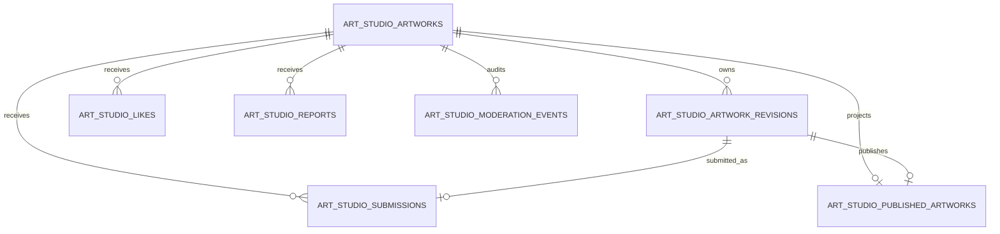
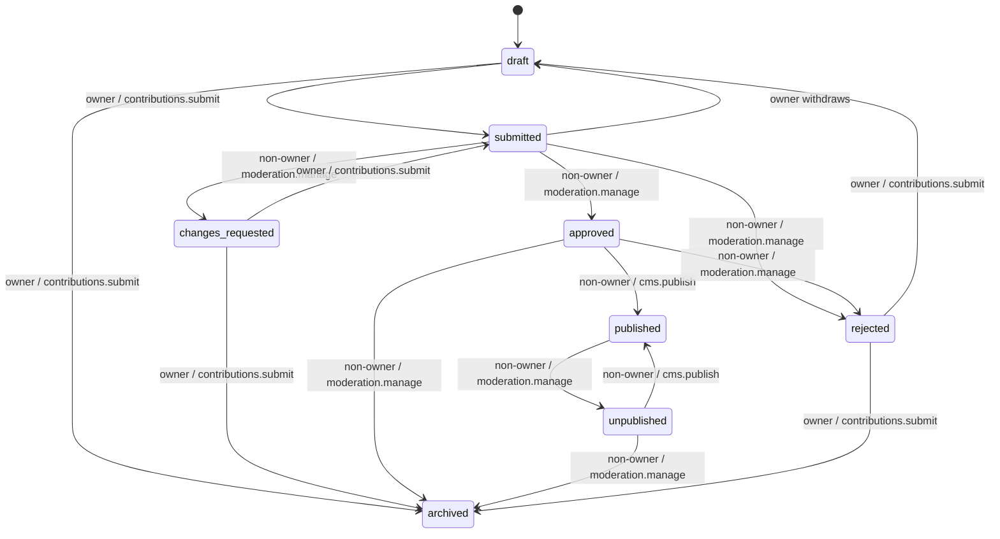
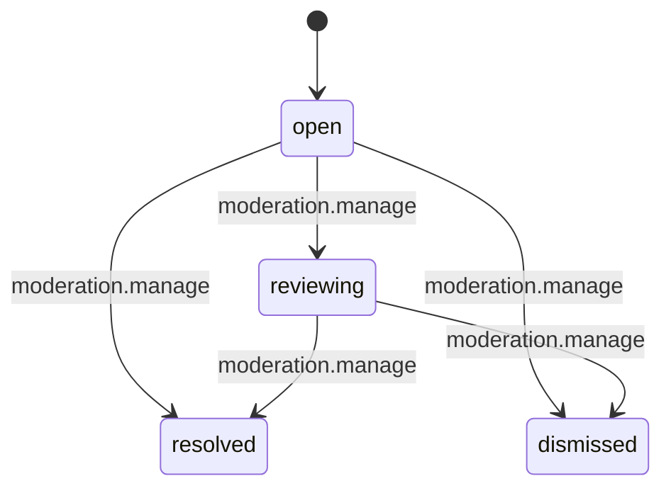

# Art Studio Community Foundation

## Status and boundary

Sprint 9.2 defines the Art Studio Community schema, security model and future
server contracts. The migration is a checked-in proposal only. It has not been
applied to Supabase project `hrvdhjscwitqpwjhnjkm` or to any other database.

This milestone does not implement public UI, submission UI, moderation UI,
HTTP handlers or live database execution. The existing static Art Studio page
continues to operate unchanged. The legacy `submissions` and `favourites`
tables remain untouched and are not authoritative for this domain.

## Architectural decisions

- Artwork is text and Unicode only. No HTML, SVG, images, uploads or screenshot
  evidence is part of the model.
- The aggregate head owns a permanent lowercase kebab-case slug.
- Revision content and identity fields are immutable. A later edit is a new
  numbered revision.
- An approved revision is fully immutable and append-only.
- Publication points to exactly one approved revision and populates a separate,
  sanitised projection.
- Unpublication changes projection visibility but retains the revision,
  publication pointer and append-only moderation history.
- Contributors can create drafts and submit, but all privileged workflow
  mutations are future server operations.
- `moderation.manage` is required for review and unpublication.
- `cms.publish` is required for publication.
- The artwork owner can neither approve nor publish their own work, even if the
  account otherwise has the capability.
- Reporter identity is visible only to the reporter and a non-owner moderator.
- No direct privileged browser mutation is granted.
- Notifications and analytics emission are deferred. Internal events are ready
  for a future notification consumer. No analytics abstraction currently
  exists, so this milestone adds no tracking or Google Analytics initialisation.

## Domain model

| Entity | Responsibility | Privacy |
| --- | --- | --- |
| `art_studio_artworks` | Stable identity, owner, lifecycle, revision pointers and optimistic version | Private aggregate head |
| `art_studio_artwork_revisions` | Immutable Unicode/text snapshot, attribution and review state | Owner and authorised staff |
| `art_studio_submissions` | One review attempt per revision, status and private moderation notes | Submitter and authorised staff |
| `art_studio_likes` | One authenticated user/artwork relationship | Each user reads/removes only their own row |
| `art_studio_reports` | Private report evidence and resolution workflow | Reporter or non-owner moderator |
| `art_studio_moderation_events` | Append-only action and audit history | Non-owner authorised staff |
| `art_studio_published_artworks` | Denormalised safe publication source for public views | Public safe columns only |

UUID foreign keys point to `auth.users` with restrictive deletion semantics for
workflow and audit identity. Likes may cascade when an auth user is deleted;
moderation evidence does not. Every foreign-key column used for joins or RLS is
indexed. Queue and catalogue query shapes use partial or composite indexes.

`art_studio_artworks.version`, `art_studio_artwork_revisions.workflow_version`,
`art_studio_submissions.version` and `art_studio_reports.version` require an
exact increment on update. Future repositories must use the current version in
their update predicate and map zero updated rows to
`ART_STUDIO_VERSION_CONFLICT`.

## Artwork lifecycle

The same transition registry exists in shared TypeScript and as a database
guard. Owner-only actions require `contributions.submit`. Review actions require
`moderation.manage`; publication requires `cms.publish`. The database also
rejects an owner recorded as approver or publication actor. Archiving a
published item requires unpublication first.

## Report lifecycle

Resolved and dismissed reports are terminal. A partial unique index permits
only one `open` or `reviewing` report for the same reporter, artwork and
category. A later report is possible after the previous report becomes
terminal.

The stable categories are:

- `rendering_issue` — artwork does not render correctly;
- `offensive_abusive` — offensive or abusive;
- `copyright_ownership` — copyright or ownership concern;
- `misleading_misclassified` — misleading or incorrectly categorised;
- `other`.

## Constraints and database enforcement

- Slugs are unique, immutable, at most 80 characters and lowercase kebab-case.
- A composite foreign key guarantees each current, approved and published
  revision belongs to its artwork.
- Publication requires `published_revision_id = approved_revision_id` and an
  approved revision.
- Approved revisions reject every update; all revisions reject deletion and
  content mutation.
- One projection row per artwork and a unique source revision enforce one
  active published revision per artwork.
- `(artwork_id, user_id)` is the like primary key.
- A security-definer trigger validates that the liked artwork is published and
  not owned by the liker. It exposes no callable function grant.
- Report insertion is limited to published artwork and duplicate active reports
  are blocked by a partial unique index.
- Moderation-event UPDATE and DELETE always fail, including for a service
  operation. A future destructive retention process therefore requires an
  explicit new migration and approval.
- Projection rows are filled from the approved revision by trigger; callers
  cannot substitute different public text or attribution.

## RLS and permissions

RLS is enabled and forced on every Art Studio table. The migration first
revokes implicit `anon` and `authenticated` table privileges and then grants
the minimum operation set explicitly.

| Resource | Anonymous | Authenticated owner/user | Moderator/publisher | Service role |
| --- | --- | --- | --- | --- |
| Public projection views | Safe published rows | Safe published rows | Safe published rows | Read |
| Artwork heads | None | Own rows; draft metadata only | Read for capability context; no browser workflow writes | Future server transaction |
| Revisions | None | Own safe columns; insert new draft snapshot | Safe columns only; no browser review writes | Future server transaction |
| Submissions | None | Own safe columns; create submission | Safe columns only; no browser moderation writes | Future server transaction |
| Likes | None | Read/insert/delete own row | Same | Server access if required |
| Reports | None | Create/read safe fields on own report | Safe fields only and only when not owner of reported artwork | Future server moderation |
| Moderation events | None | None | Read only when not owner of artwork | Append through future server transaction |

RLS is defence in depth, not the capability authority for privileged commands.
The future server must authenticate the actor, call the Art Studio capability
assertion, reject owner self-action, apply the optimistic version, execute the
transaction and append its moderation event. Browser code must not use the
service role or issue review/publication mutations.

Authenticated SELECT is column-scoped on artwork heads, revisions,
submissions and reports. Reviewer/approver/assignment IDs, moderation notes,
raw resolutions and status-actor IDs have no authenticated column grant. A
future server response must deliberately map any moderator-authored safe outcome
rather than return a base-table row.

## Public projections

`art_studio_public_catalogue` and `art_studio_public_details` are
`security_invoker` and `security_barrier` views over the sanitised projection
table. The underlying table receives column-level public SELECT grants only.

Catalogue fields:

- slug, title, description, category and tags;
- optional creator attribution;
- like count;
- publication and projection-update timestamps.

Detail adds the text/Unicode artwork content. Neither view exposes an internal
artwork/revision/submission/report ID, any user ID, reporter identity,
moderation note, audit metadata or private submission history. Public detail
URLs are `/art-studio/:slug`; route implementation is deferred.

## Server contracts

The provider-neutral interfaces under `shared/domains/art-studio` define:

- create submission, update draft, submit for review and withdraw;
- list/read the actor's submission status;
- like and unlike;
- general and rendering-failure reports;
- moderation queue, request changes, approve and reject;
- publish and unpublish;
- resolve and dismiss report.

They also define repository, capability resolver, rate limiter and event sink
ports without Supabase or HTTP types. `server/art-studio/capabilities.ts`
provides a Supabase-backed Forge permission resolver and assertion functions.
The module does not execute until a future endpoint injects and calls it.

All future moderation commands must call
`assertArtStudioModerationCapability`; all publication commands must call
`assertArtStudioPublicationCapability`. Both compare actor and owner before the
database operation. The common error envelope contains a stable code, safe
message, retryability and optional `retryAfterSeconds`/details.

## Validation and sanitisation

Validation counts Unicode code points rather than UTF-16 units and preserves
multilingual text, emoji, ZWJ emoji sequences, tabs and line breaks. Limits are:

| Field | Limit |
| --- | ---: |
| Title | 120 code points |
| Description | 2,000 code points |
| Artwork | 20,000 code points |
| Slug | 80 ASCII kebab-case characters |
| Tags | 10 values, 32 code points each |
| Attribution | 120 code points |
| Repeated run | 512 identical code points |

Empty title/content, malformed surrogate sequences, C0/C1 controls other than
tab/line endings, bidi overrides/isolates, zero-width space, word joiner and
BOM are rejected. ZWNJ and ZWJ are retained because they are legitimate in
multilingual text and emoji. Attribution is required only when the submitter is
acting for another creator. The renderer contract remains plain text in a
whitespace-preserving element; validation does not convert content to HTML.

The database duplicates the critical size, empty, control/invisible, category,
slug and attribution guards. Shared TypeScript adds malformed-Unicode and
repeated-run abuse checks before persistence.

## Rate limits

No dependency or storage implementation is introduced. Future endpoints must
inject `ArtStudioRateLimiter` and use the stable policies below.

| Action | Limit | Window |
| --- | ---: | ---: |
| Create submission | 5 | 1 hour |
| Update submission | 30 | 1 hour |
| Like/unlike mutation | 60 | 1 minute |
| General report | 5 | 24 hours |
| Rendering report | 10 | 1 hour |
| Moderation action | 60 | 1 hour |

Denied checks return `ART_STUDIO_RATE_LIMITED`, HTTP 429 semantics,
`retryable: true`, a reset timestamp and `retryAfterSeconds`.

## Domain events

The internal version-1 event contract includes submission creation/review,
changes requested, approval, publication/unpublication, rejection,
like/unlike, general/rendering reports and report resolution. Events are not
published externally in Sprint 9.2. A future transaction/outbox design must be
approved before notifications consume them.

## Migration sequencing and rollback

The Supabase CLI created
`20260717130232_art_studio_community_foundation.sql`. An existing editorial
migration is future-dated later on the same day, so this proposal includes the
same idempotent `forge_private.has_permission` definition that the later file
will safely replace with identical behaviour.

Application sequence after approval:

1. identify an approved non-production Supabase branch;
2. review the migration and confirm existing capability tables;
3. apply only in that branch;
4. run SQL constraint, grant, RLS and role-matrix tests with disposable users;
5. exercise rollback in the branch;
6. obtain Clark and Aegis approval before any production plan.

Because this proposal is unapplied, the present rollback is to revert the local
commit. After a future non-production application, rollback must first disable
future handlers, export required audit evidence, drop public views, policies,
triggers and functions, then drop tables in reverse dependency order. No
destructive production rollback SQL is supplied in this milestone.

## Deferred scope and roadmap

Deferred: all UI, HTTP handlers, executable repositories/transactions, seed
import, notifications, analytics, images/uploads, HTML/SVG, share UI,
moderation tooling, report attachments and production migration.

The next approved milestone should implement a non-production repository and
transaction layer behind these contracts, add pgTAP/role-matrix tests on an
approved Supabase branch, and only then build user journeys. The current
migration must remain disabled until that approval.
